# Less 19

Đề bài cho khung đăng nhập

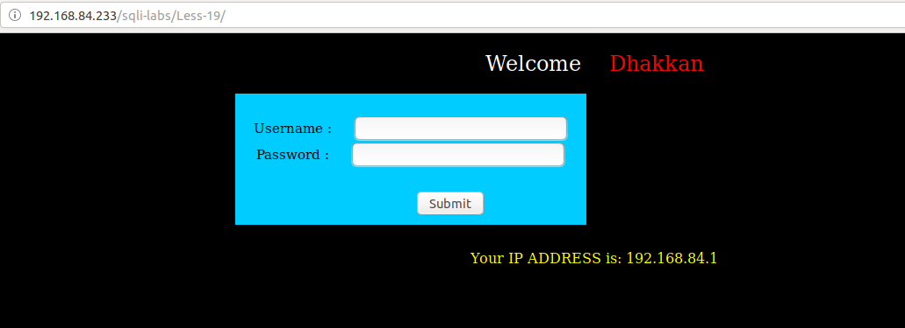

Thử đăng nhập vào đây

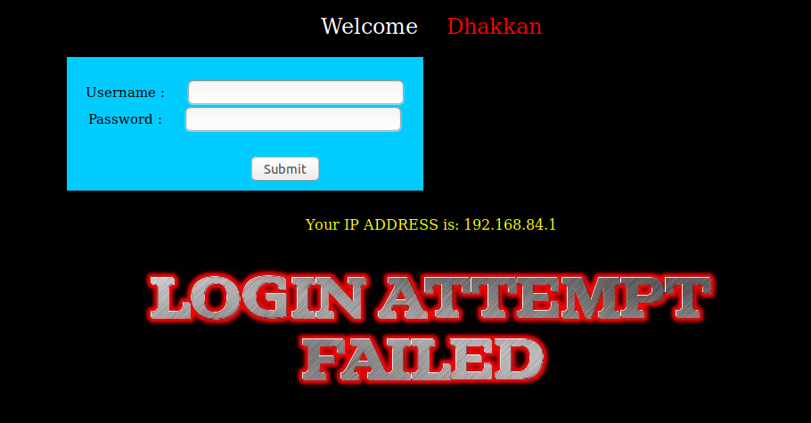

Thử đăng nhập xem có thể pass qua màn đăng nhập như những bài trước được hay không. Nhưng trong bài này tôi thấy không thể pass qua màn đăng nhập được như những bài trước. Tôi thử dùng một tài khoản để đăng nhập vào

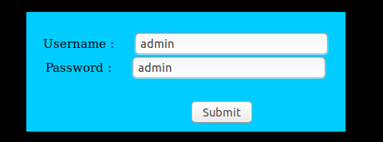

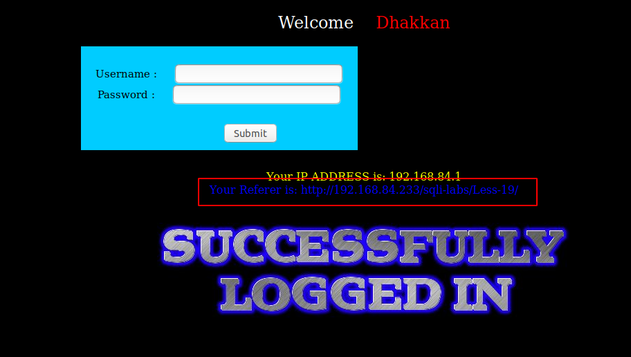

Tôi thấy có một dòng hiện lên. Dòng này tôi thấy giống với một trường trong header của http request

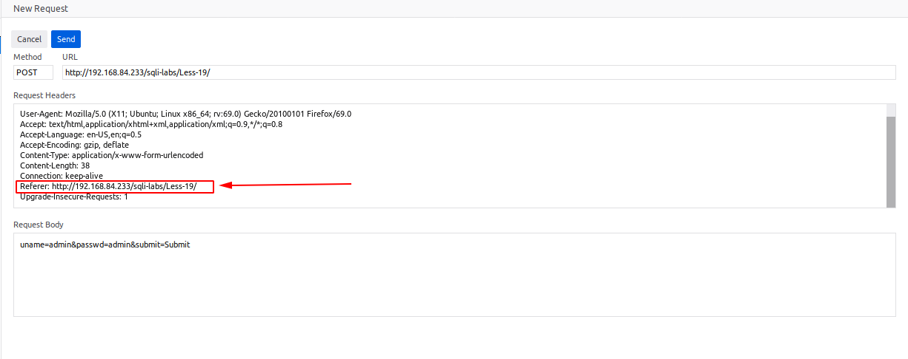

Thôi thử sửa dòng này trong header của http request

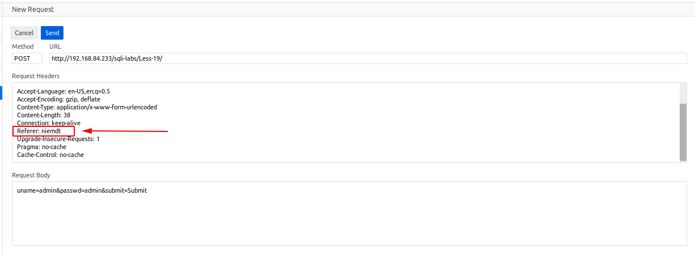

Tôi thấy nó lấy đúng giá trị này lên trên màn hình

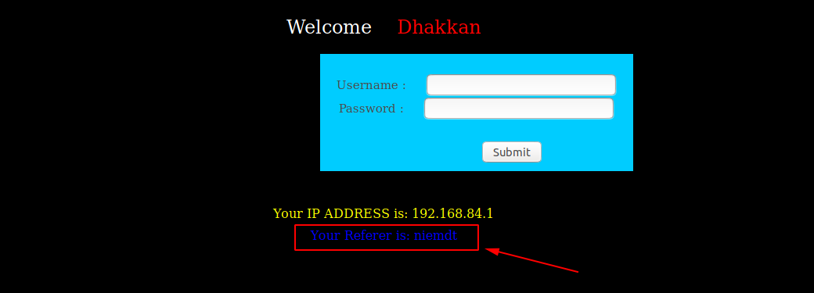

Tôi thử truyền vào một vài giá trị có các ký tự đặc biệt vào đây

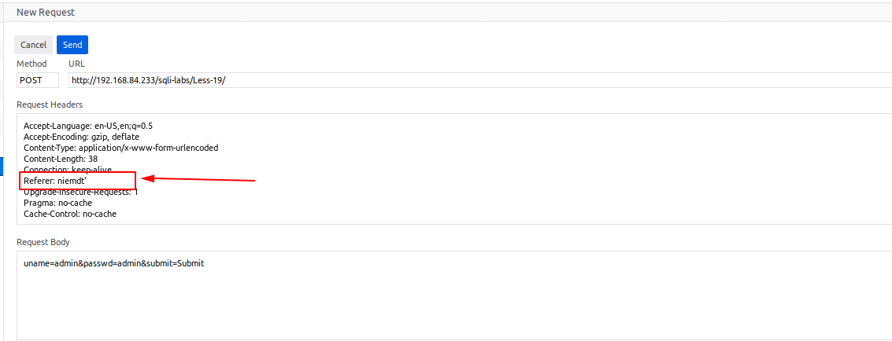

Thì tôi thấy

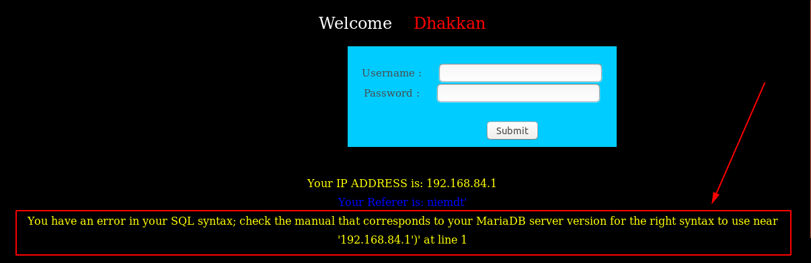

Tôi thấy ở đây có xuất hiện lỗi lên màn hình. Lỗi ở đây là lỗi của SQL, như vậy ta có thể tận dụng vào đây để show lên các thông tin của DB. Dựa vào lỗi ta có thể thấy nó ở đây họ đã lấy thông tin của `Referer` trong http request header để ghi xuống DB. Câu query xuống DB có thể là một câu lệnh `insert` hoặc `update`. Phía sau trường dữ liệu của lấy từ `referer` còn một trường giá trị là `IP`. 

Khi tôi truyền vào 

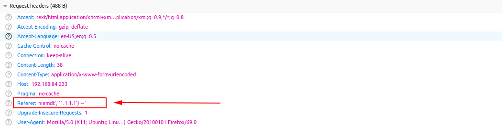

Thì tôi thấy giá trị trả về đã không còn báo lỗi 

Tôi thử show một vài thông tin trong DB

Show tên DB

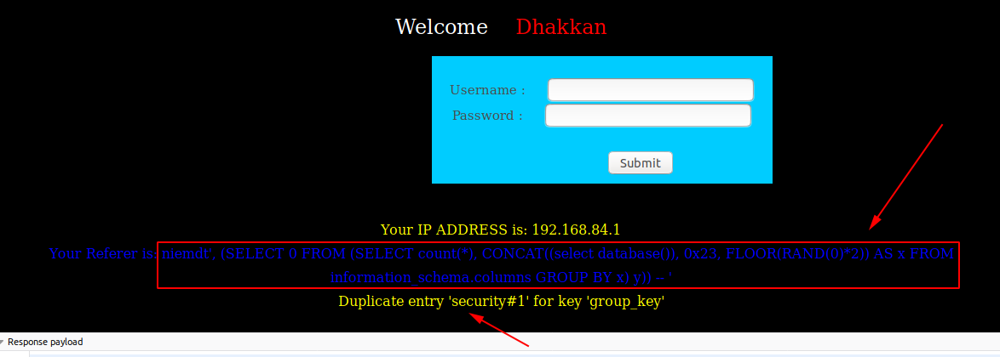

Show user sử dụng để kết nối DB

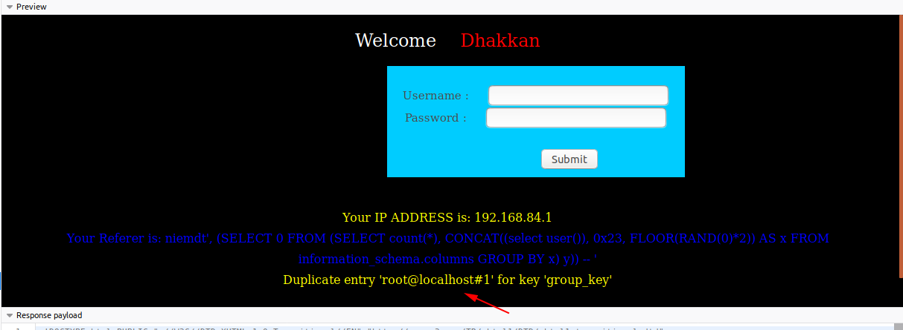

Show cột bên trong một bảng

Hoặc cũng có thể show dữ liệu bên trong một bảng

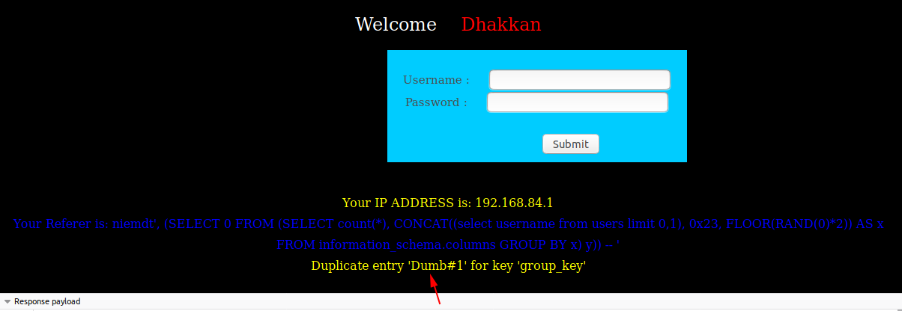

Tương tự như vậy ta có thể show các giá trị khác nữa
