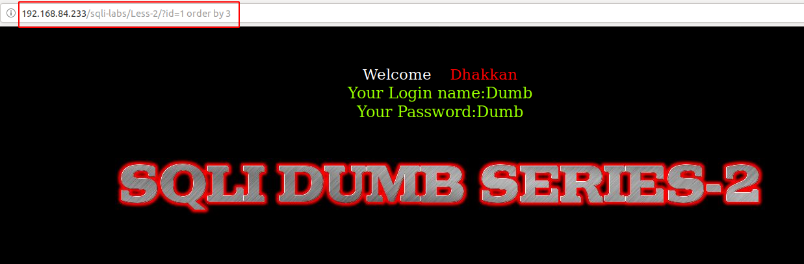
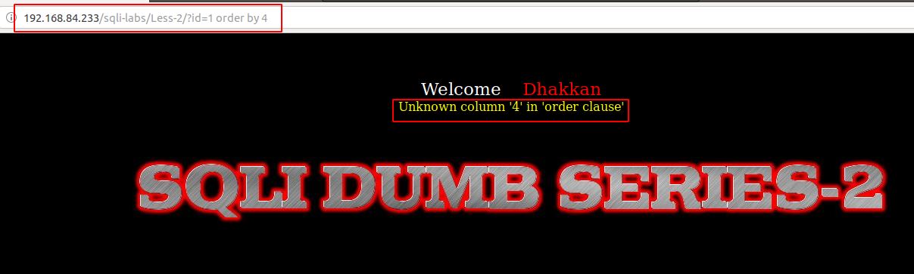
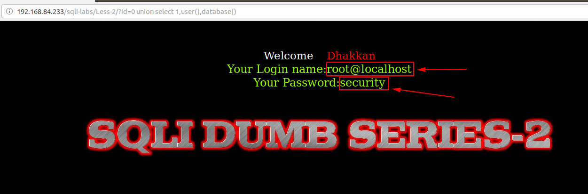
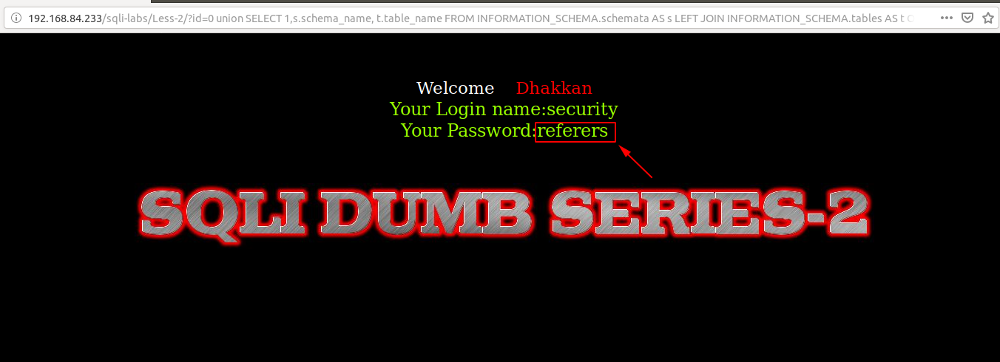
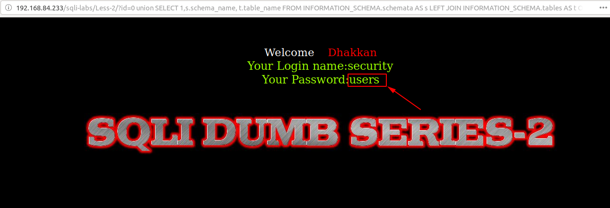

# Less 2

Ta thấy ở bài này là lỗi error based


Đề bài yêu cầu truyền vào giá trị là số


Nhập thử một số giá trị


Dự đoán câu query sẽ là:

```
select name, passwd from table where id='$ID'
```

Tiếp tục truyền vào một số giá trị


Chứng tỏ `$ID` không nằm trong dấu nháy. Câu query có thể là:

```
select name, passwd from table where id=$ID
```


Câu query lúc này có thể là:

```
select name, passwd from table where id=$ID limit 0,1
```

Tiếp tục thử để xác định số cột trả về của câu query





Kết quả trả về của 1 câu query gồm 3 cột. Câu query có thể sẽ là:

```
select id,name, passwd from table where id=$ID limit 0,1
```

Show được DB hiện tại đang thao tác



Show được các table trong một DB





Thao tác được giống với ở less-1