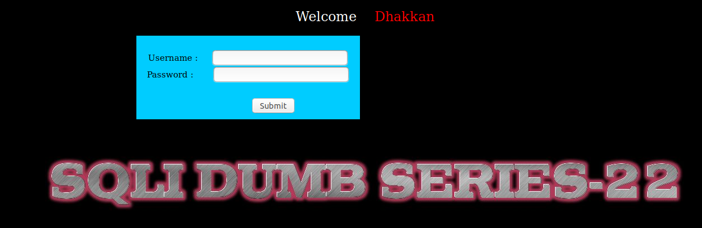
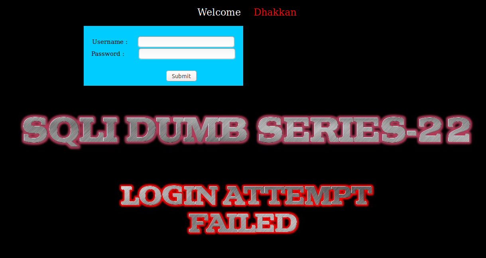
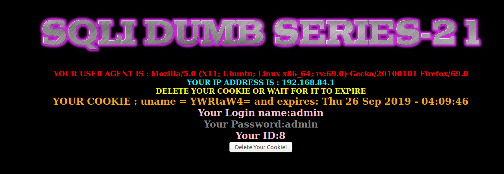
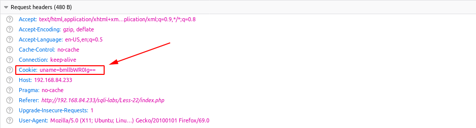
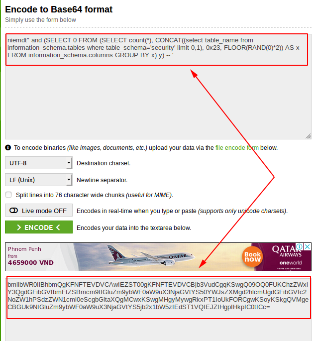
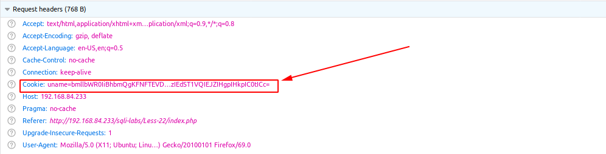
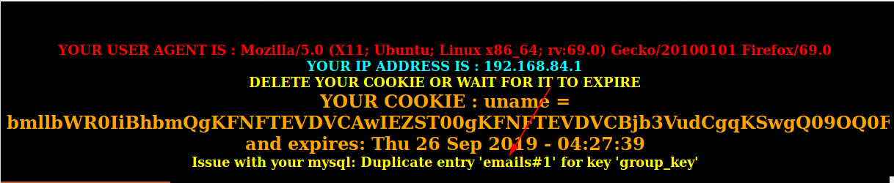

# Less 22

Đề bài cho khung đăng nhập

Tôi thử đăng nhập 

Thử để pass qua màn đăng nhập hoặc injection thông qua màn đăng nhập nhưng không được. Tôi dùng tài khoản để đăng nhập 

Tôi thấy có khá nhiều thông tin hiển thị ở đây. Ta thấy thông tin hiển thị lên đây. Tôi thử tìm cách injection vào các trường trong request header thì thấy có thể injection vào cookies giống với [Less 21](Less-21.md). Ở đây giá trị cũng được decode trước khi truyền vào câu query.

Khi tôi nhập vào

`niemdt"` --> `bmllbWR0Ig==`

Như vậy ta có thể khai thác nó giống như [Less 21](Less-21.md)

Ví dụ show tên bảng trong DB

