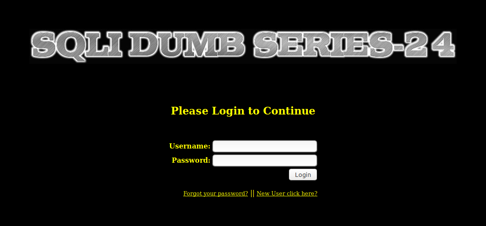
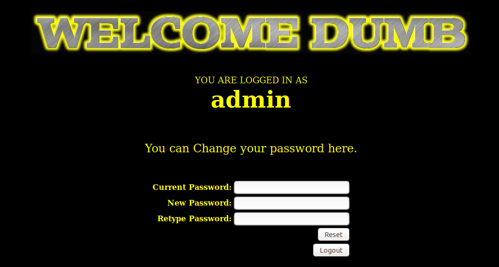
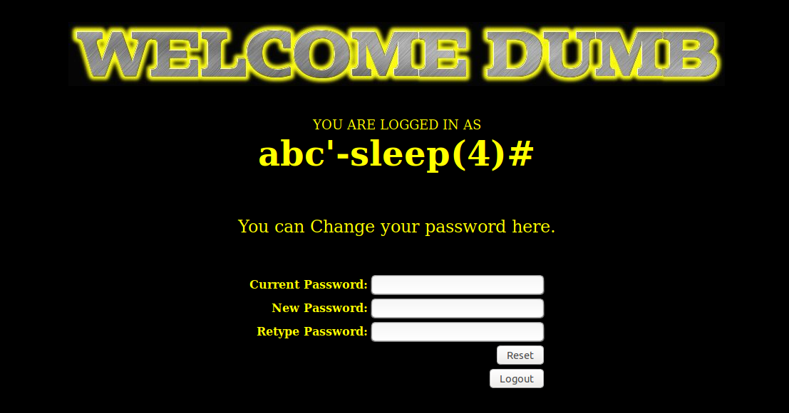
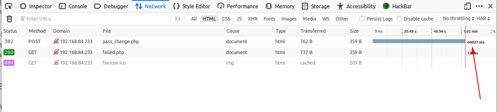
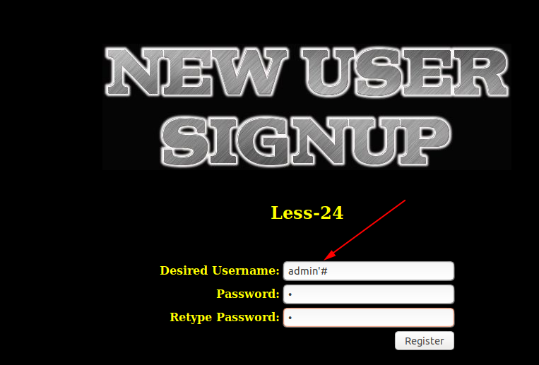
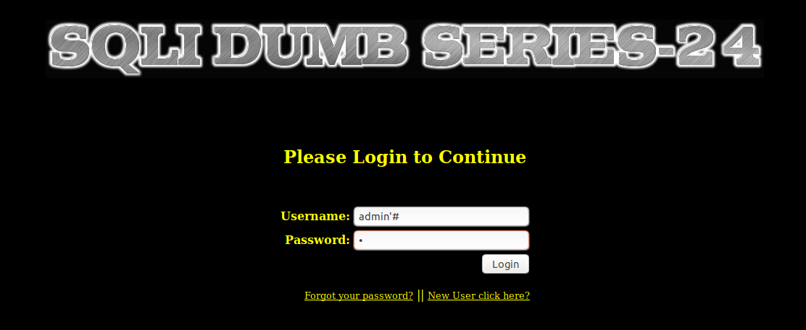
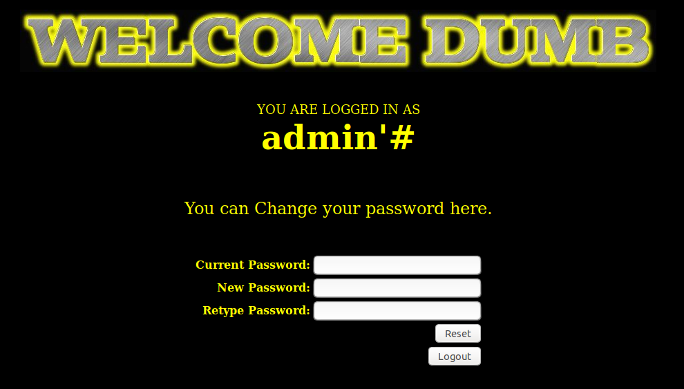
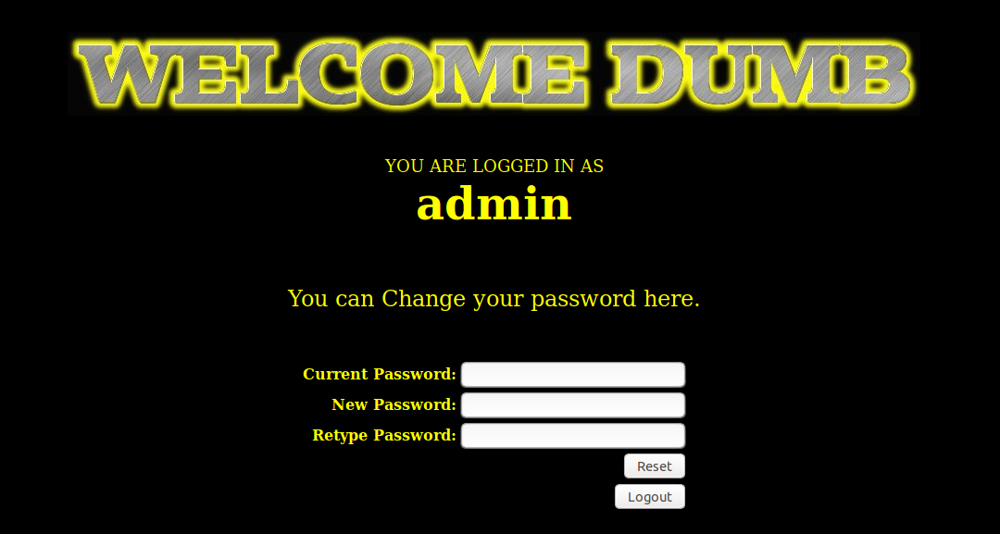

# Less 24

Đề bài cho một khung đăng nhập với khá nhiều chức năng

Trước tiên tôi thử đăng nhập

Tôi thử tìm cách để pass qua đăng nhập và tìm cách để injection từ đây nhưng không được.

Chọn `Forgot your password`

Ta thấy ở đây nó chỉ bắn ra cho ta một thông báo. Có thể thấy sẽ không khai thác được gì từ đây.

Chọn `New User click here?` 

Trong màn này ta có thể tạo một user mới.

Tôi thử sử dụng một tài khoản để thực hiện đăng nhập

Ta thấy nó đã chuyển sang màn cho phép ta thay đổi mật khẩu. Tôi thử thay đổi mật khẩu

Tôi tìm cách injection vào tất cả các khung được phép điền thông tin. Nhưng việc này không thực hiện được. Có thể tất cả thông tin truyền vào các khung khập đã được kiểm tra để chống injection. Tôi đọc trong code của màn này thì thấy đúng là dữ liệu lấy từ các khung đăng nhập đã được kiểm tra để chống injection. Nhưng tôi thấy rằng ở màn đổi password thì tôi thấy lúc so sánh tên user để thực hiện change pass thì user lúc này không được kiểm tra lại mà lấy luôn trong session trên server. Tôi thử injection từ đây

Để có một user có thể injection tôi thực hiện tạo một user

Tôi tạo một user có username là `abc'-sleep(4)#` và password là `1`. Tôi sử dụng user này để thực hiện đăng nhập và ra màn đổi password

Khi đổi pass thì tôi thấy đã có thể injection từ đây

Như ban đầu khi vào màn `Forgot your password` thì ta thấy thông báo

Bây giờ dựa vào vị trí có thể injection vừa tìm được tôi có thể tự đổi pass của mình mà không cần nhớ password cũ.

User `admin` tôi không nhớ password nên không thể thực hiện đăng nhập. Để lấy lại pass của user này tôi thực hiện tạo ra một user khác có tên `admin'#`

Sau đó sử dụng user này để thực hiện đăng nhập

Thực hiện đổi pass

Thực hiện đăng nhập với username `admin` và sử dụng password mà ta vừa thay đổi

Login thành công với password mới vừa thay đổi

