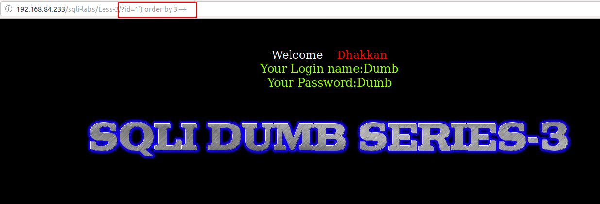
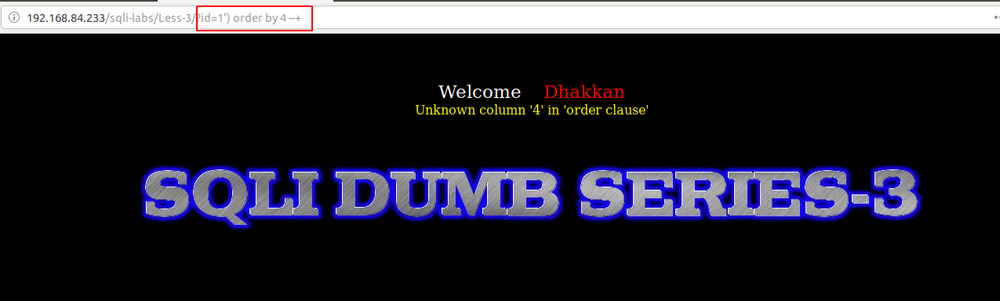

# Less 3

Ta thấy bài này là error based


Yêu cầu nhập vào một số


Bắt đầu thử


Có thể dự đoán câu query sẽ là:

```
select user, passwd from table where id='$ID'
```


Câu query có thể là:

```
select user, passwd from table where id=('$ID') limit 0,1
```

Ta thấy câu query trả về 3 cột





Ta có thể thao giống less-1