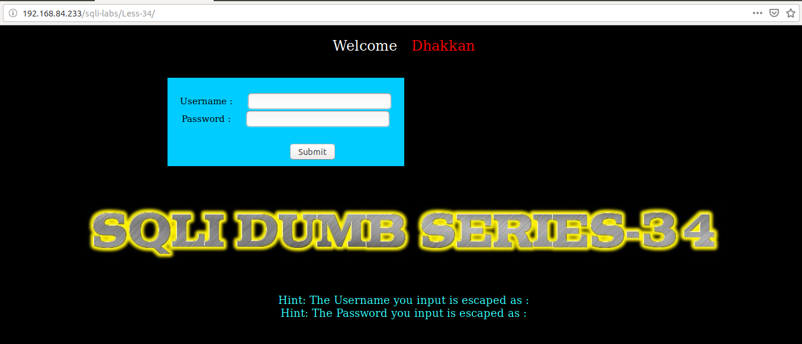
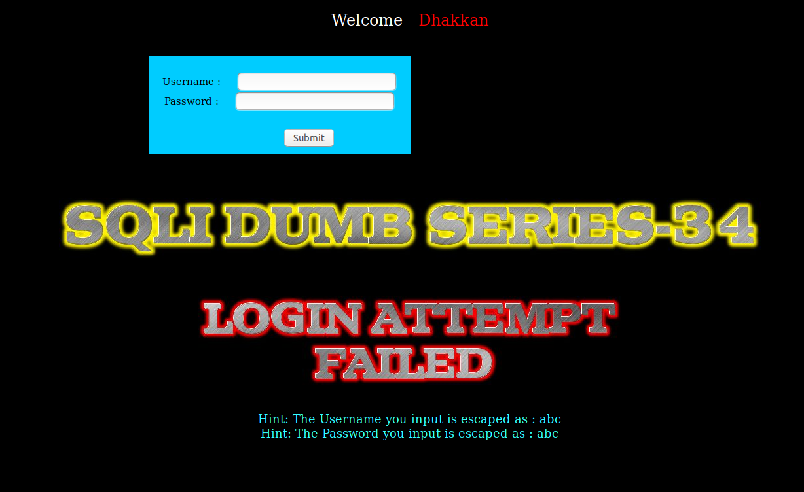
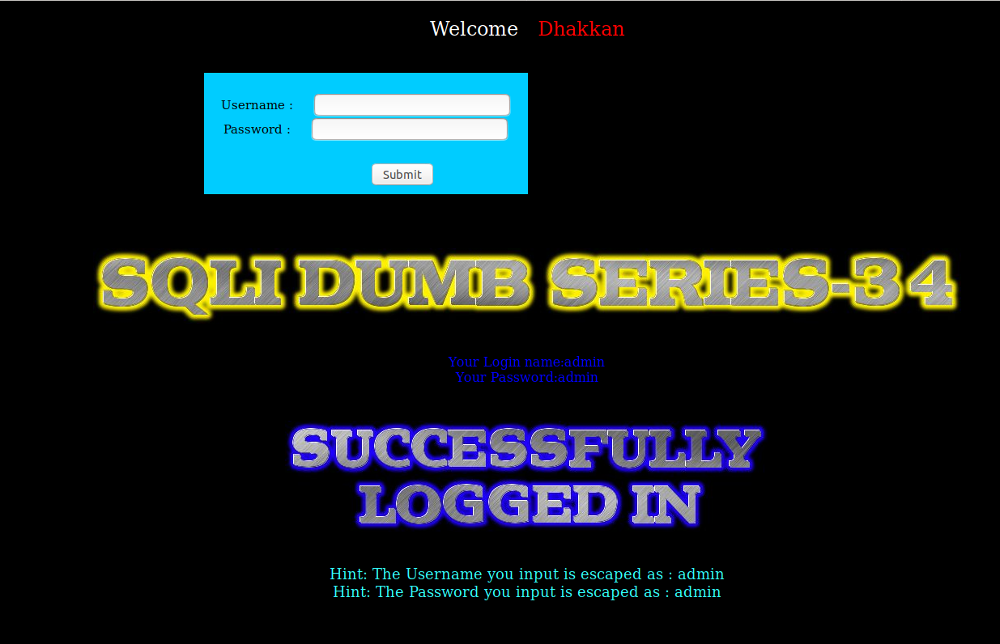
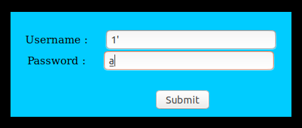
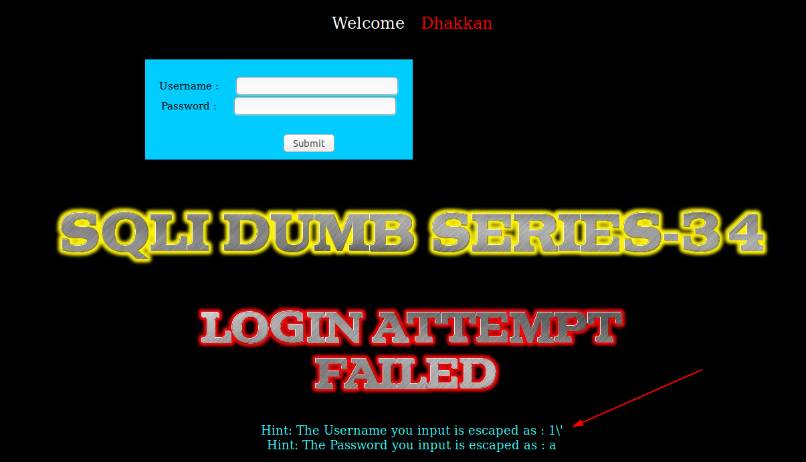
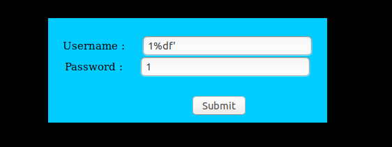
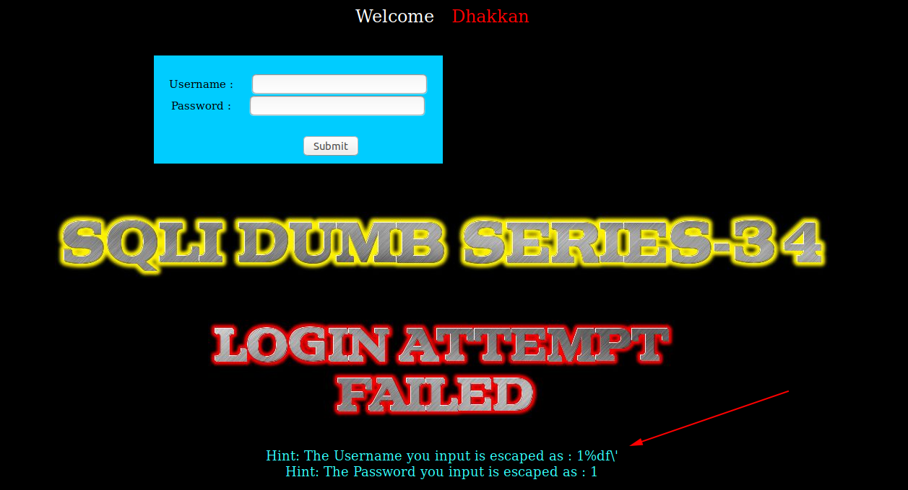
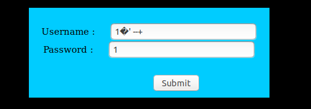
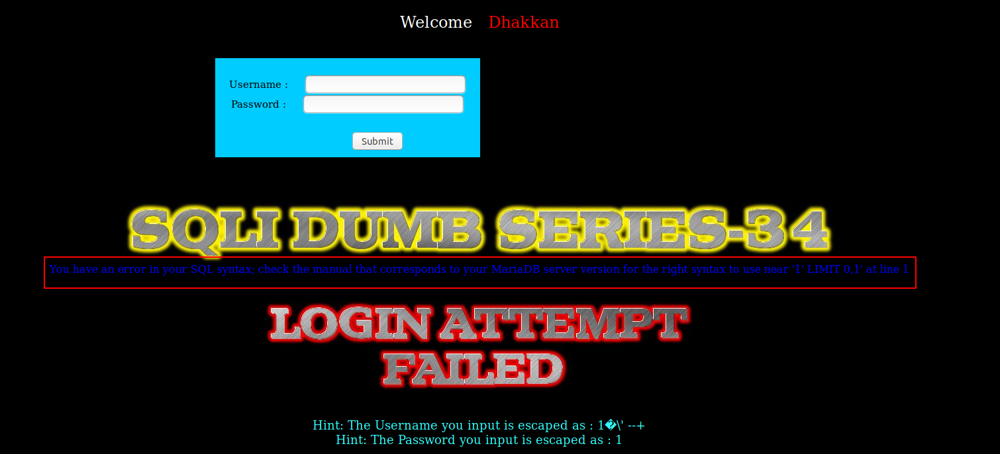
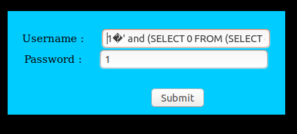

# Less 34

Bài này ta thấy có khung đăng nhập



Tôi thử điền vào khung đăng nhập



Tôi thử dùng một tài khoản để login



Tôi thấy không có gì đặc biệt. Tôi tìm cách để injection từ các khung đăng nhập



Tôi thấy ở đây nó giống như những bài trước nó đã thêm ký tự `\` và trước các ký tự đặc biệt để vô hiệu hóa các ký tự đặc biệt



Tôi tiếp tục thử bằng cách thêm `%df` vào trước dấu `'` như 2 bài trước để vô hiệu hóa ký tự `\` thêm vào



Thì tôi thấy nó không nhận mã hóa để vô hiêu hóa ký tự `\`



Ta thấy ở đây dùng method `post` nên nó không encode được ký tự đó như sử dụng `get`. Tiếp tục thử tiếp 



Ở đây tôi đã truyền thẳng vào ký tự đặc biệt thì đã thấy xuất hiện lỗi



Ta thấy lỗi SQL hiển thị lên màn hình nên ta có thể tận dụng vào đây để khai thác các thông tin trong DB.

```
1�' and (SELECT 0 FROM (SELECT count(*), CONCAT((select database()), 0x23, FLOOR(RAND(0)*2)) AS x FROM information_schema.columns GROUP BY x) y) -- 
```



