# Less 37

Đề bài cho khung đăng nhập

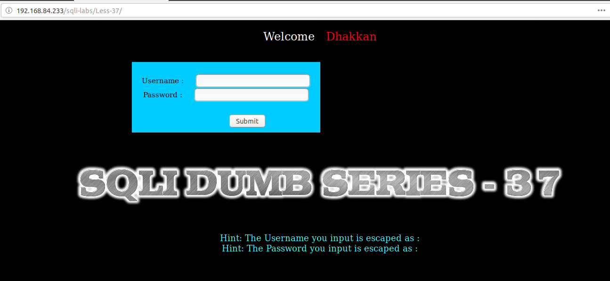

Thử đăng nhập

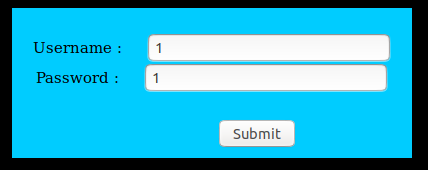

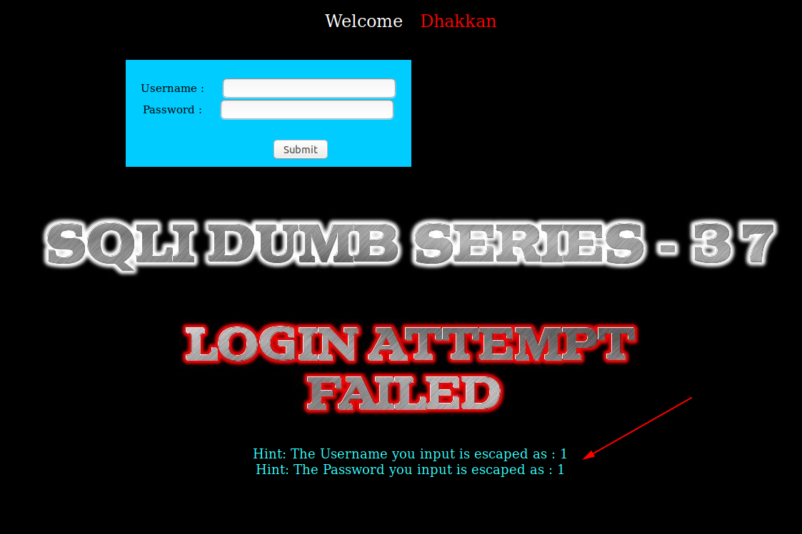

Tiếp tục thử

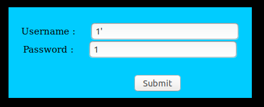

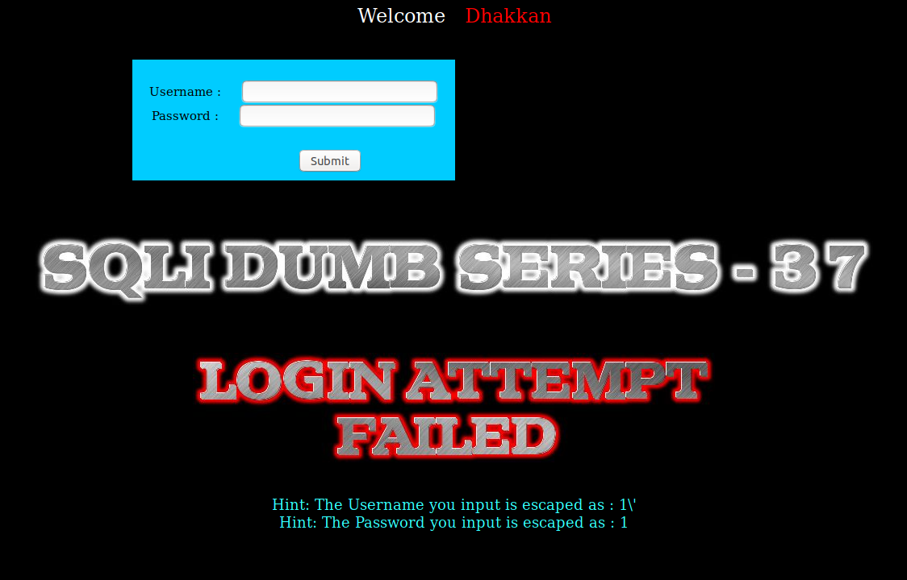

Ta thấy ở đây trước một số các ký tự đặc biệt đã được thêm ký tự `\` phía trước để chống injection.

Tôi tiếp tục thử

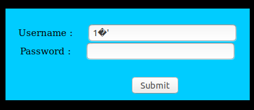

Thì thấy có lỗi của SQL trên màn hình

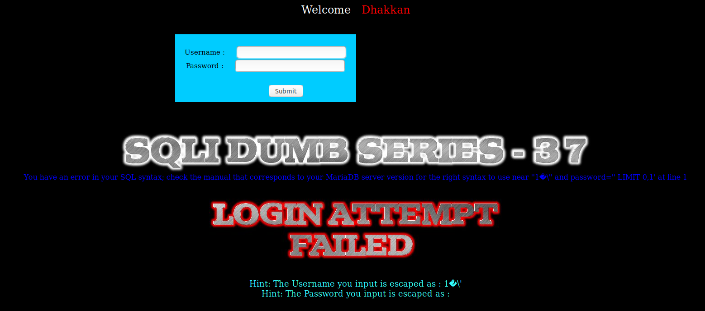

Tục thử 

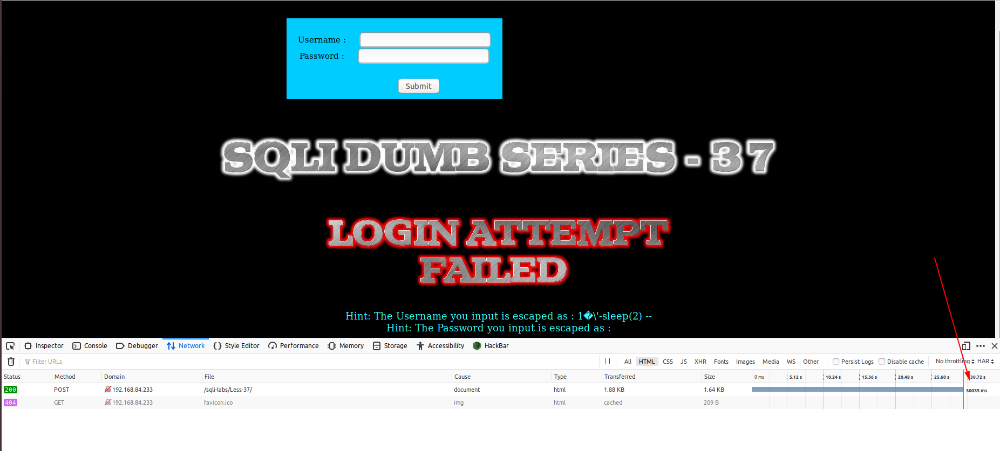

Như vậy ta có thể khai thác DB thông qua sử các lỗi SQL mà nó hiển thị lên trên màn hình

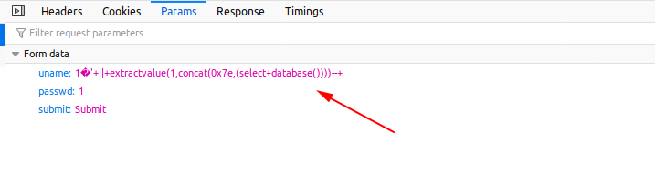

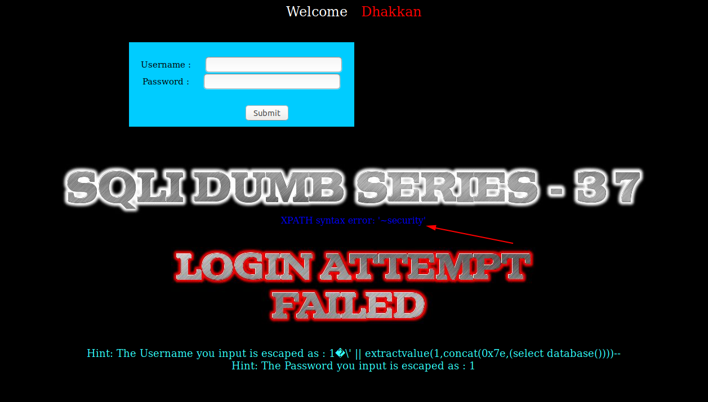

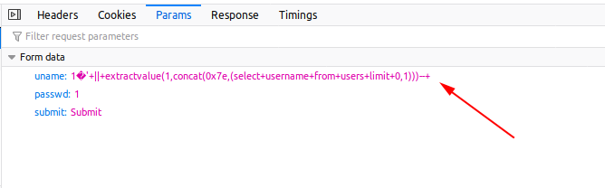

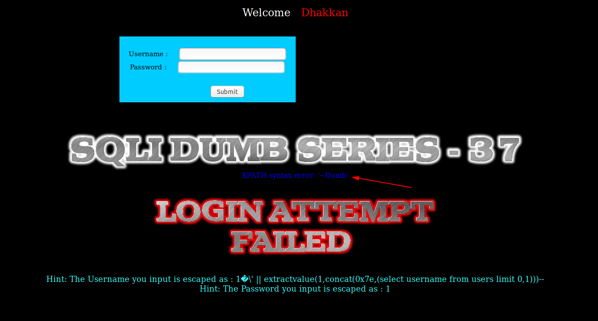