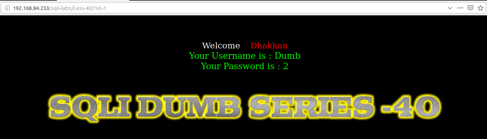
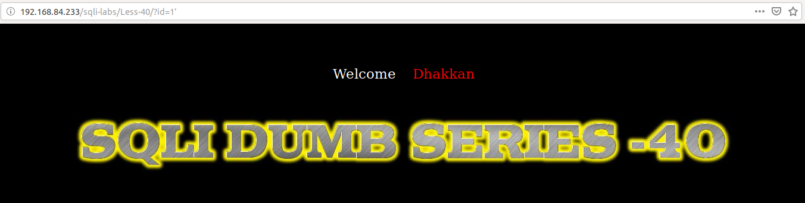
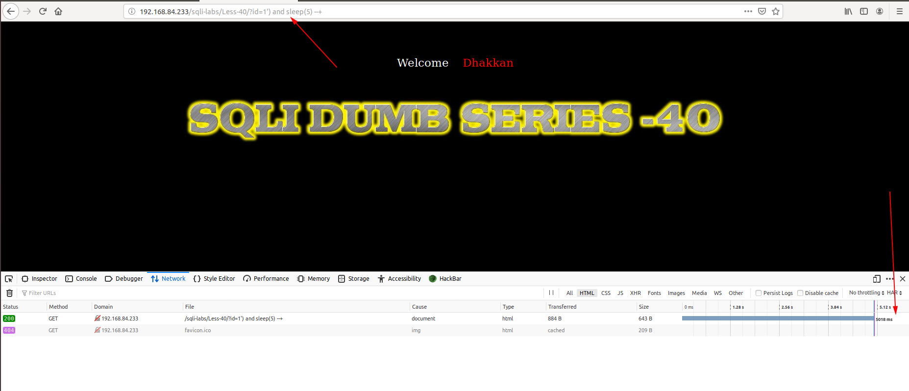
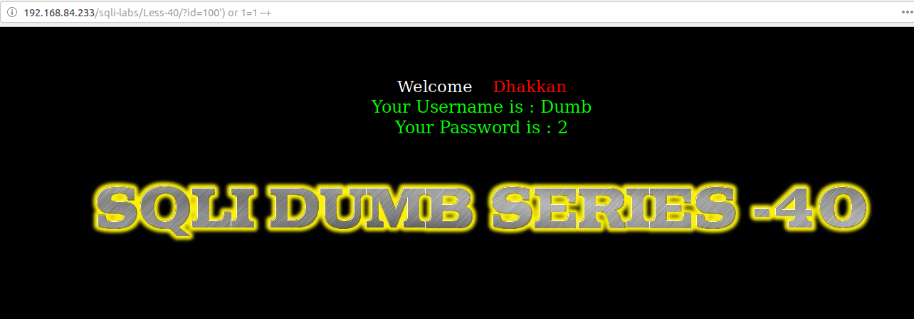

# Less 40

Đề bài cho phép truyền ID vào URL

Thử truyền ID

Nhập một số giá trị có thể gây ra lỗi

Ta thấy lỗi ở đây không được hiển thị lên màn hình.

Tiếp tục thử

Ta thấy được ở bài này ta có thể khai thác được thông qua time based hoặc boolean based giống [Less 7](Less-7.md) hoặc [Less 8](Less-8.md).