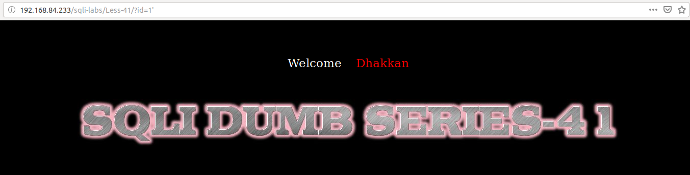
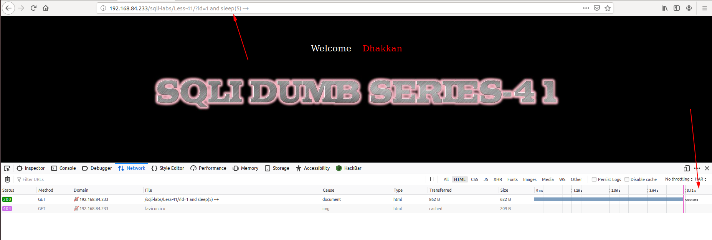
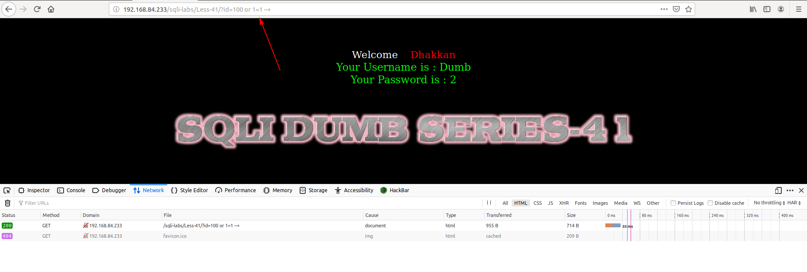

# Less 41

Trong bài này ta thấy nhập vào các gía trị có thể gây ra lỗi thì không thấy có gì được hiển thị lên màn hình.

Tôi tiếp tục thử

Ta thấy bài này có thể khai thác thông tin theo kiểu time based và boolean based như [Less 7](Less-7.md) và [Less 8](Less-8.md)
 