# Less 42

Đề bài cho một khung đăng nhập

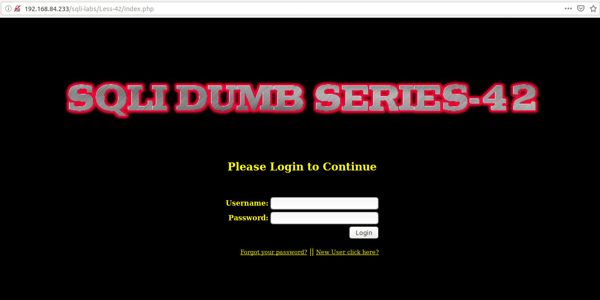

Ta thấy có khá nhiều chức năng nên thử hết các chức năng của website này

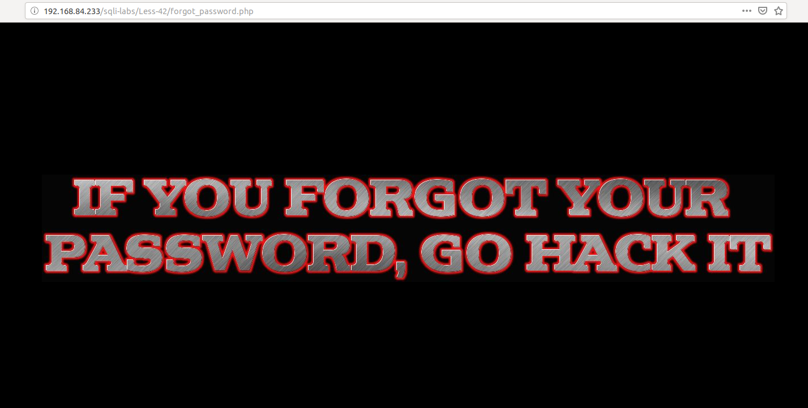

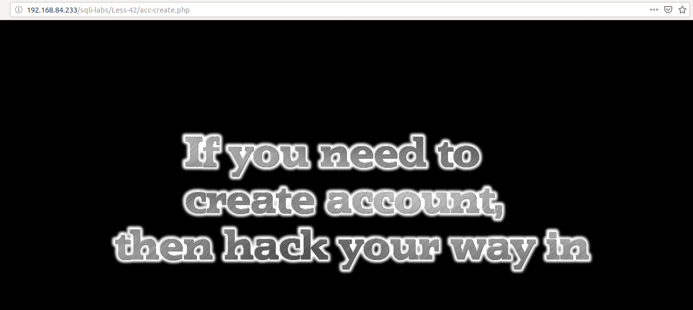

Như vậy ta thấy ở 2 màn quên pass và tạo mật khẩu chỉ đơn giản là html nên không thể injection được từ đây.

Tôi thử đăng nhập với 1 tài khoản không đúng

Thử đăng nhập với 1 tài khoản đúng

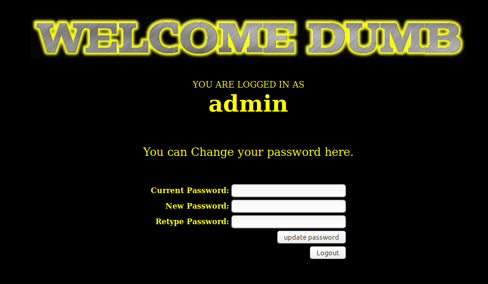

Thì ta thấy ở đây cho phép chúng ta đổi pass của tk vủa login.

Trở lại khung đăng nhập tôi tìm cách injection từ đây

Tôi thử nhập vào như sau

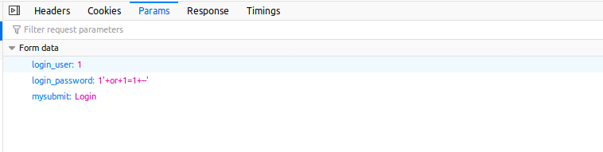

Thì tôi thấy đã login được với user `Dumb`

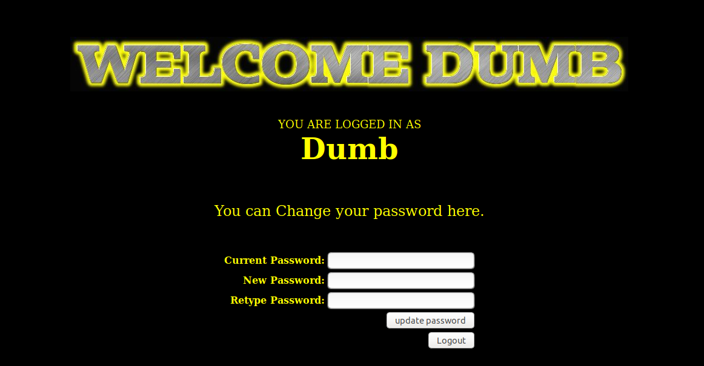

Tôi thử truyền vào params

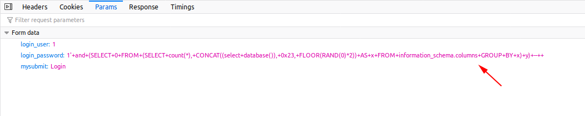

Thấy có lỗi hiển thị lên màn hình

Tiếp tục thử

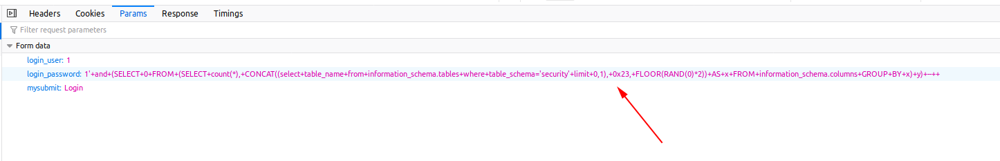

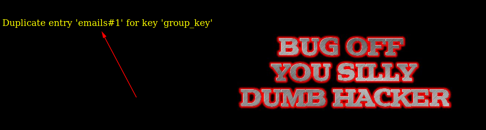

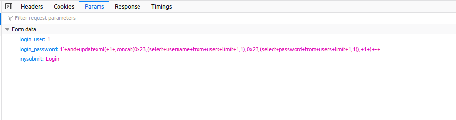

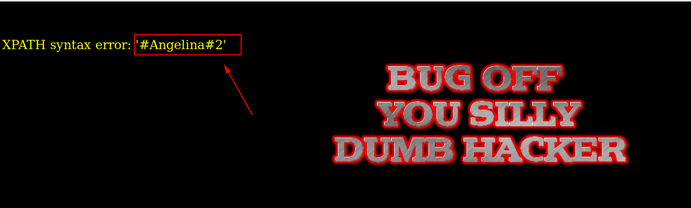

Ta thấy có thể khai thác DB thông qua cách này.

Tôi thấy ở bài này có sử dụng hàm `mysqli_multi_query` tôi thử nhập thử

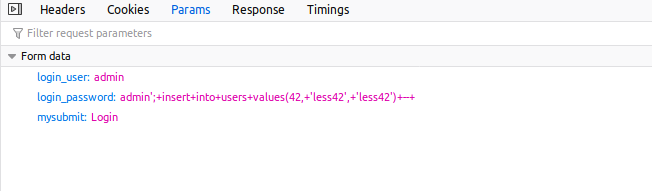

Thì ta thấy kết quả

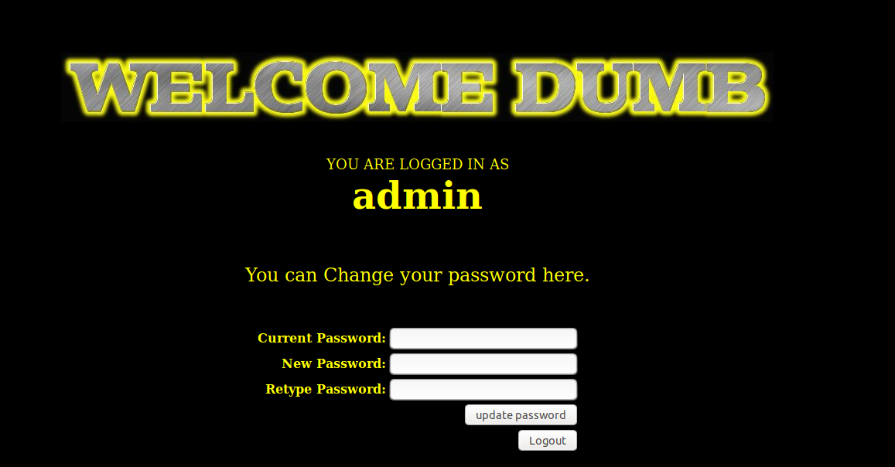

Bây giờ tôi đã tạo được user mới với username và password là `less42`

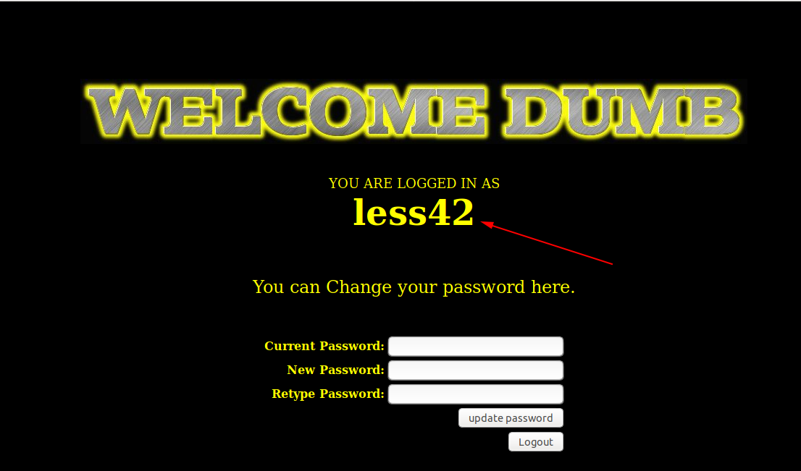

