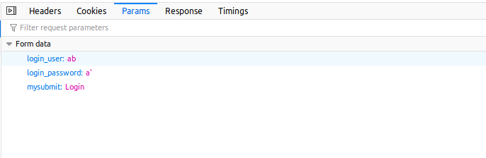
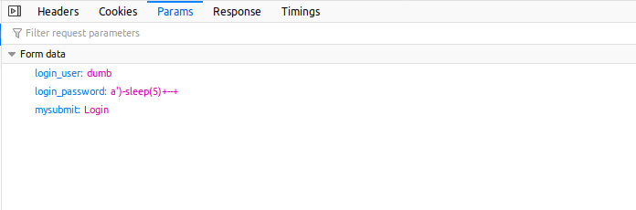
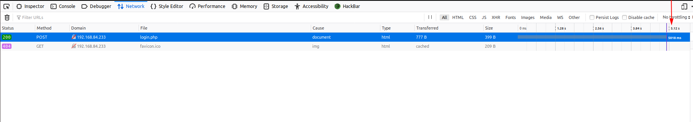
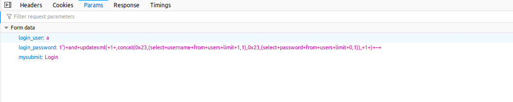
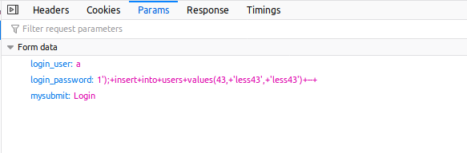
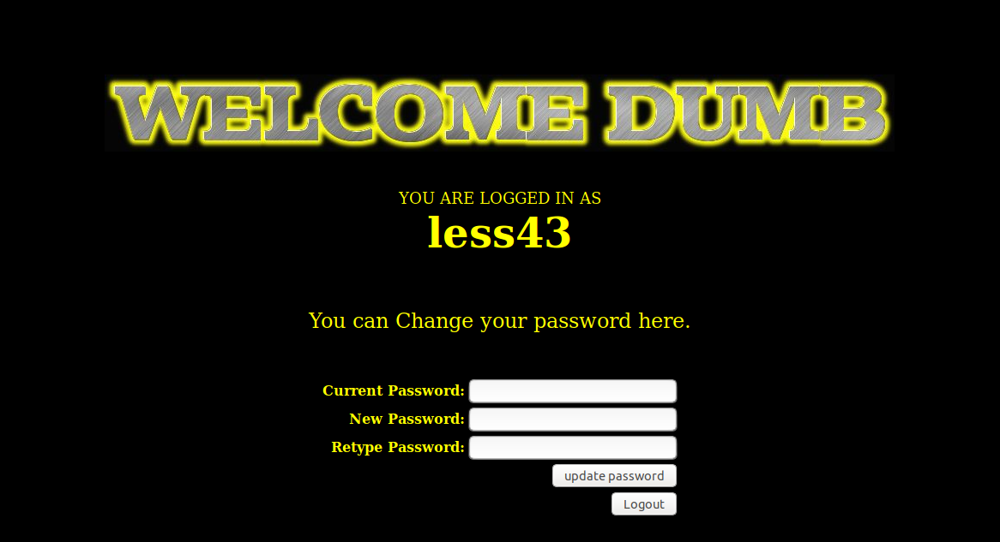
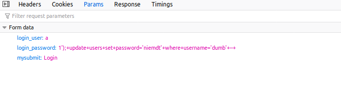
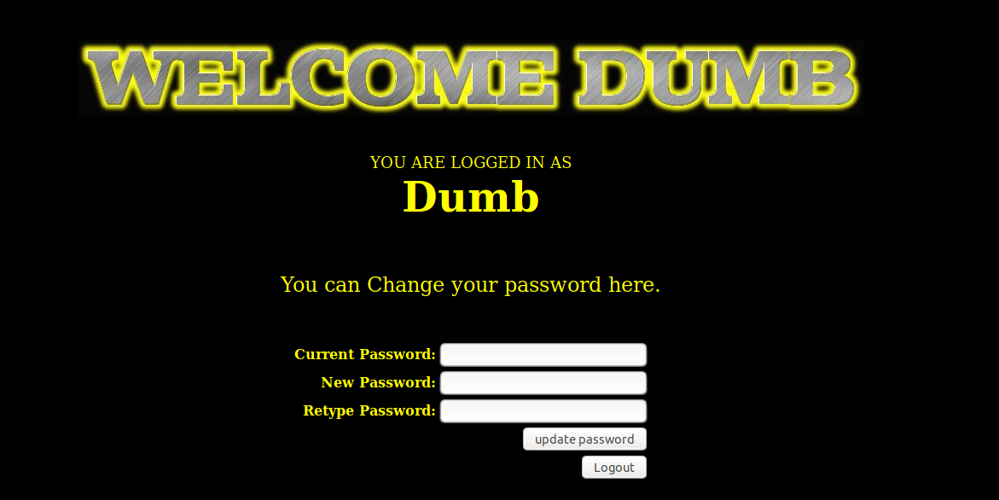

# Less 43

Tôi thấy khung đăng nhập

Tôi thử click vào một số đường dẫn trên màn này thì thấy không có gì để khai thác. Tôi quay lại đây để nhập linh tinh vào xem có thể khai thác được gì từ đây không

Khi tôi nhập một tài khoản không đúng

Tôi nhập vào

Thì thấy có lỗi SQL hiển thị lên màn hình

Tôi tiếp tục thử

Thì thấy 

Từ đây ta có thể show được toàn bộ thông tin trong DB

Ta có thể tạo một user mới

Sử dụng user vừa tạo để login

Tôi có thể đổi password cho một user khi quên pass

Login với user `dumb` với password vừa đổi

