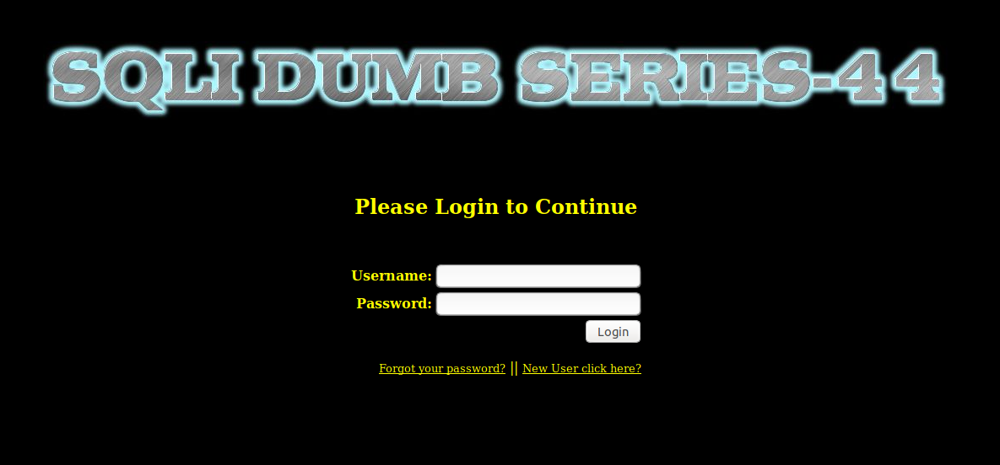
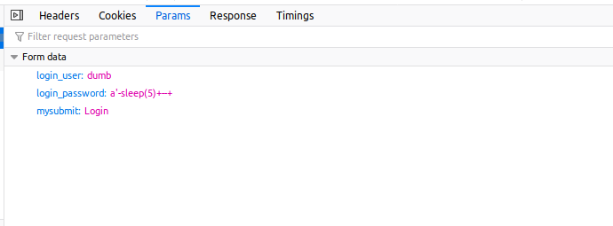
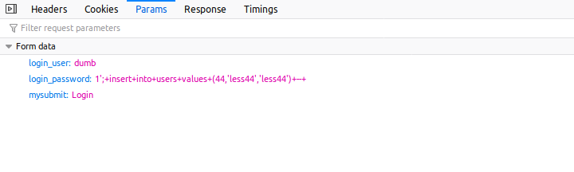
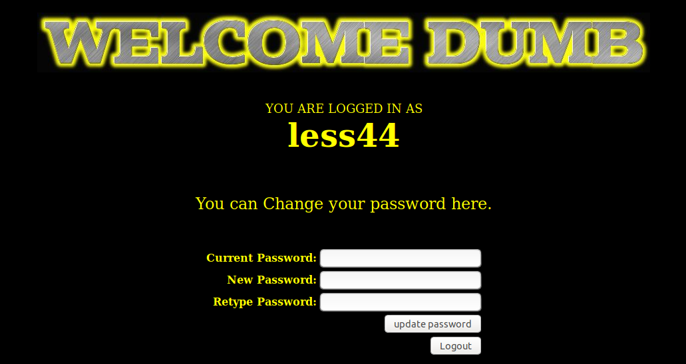
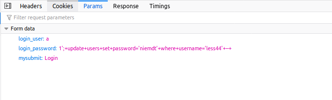
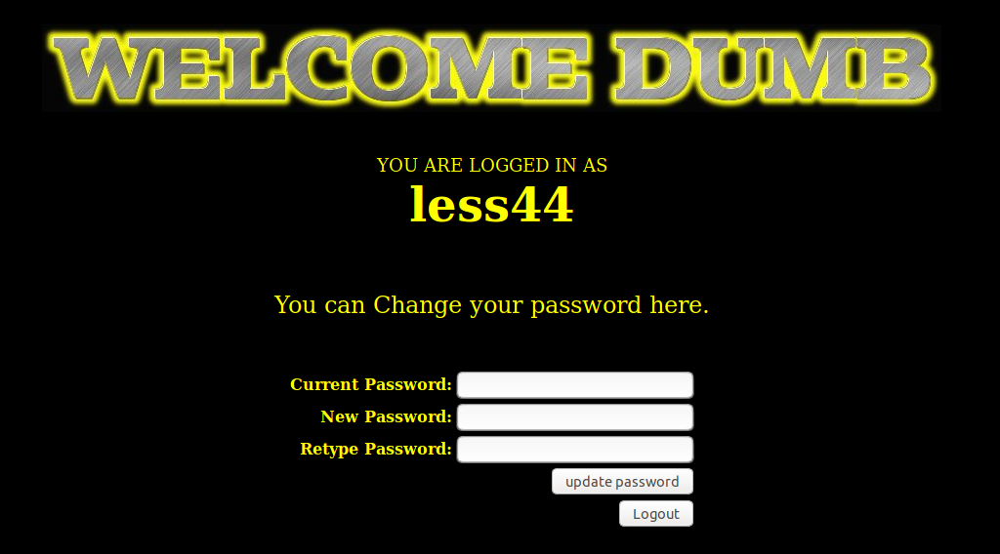
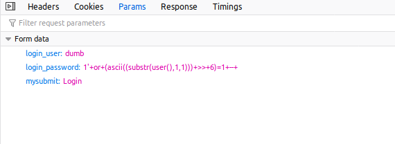

# Less 44

Ta thấy khung đăng nhập



Thử tìm cách injection từ đây




Create 1 user mới



Đăng nhập với user vừa tạo



Đổi password cho 1 user mà không cần biết password hiện tại



Đăng nhập được với password vừa đổi



Ta có thể khai thác dữ liệu trong DB bằng cách sử dụng boolean based

```
1' or (ascii((substr(user(),1,1))) >> 6)=1 -- 
```

