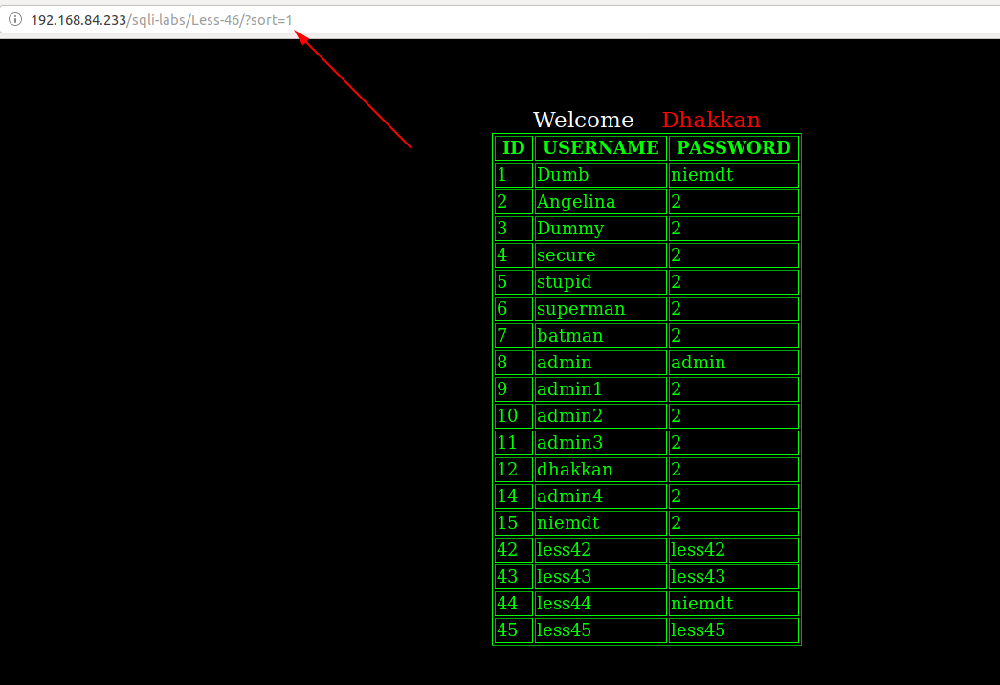
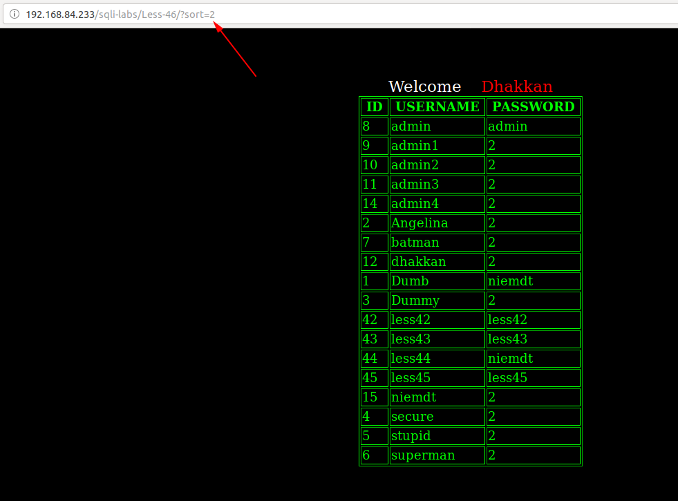
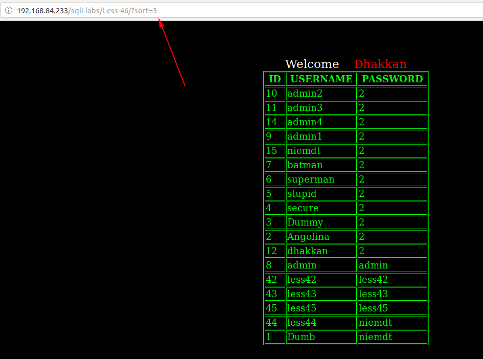
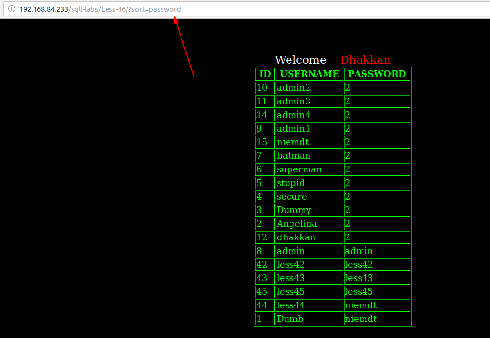
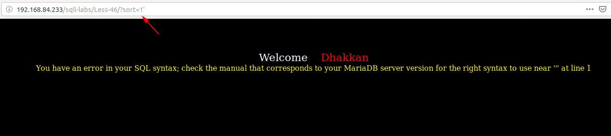
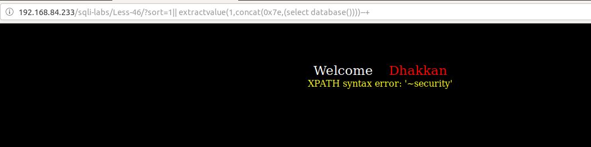
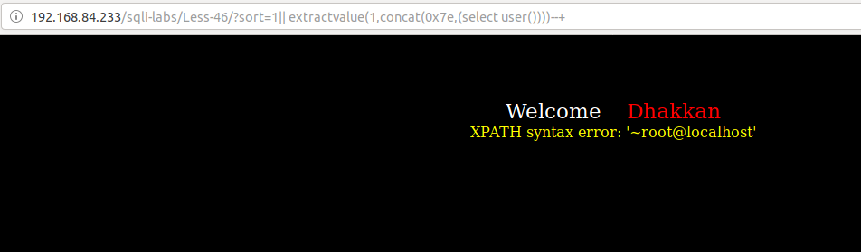
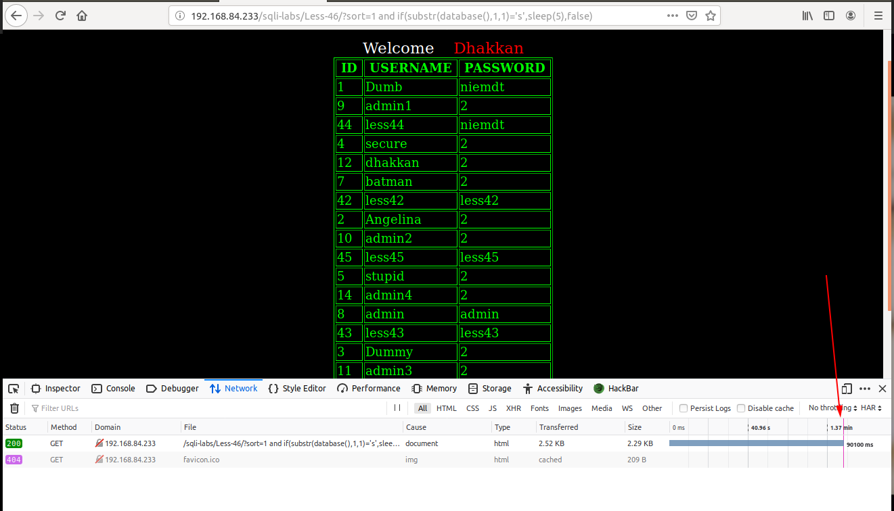

# Less 46

Ta thấy đề bài cho phép truyền vào param `sort`


Tôi thử truyền vào một số giá trị









Ta thấy ở đây bảng output được sắp xếp theo cột được truyền vào. Gía trị được truyền vào được sử dụng cho `order by` để thực hiện cho việc sắp xếp.

Tôi thử truyền vào một số giá trị có thể gây ra lỗi thì thấy



Tôi thấy ở đây lỗi của SQL hiển thị lên trên màn hình. Dựa vào đây ta có thể show các thông tin của DB bằng cách khai thác thông qua error based.

```
http://192.168.84.233/sqli-labs/Less-46/?sort=1|| extractvalue(1,concat(0x7e,(select database())))--+
```





Hoặc ta có thể sử dụng time based để khai thác

