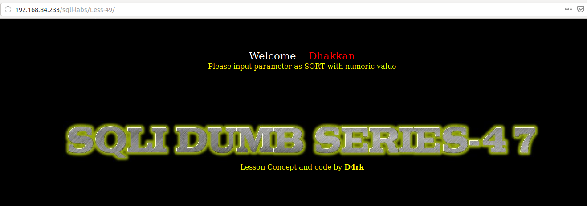
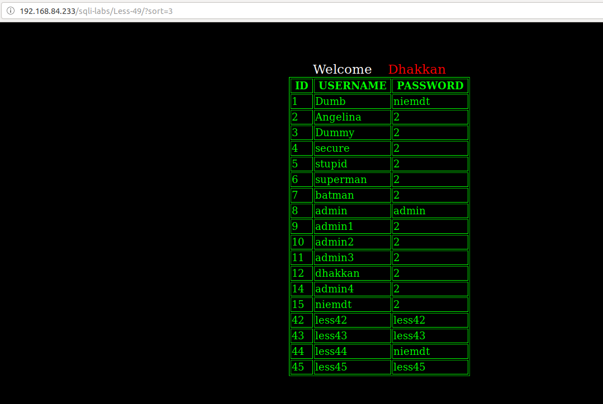
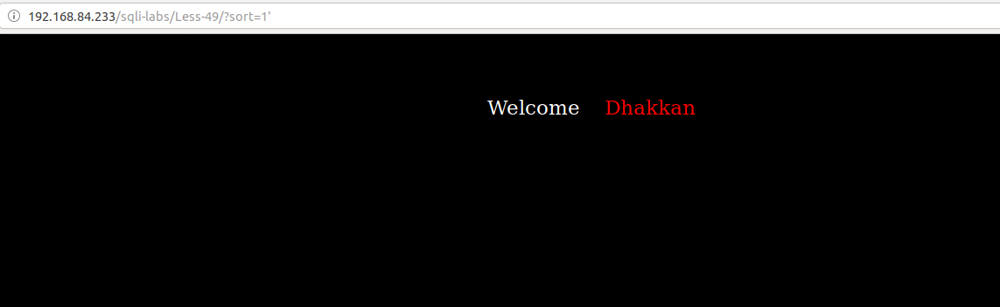
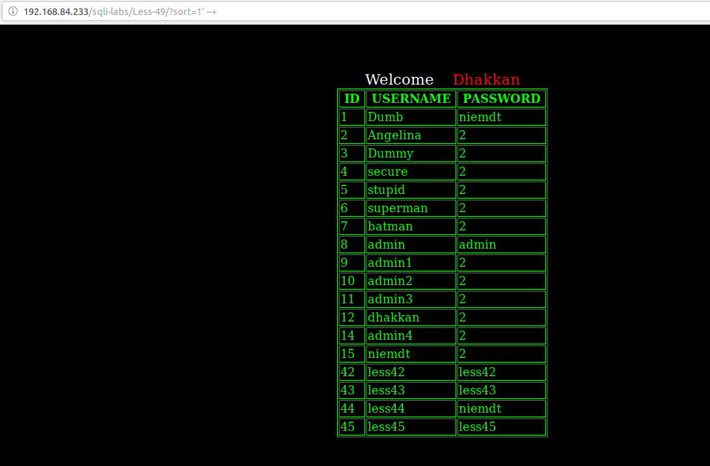
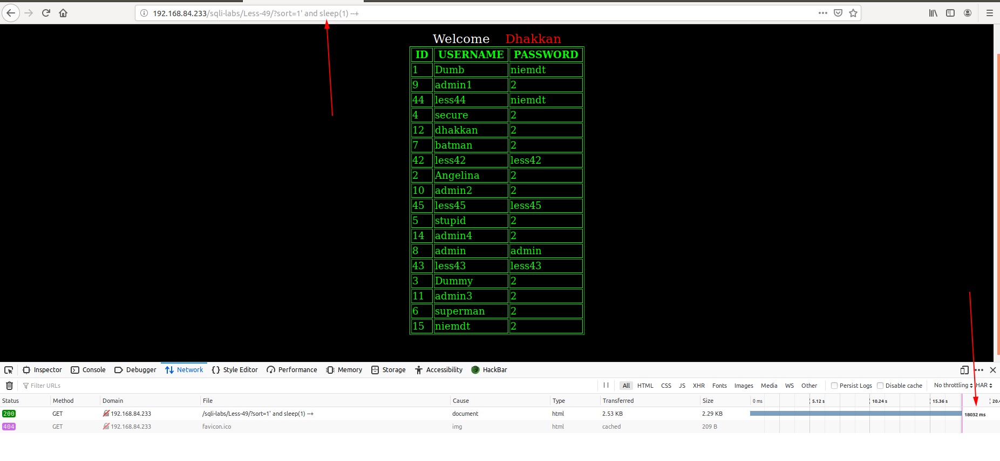
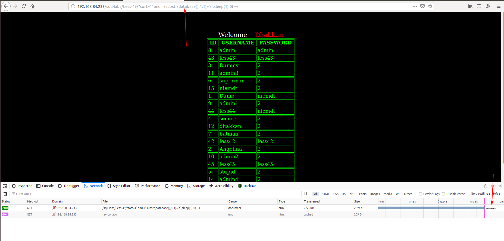

# Less 49

Đề bài vẫn cho phép truyền vào params là `sort`

Thử truyền vào một số params

Truyền vào một số giá trị có thể gây ra lỗi

Như vậy ta thấy ở bài này lỗi ko hiển thị lên màn hình nên ta tìm cách khác để injection

Ta thấy có thể injection bằng cách time based

