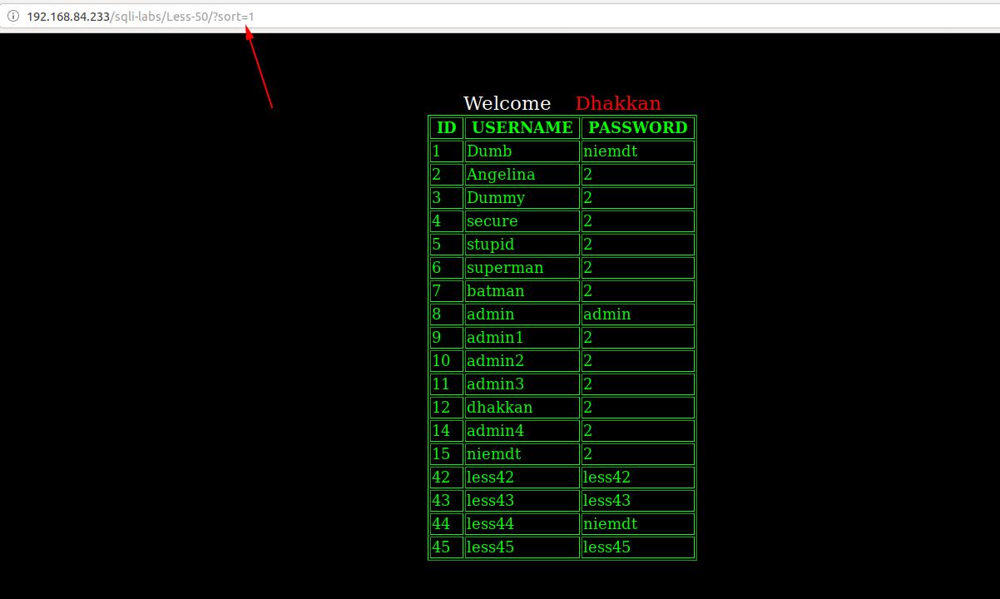
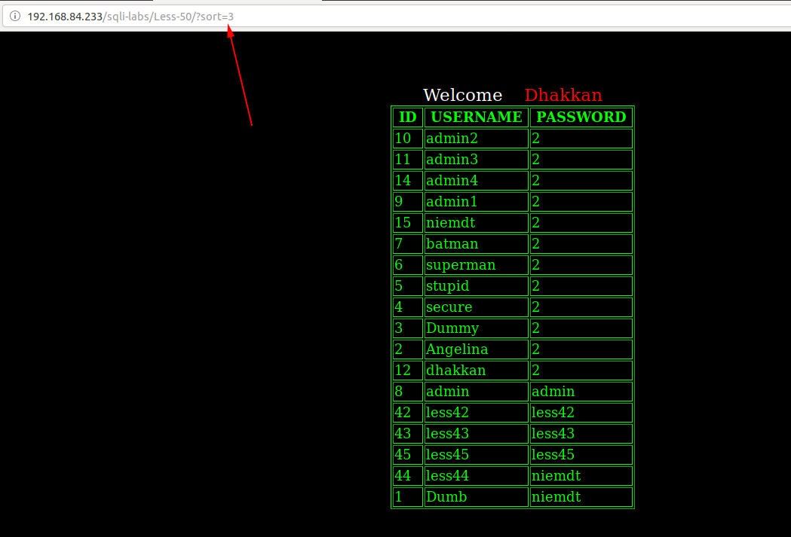
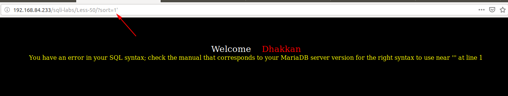
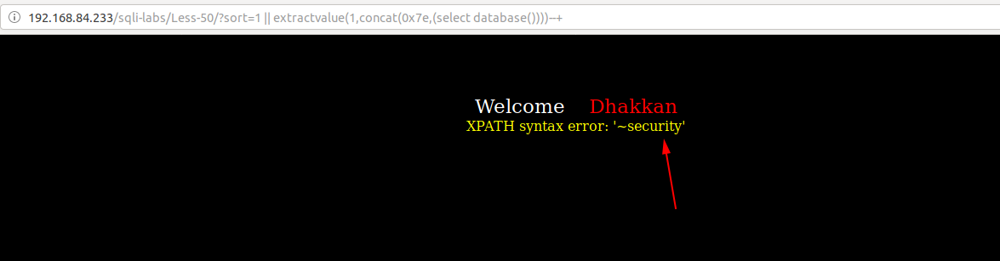
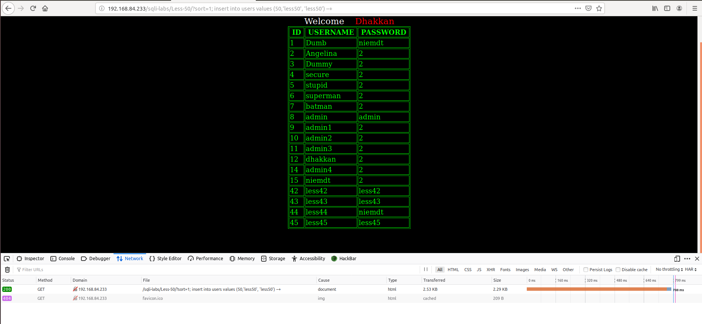
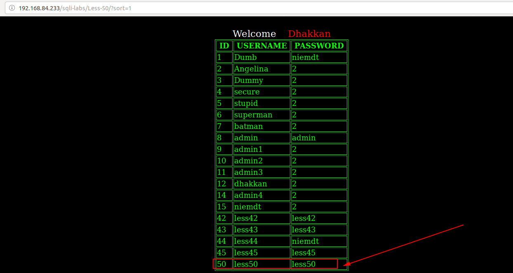

# Less 50

Đề bài cho phép truyền vào params `sort`

Truyền thử vào một số giá trị

Thử truyền vào một số giá trị có thể gây ra lỗi

Ta thấy lỗi được hiển thị lên màn hình. Như vậy ta có thể căn cứ vào đây để show thông tin bên trong DB

Tiếp tục thử thì tôi thấy có thể sử dụng query nhiều câu lệnh cùng lúc.

Tôi thử insert dữ liệu vào bảng này thì tôi thấy kết quả đã insert vào được

