# Less 54

Đề bài cho phép truyền vào ID.

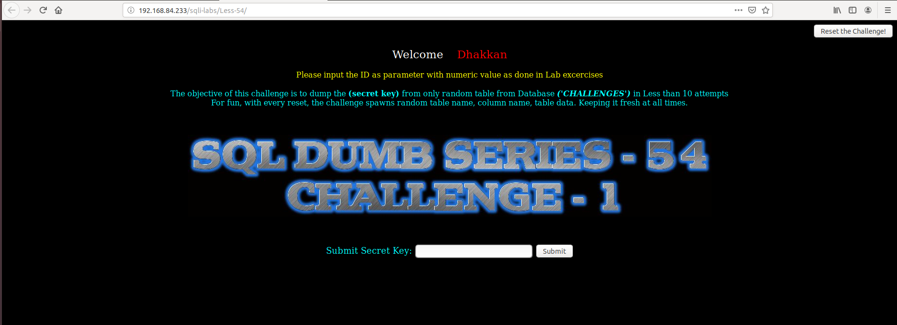

Ta thấy như thông báo ở đây chỉ cho phép thực hiện 10 request. Nếu quá 10 request thì tên bảng và tên column sẽ được đổi bằng cách sinh random.

Tôi thử truyền vào id

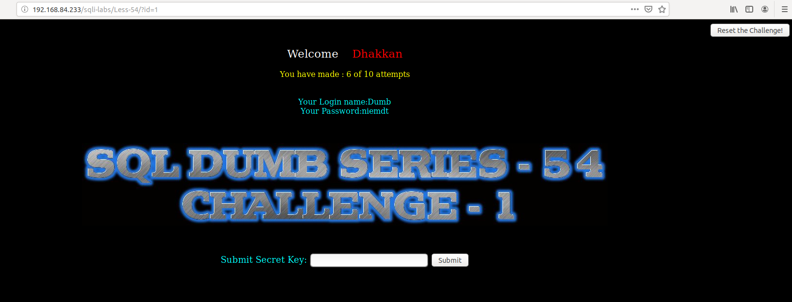

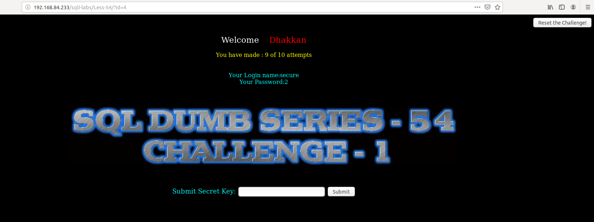

Mỗi lần request thì ta thấy nó đã được đếm. Khi quá 10 lần thì nó được reset lại 0

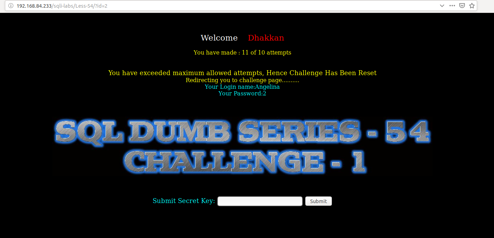

Thử reset lại challenge

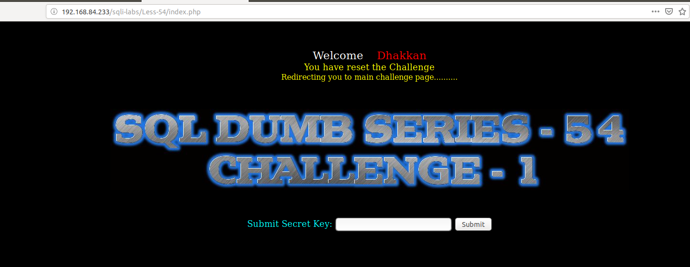

Thử tìm cách injection

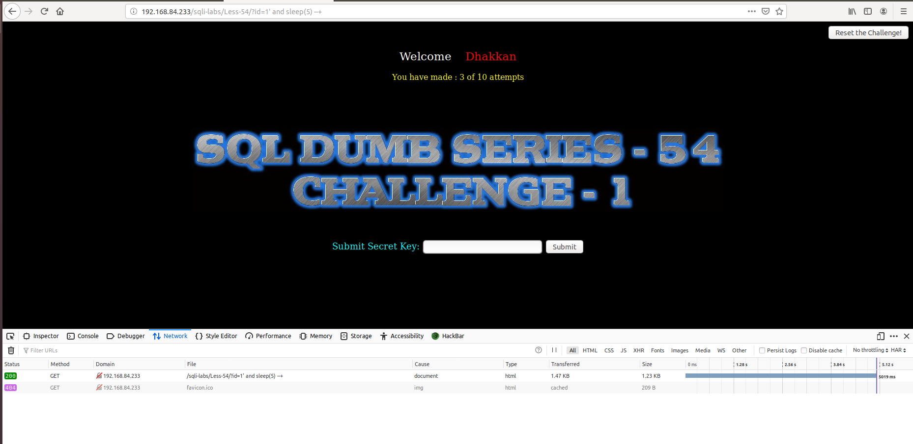

Show tên DB đang làm việc

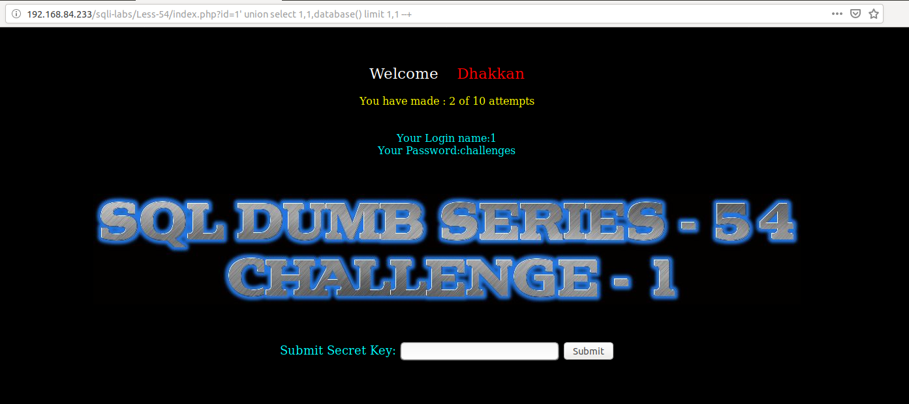

Show user đang đứng

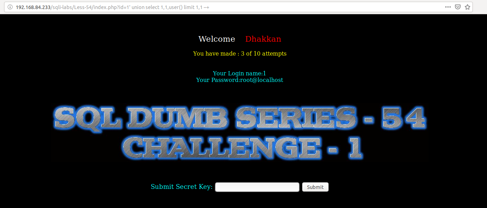

Show tên tables

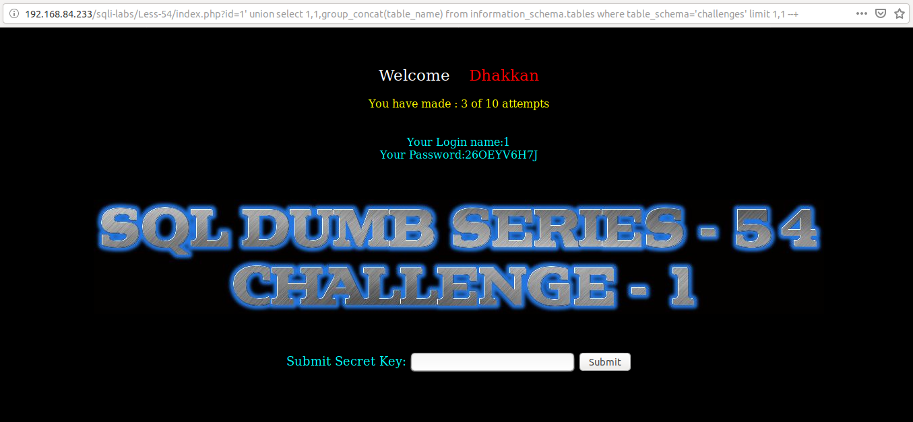

Show các column của bảng

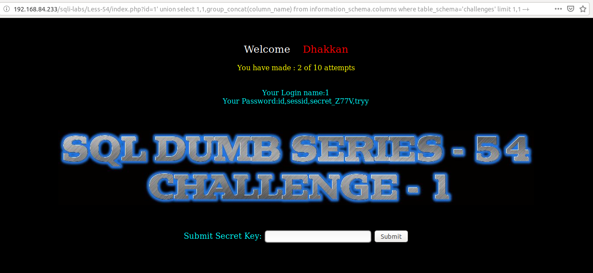

Show thông tin trong bảng

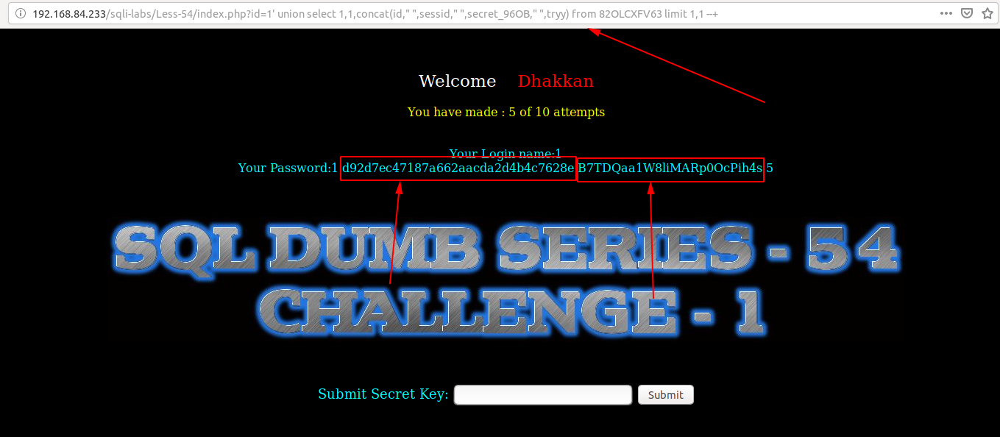

Tôi thử đem lần lượt 1 trong 2 chuỗi show được để submit vào khung submit `secret key`. Thì khi submit chuỗi thứ 2 thì thành công

Ở trong bài này để thực hiện lấy được chuỗi như bên trên thì từ đầu đến cuối chỉ được thực hiện dưới 10 request. Nếu quá 10 request thì ta lại phải thực hiện lại từ đầu.

Trong bài này tôi cũng thử tìm các injection từ khung `submit` nhưng không được.