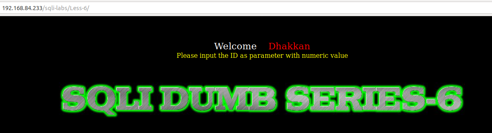
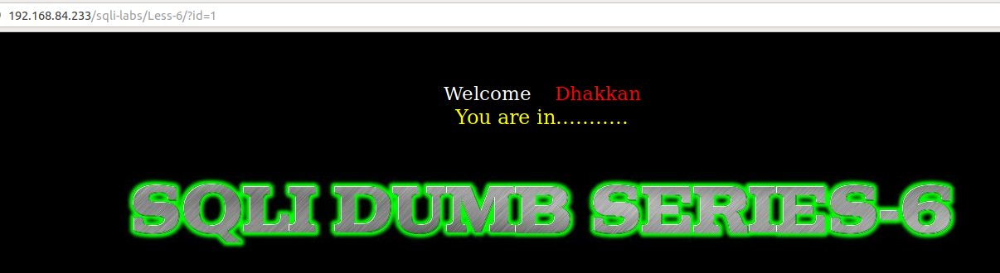
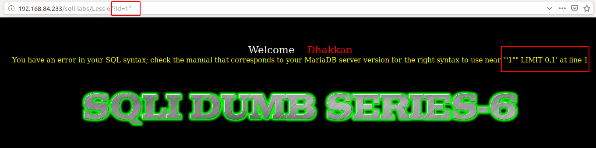
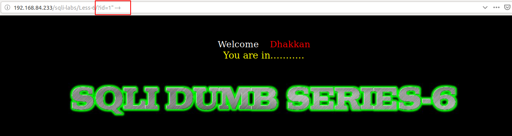

# Less 6

Đề bài yêu cầu nhập một id



Nhập thử một giá trị



Nhập thử các gía trị để xuất hiện lỗi




Ta thể dự đoán câu query sẽ là

```
select * from table where id="$ID" limit 0,1
```

Ta có thể pass qua cái này



Từ đây ta có thể khai thác tương tự như ở [Less-1](Less-1.md)