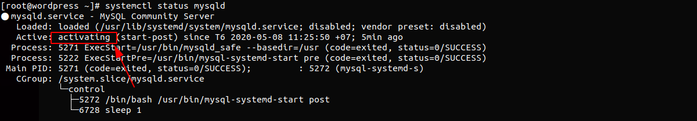
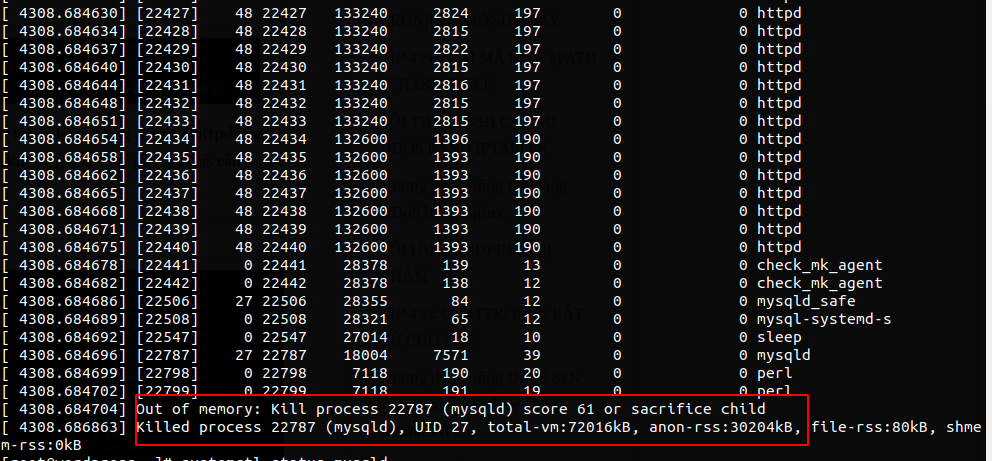
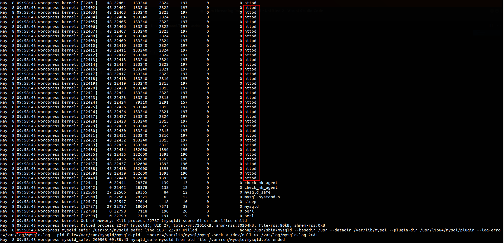
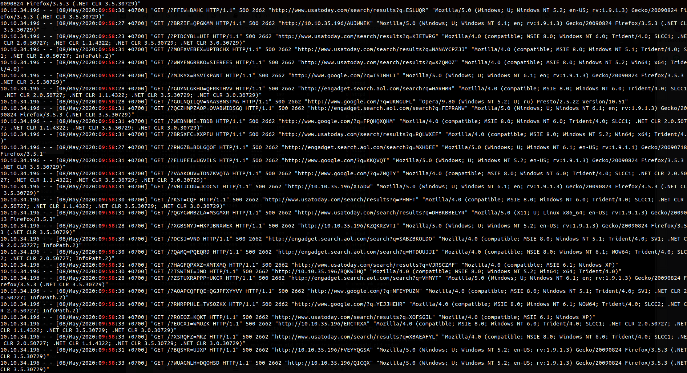

# Nguyên nhân gây ra Lỗi kết nối tới cơ sở dữ liệu của website Wordpress

Một trang web đang chạy bình thường bỗng một ngày đẹp trời nó xuất hiện `Lỗi kết nối tới cơ sở dữ liệu`


Kiểm tra trạng thái MySQL



Ta thấy MySQL đang trong trạng thái `activating`.

Sử dụng lệnh `dmesg message` để xem log của hệ thống thì ta thấy service `mysqld` bị kill do hết RAM



Ta thấy trước khi bị kill có rất nhiều tiến trình httpd được sinh ra trước đó

Lệnh trên mới biết được nguyên nhân nhưng ta chưa thể xác định được thời gian bị kill. Để xác định được thời gian ta xem trong file `/var/log/messages`

```
tailf -n 500 /var/log/messages
```

Thấy thời gian `mysqld` bị kill vào lúc `9:58:43`. Trước đó đang có rất nhiều tiến trình `httpd`.



Thực hiện tailf log accept của http trong khoảng thời gian này

```
cat /var/log/httpd/access_log | grep -B 500 "9:58"
```



Ta thấy IP 10.10.34.196 thục hiện truy cập rất nhiều lần trong khoảng thời gian này với truy vấn rất lạ, có cùng một kiểu truy vấn và không load các file như css đi kèm. Ta có thể xác định IP này đang cố tình tấn công DOS trang web.