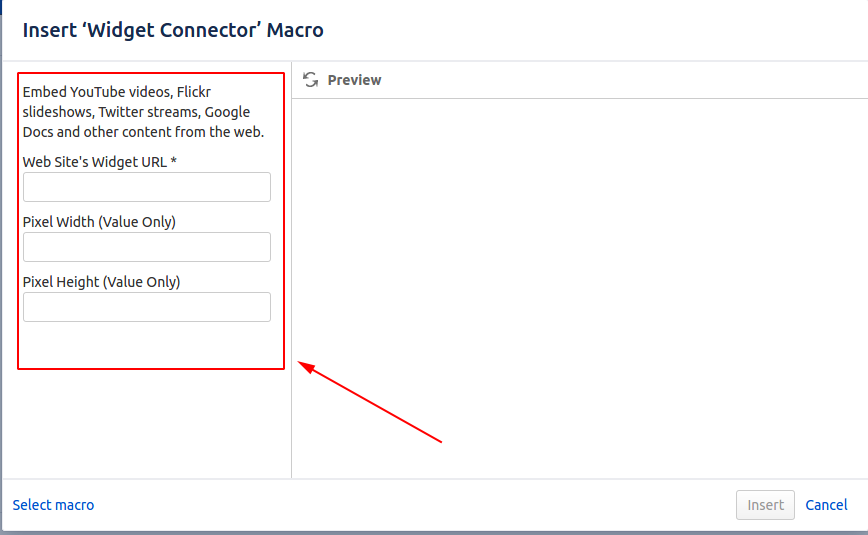
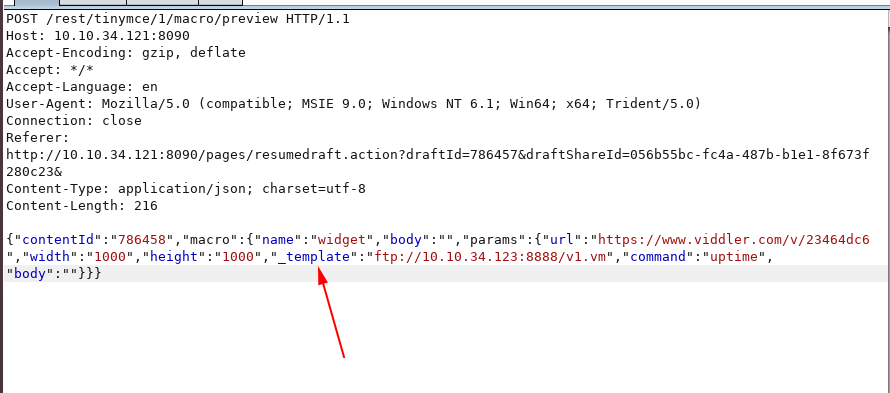
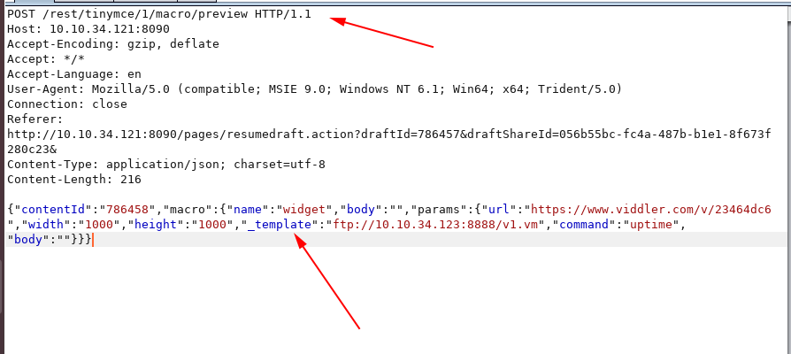
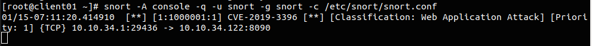

# CVE-2019-3396

Đây là CVE ảnh hưởng đến `Confluence` trong `Widget Connector`. Attacker có thể thực thi các đoạn code có trên máy hoặc trên các máy remote.

## Khai thác

Ta thấy trong màn này có 3 trường cần điền 



Nhưng ta có thể injection thêm một tham số là `_template`



Với tham số `_template` này ta có thể truyền vào các file (các file có thể trên máy hoặc từ các máy từ xa).

Theo thiết kế thì giá trị `_template` này sẽ được đặt bên dưới code. Như vậy khi có tham số `_template` thì chắc chắn đang có attacker đang cố tình tìm cách injection

## Rules snort

```
alert tcp any any -> $HOME_NET 8090 (msg:"CVE-2019-3396"; sid:1000001; rev:001; classtype:web-application-attack; content: "_template"; content:"POST /rest/tinymce/1/macro/preview";)
```

Ta kiểm tra trong header của các requests đến nếu có nội dung là `POST /rest/tinymce/1/macro/preview` và `_template` thì chắc đang có attack. 



