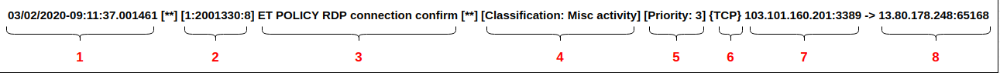

# Format log cảnh báo suricata

Thư mục log của suricata mặc định sẽ nằm trong thư mục `/var/log/suricata/`

File chứa log cảnh báo `/var/log/suricata/fast.log`

Một bản tin log có định dạng như sau:



Trong đó:
 * **1**: thời gian xaỷ ra cảnh báo
 * **2**: format như sau [gid:sid:rev]
     * `gid`: nhóm các rule khác nhau. Mặc định sẽ nhận giá trị 1 nếu không được set trong rule
     * `sid`: dùng để định danh một rule. Mỗi rule có 1 `sid` duy nhất
     * `rev`: xác định số lẫn sửa đổi của 1 rule. Mỗi lần rule thay đổi thì giá trị `rev` sẽ tăng lên
 * **3**: nội dung của message.
 * **4**: classtype mô tả các rule thuộc loại attack nào. Classtype đều được định nghĩa trong file `/etc/suricata/classification.config`

 Ví dụ một classtype sẽ được định nghĩa trong file như sau:

```
config classification: web-application-attack,Web Application Attack,1
config classification: not-suspicious,Not Suspicious Traffic,3
```

| classtype | Description | Priority |
|-----------|-------|----------|
| web-application-attack | Web Application Attack | 1 |
| not-suspicious | Not Suspicious Traffic | 3 |

 * **5**: Priority thể hiện mức độ ưu tiên của cảnh báo. Thứ tự ưu tiên cao hơn sẽ được xử lý trước. Ví dụ `1` sẽ được ưu tiên hơn `3`.
 * **6**: Giao thức của gói tin
 * **7**: Địa chỉ nguồn của gói tin(gồm IP và port)
 * **8**: Địa chỉ đích của gói tin (gồm IP và port)