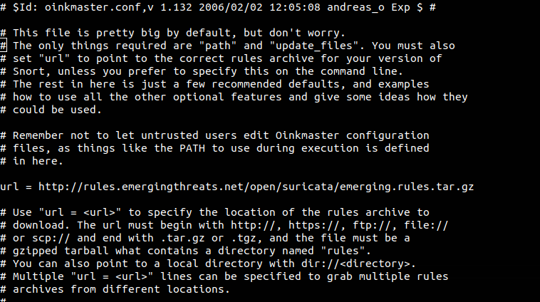

# Cài đặt suricata sử dụng làm IDS

Cài các gói cần thiết

```
yum -y install epel-release
yum -y install jq cargo openssl-devel PyYAML lz4-devel gcc libpcap-devel pcre-devel libyaml-devel file-devel zlib-devel jansson-devel nss-devel libcap-ng-devel libnet-devel tar make libnetfilter_queue-devel lua-devel wget
```

Download suricata

```
wget https://www.openinfosecfoundation.org/download/suricata-4.1.2.tar.gz
```

Install

```
tar xzvf suricata-4.1.2.tar.gz
cd suricata-4.1.2
./configure --libdir=/usr/lib64 --prefix=/usr --sysconfdir=/etc --localstatedir=/var --enable-nfqueue --enable-lua
make install-full
```

Kiểm tra

```
suricata -V
```

Nếu kết quả trả về như sau thì đã cài đặt thành công

```
This is Suricata version 4.1.2 RELEASE
```

Thực hiện cấu hình

```
vi /etc/suricata/suricata.yaml
```

Khai báo một số thông tin

```
HOME_NET: "[10.10.3.0/24. 10.10.4.0/24]"
EXTERNAL_NET: "!$HOME_NET"
```

Khai báo dải mạng local phù hợp với mạng bạn đang sử dụng

```
default-rule-path: /etc/suricata/rules
rule-files:
 - suricata.rules
```

Trong đó:
 * `default-rule-path`:  là đường dẫn đến thư mục chứa các file rules của suricata
 * `rule-files`: khai báo các file chứa rules (nếu có nhiều file thì để nhiều dòng)

Tạo rules để kiểm tra

```
mkdir /etc/suricata/rules
touch suricata.rules
echo 'alert icmp any any -> any any (msg: "ICMP Packet found";)' > /etc/suricata/rules/suricata.rules
```

Bây giờ mở 2 terminal

Trên terminal thứ nhất chạy lệnh

```
suricata -c /etc/suricata/suricata.yaml -i eth0
```

Trên terminal 2 chạy lệnh sau để xem log

```
tailf /var/log/suricata/fast.log
```

Bây giờ đứng từ 1 máy khác thực hiện lệnh ping đến máy vừa cài suricata. Nếu trên terminal 2 thấy có log như sau là đã cài đặ thành công

```
11/20/2019-18:02:51.951768  [**] [1:0:0] ICMP Packet found [**] [Classification: (null)] [Priority: 3] {ICMP} 10.10.3.1:8 -> 10.10.3.7:0
11/20/2019-18:02:51.951919  [**] [1:0:0] ICMP Packet found [**] [Classification: (null)] [Priority: 3] {ICMP} 10.10.3.7:0 -> 10.10.3.1:8
```

Để suricata chạy như một chương trình deamon

Mở file `/lib/systemd/system/suricata.service` và thêm vào những nội dung sau

```
[Unit]
Description=suricata NIDS Daemon
After=syslog.target network.target

[Service]
Type=simple
ExecStart=/usr/bin/suricata -c /etc/suricata/suricata.yaml -i eth0

[Install]
WantedBy=multi-user.target
```
Chạy suricata và cho phép khởi động cùng hệ thống

```
systemctl start suricata
systemctl enable suricata
```

Đến đây việc cài đặt và cấu hình đã xong. Ta có thể thêm các rule phù hợp vào file `/etc/suricata/rules/suricata/rules`

Tong hướng dẫn này mới thực hiện cài để làm HIDS. Nếu muốn làm NIDS thì bạn cần phải cấu hình (ví dụ như mirror trên switch) để có thể copy lưu lượng đi trên mạng đẩy về máy cài suricata


### Cấu hình tự động update rule

Sử dụng Oinkmaster để thực hiện tự động update các rule của snort

Cài đặt oinkmaster

```
yum install perl
wget http://nchc.dl.sourceforge.net/project/oinkmaster/oinkmaster/2.0/oinkmaster-2.0.tar.gz
tar zxvf oinkmaster-2.0.tar.gz
cd oinkmaster-2.0
cp oinkmaster.pl /usr/local/bin/
chmod +x /usr/local/bin/oinkmaster.pl
cp oinkmaster.conf /etc/suricata/
```

Mở file `/etc/suricata/oinkmaster.conf` thêm vào dòng sau

```
url = http://rules.emergingthreats.net/open/suricata/emerging.rules.tar.gz
```



Chạy lệnh sau

```
oinkmaster.pl -C /etc/suricata/oinkmaster.conf -o /etc/suricata/rules
```

Kiểm tra các file rule mới được download

```
ls /etc/suricata/rules/*.rules
```

Mở file `/etc/suricata/suricata.yaml` khai báo các file rule vào đây

```
default-rule-path: /etc/suricata/rules
rule-files:
 - suricata.rules
```

Để tự động update thì có thể cho lệnh `oinkmaster.pl -C /etc/suricata/oinkmaster.conf -o /etc/suricata/rules` vào crontab để chạy định kỳ