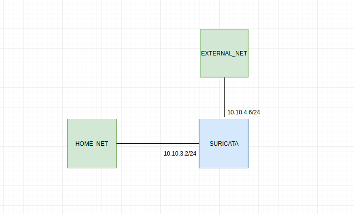

# Cài đặt suricata dùng làm IPS

### Mô hình 



### Chuẩn bị

Một máy Centos7 có cấu hình tối thiểu
* 2G RAM
* 2 core
* 20G disk
* 2 interface

| interface | ip address |
| -------- | ---------- |
| ens9 | 10.10.3.2 |
| eth1 | 10.10.4.6 |

Để sử dụng với mô hình này tất cả lưu lượng phải được đi qua máy cài đặt suricata. Tại đây suricata sẽ sử dụng iptables trên máy naỳ để có thể xử lý goí tin.

### Cài đặt

Thực hiện cài đặt và cấu hình như với [cài đặt mode IDS](/docs/cai-dat-ids.md)

Bỏ qua phần cấu hình để chạy deamon

### Cấu hình

Cấu hình iptables

```
sysctl -w net.ipv4.ip_forward=1
iptables -I FORWARD -i ens9 -o eth1 -j NFQUEUE
iptables -I FORWARD -i eth1 -o ens9 -j NFQUEUE
iptables -t nat -I POSTROUTING -s 10.10.3.0/24 -o eth1 -j SNAT --to-source 10.10.4.6
```

Sửa file cấu hình

Mở file `suricata.yaml` và sửa `inline` thành `yes` sử dụng mode IPS

```
stream:
  memcap: 64mb
  checksum-validation: yes      
  inline: yes               
```

Thêm 1 rule để kiểm tra thử 

```
vi /etc/suricata/rules/suricata.rules
```

Thêm vào rule như sau 

```
drop icmp any any -> any any (msg: "ICMP Packet found";)
```

Để kiểm tra xem nó đã hoạt động

Trên máy suricata chạy lệnh sau

```
suricata -c /etc/suricata/suricata.yaml -q 0
```

Ta dùng một máy trong vùng `HOME_NET` để ping ra ngoài `EXTERNAL_NET`. Lúc này tất cả các gói tin icmp đã bị drop nên ko thể ping đươc.

Quay trở lại với máy cài suricata để xem log

```
tail /var/log/suricata/fast.log
```

Ta thấy có dòng sau

```
02/16/2020-19:19:10.823182  [Drop] [**] [1:0:0] ICMP Packet found [**] [Classification: (null)] [Priority: 3] {ICMP} 10.10.3.5:8 -> 8.8.8.8:0
```

Như vây việc cài đặt đã thành công