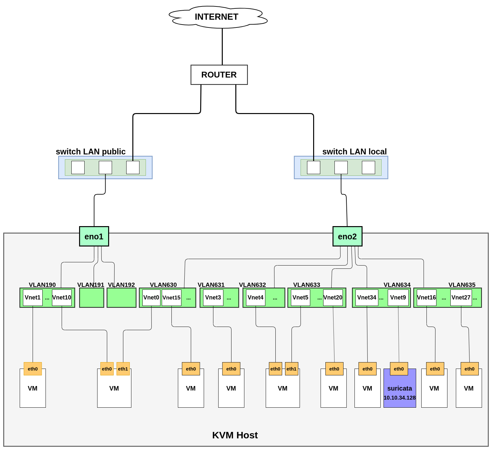
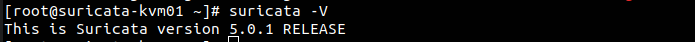
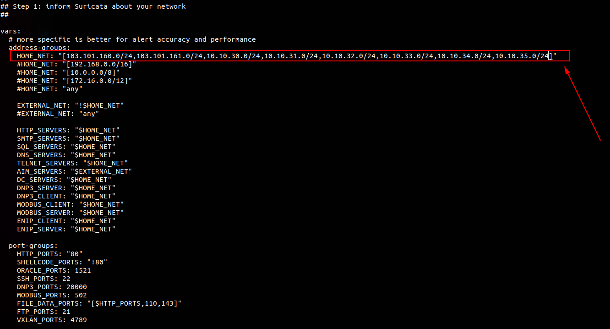
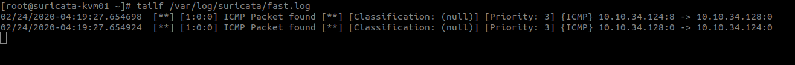
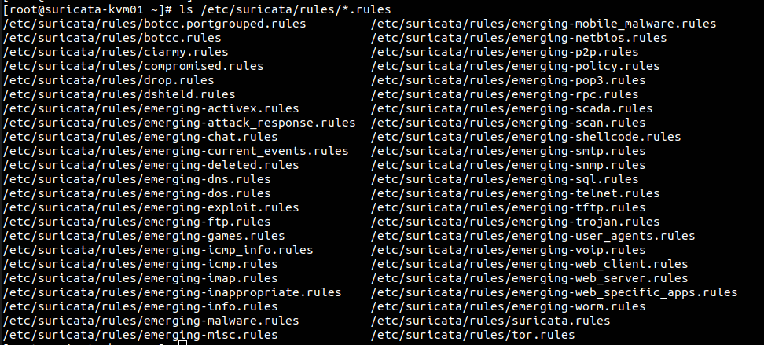
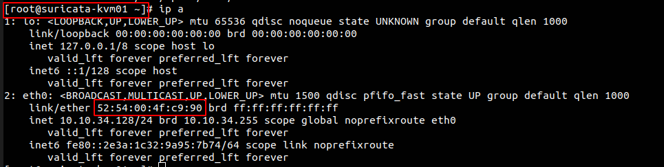
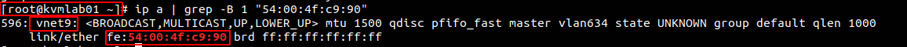

# Cài đặt suricata làm NIDS trên KVM01

## Mục lục

[I. Mô hình](#mo_hinh)

[II. Cài đặt suricata](#phan_1)
 * [Bước 1: Tạo máy để cài suricata](#1.1)
 * [Bước 2: Cài đặt](#1.2)
 * [Bước 3: Cấu hình](#1.3)
 * [Bước 4: Đặt suricata chạy deamon](#1.4)
 * [Bước 5: Cấu hình tự động update các rule mới nhất](#1.5)

[III. Cấu hình mirror](#phan_2)
 * [Bước 1: Xác định vnet của VM cài suricata](#2.1)
 * [Bước 2: Mirorr eno1](#2.2)
 * [Bước 3: Mirror eno2](#2.3)
 * [Bước 4: Up interface vnet9](#2.4)

[IV. Kiểm tra](#phan_3)

<a name="mo_hinh">

## I. Mô hình



<a name="phan_1">

## II. Cài đặt suricata

<a name="1.1">

**Bước 1: Tạo máy để cài suricata**

Tạo một VM Centos7 trên KVM host có cấu hình tối thiểu:

 * 2G RAM
 * 2 core
 * 50G disk
 * 1 interface nối với 1 VLAN (VLAN634) ra được internet

<a name="1.2">

**Bước 2: Cài đặt**

```
yum -y install epel-release
yum -y install jq cargo openssl-devel PyYAML lz4-devel gcc libpcap-devel pcre-devel libyaml-devel file-devel zlib-devel jansson-devel nss-devel libcap-ng-devel libnet-devel tar make libnetfilter_queue-devel lua-devel wget perl
wget https://www.openinfosecfoundation.org/download/suricata-5.0.1.tar.gz
tar xzvf suricata-5.0.1.tar.gz
cd suricata-5.0.1
./configure --libdir=/usr/lib64 --prefix=/usr --sysconfdir=/etc --localstatedir=/var --enable-nfqueue --enable-lua
make install-full
```

Sử dụng lệnh sau để kiểm tra

```
suricata -V
```

Nếu kết quả trả về như sau thì việc cài đặt đã thành công



<a name="1.3">

**Bước 3: Cấu hình**

Mở file `/etc/suricata/suricata.yaml` để sửa một số thông tin

Khai báo các dải LAN trên KVM host.

Trên KVMlab01 gồm các dải mạng:

 * 103.101.160.0/24
 * 103.101.161.0/24
 * 10.10.30.0/24
 * 10.10.31.0/24
 * 10.10.32.0/24
 * 10.10.33.0/24
 * 10.10.34.0/24
 * 10.10.35.0/24

Khai báo như sau



Chỉ ra đường dẫn tới thư mục lưu các rule

```
sed -i 's/default-rule-path: \/var\/lib\/suricata\/rules/default-rule-path: \/etc\/suricata\/rules/g' /etc/suricata/suricata.yaml
```

Tạo rule để kiểm tra

```
mkdir /etc/suricata/rules
echo 'alert icmp any any -> any any (msg: "ICMP Packet found";)' > /etc/suricata/rules/suricata.rules
```

Bây giờ mở 2 terminal

Terminal thứ nhất chạy lệnh:

```
suricata -c /etc/suricata/suricata.yaml -i eth0
```

Trong đó: 
 * `eth0` là interface kết nối với `vnet9`

Terminal thứ 2 chạy lệnh:

```
tailf /var/log/suricata/fast.log
```

Đứng từ một máy khác thực hiện ping đến máy suricata. Nếu trên terminal 2 có thấy dòng log như sau thì việc cấu hình thành công



<a name="1.4">

**Bước 4: Đặt suricata chạy deamon**

```
cat <<EOF> /lib/systemd/system/suricata.service
[Unit]
Description=suricata NIDS Daemon
After=syslog.target network.target

[Service]
Type=simple
ExecStart=/usr/bin/suricata -c /etc/suricata/suricata.yaml -i eth0

[Install]
WantedBy=multi-user.target
EOF
```

Start và cho phép suricata khởi động cùng hệ thống

```
systemctl start suricata
systemctl enable suricata
```

<a name="1.5">

**Bước 5: Cấu hình tự động update các rule mới nhất**

Sử dụng Oinkmaster để thực hiện tự động update các rule của suricata

Cài đặt oinkmaster

```
wget http://nchc.dl.sourceforge.net/project/oinkmaster/oinkmaster/2.0/oinkmaster-2.0.tar.gz
tar zxvf oinkmaster-2.0.tar.gz
cd oinkmaster-2.0
cp oinkmaster.pl /usr/local/bin/
chmod +x /usr/local/bin/oinkmaster.pl
cp oinkmaster.conf /etc/suricata/
echo "url = http://rules.emergingthreats.net/open/suricata/emerging.rules.tar.gz" >> /etc/suricata/oinkmaster.conf
```

Chạy lệnh sau để download các rule

```
oinkmaster.pl -C /etc/suricata/oinkmaster.conf -o /etc/suricata/rules
```

Kiểm tra các rule mới được download

```
ls /etc/suricata/rules/*.rules
```



Khai báo các rule này vào file `suricata.yaml`

```
sed -i 's/default-rule-path: \/etc\/suricata\/rules/#default-rule-path: \/etc\/suricata\/rules/g' /etc/suricata/suricata.yaml
sed -i 's/rule-files:/#rule-files:/g' /etc/suricata/suricata.yaml
sed -i 's/  - suricata.rules/#  - suricata.rules/g' /etc/suricata/suricata.yaml
```

```
cat <<EOF>> /etc/suricata/suricata.yaml
default-rule-path: /etc/suricata/rules

rule-files:
  - botcc.portgrouped.rules
  - botcc.rules
  - ciarmy.rules
  - compromised.rules
  - drop.rules
  - dshield.rules
  - emerging-activex.rules
  - emerging-attack_response.rules
  - emerging-chat.rules
  - emerging-current_events.rules
  - emerging-deleted.rules
  - emerging-dns.rules
  - emerging-dos.rules
  - emerging-exploit.rules
  - emerging-ftp.rules
  - emerging-games.rules
  - emerging-smtp.rules
  - emerging-snmp.rules
  - emerging-sql.rules
  - emerging-telnet.rules
  - emerging-tftp.rules
  - emerging-trojan.rules
  - emerging-user_agents.rules
  - emerging-voip.rules
  - emerging-web_client.rules
  - emerging-web_server.rules
  - emerging-web_specific_apps.rules
  - emerging-worm.rules
  - suricata.rules
  - tor.rules
  - emerging-icmp_info.rules
  - emerging-icmp.rules
  - emerging-imap.rules
  - emerging-inappropriate.rules
  - emerging-info.rules
  - emerging-malware.rules
  - emerging-misc.rules
  - emerging-mobile_malware.rules
  - emerging-netbios.rules
  - emerging-p2p.rules
  - emerging-policy.rules
  - emerging-pop3.rules
  - emerging-rpc.rules
  - emerging-scada.rules
  - emerging-scan.rules
  - emerging-shellcode.rules
EOF
```

Restart lại suricata

```
systemctl restart suricata
```

Để update định kỳ mỗi ngày 1 lần

```
echo "0 1 * * * root /usr/local/bin/oinkmaster.pl -C /etc/suricata/oinkmaster.conf -o /etc/suricata/rules >> /dev/null 2>&1" >> /etc/crontab
```

<a name="phan_2">

## III. Cấu hình mirror

Bước này thao tác trên KVM host

Thực hiện mirror `eno1` và `eno2` đến `vnet9` cho phép traffic đi qua `eno1` và `eno2` được copy đến `vnet9` để đi vào `suricata` phân tích.

<a name="2.1">

**Bước 1: Xác định vnet của VM cài suricata**

Địa chỉ MAC trên interface của VM và MAC trên vnet mà nó kết nối đến sẽ gần giống nhau. Nếu khác nhau chỉ khác nhau 8 bit đầu tiên

Kiểm tra MAC trên VM cài suricata



Tìm `vnet` trên KVM host



Ta thấy ở đây là `vnet9`

<a name="2.2">

**Bước 2: Mirror eno1**

```
tc qdisc add dev eno1 ingress
tc filter add dev eno1 parent ffff: protocol all u32 match u8 0 0 action mirred egress mirror dev vnet9
tc qdisc add dev eno1 handle 1: root prio
tc filter add dev eno1 parent 1: protocol all u32 match u8 0 0 action mirred egress mirror dev vnet9
```

<a name="2.3">

**Bước 3: Mirror eno2**

```
tc qdisc add dev eno2 ingress
tc filter add dev eno2 parent ffff: protocol all u32 match u8 0 0 action mirred egress mirror dev vnet9
tc qdisc add dev eno2 handle 1: root prio
tc filter add dev eno2 parent 1: protocol all u32 match u8 0 0 action mirred egress mirror dev vnet9
```

<a name="2.4">

**Bước 4: Up interface vnet9**

```
ip link set vnet9 up
```

<a name="phan_3">

## IV. Kiểm tra

Đứng từ một máy bên ngoài KVM host thực hiện ping đến một VM bất kỳ trong KVM host.

Trên Suricata chạy lệnh sau:

```
cat /var/log/suricata/fast.log | grep "ICMP Packet found"
```

Nếu thấy có dòng log như sau là thành công

```
02/24/2020-08:23:49.514446  [**] [1:0:0] ICMP Packet found [**] [Classification: (null)] [Priority: 3] {ICMP} 10.10.35.1:8 -> 10.10.35.250:0
```

**Xóa rule test**

Xóa rule test tạo ở bên trên

```
echo "" > /etc/suricata/rules/suricata.rules
systemctl restart suricata
````